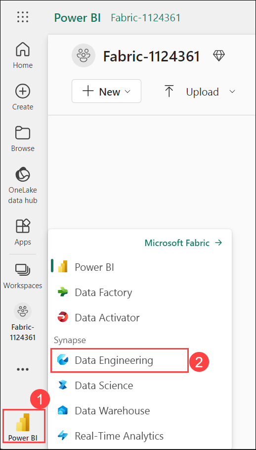

# Module 01b: Ingest data with Spark and Microsoft Fabric notebooks

## Lab scenario 

In this lab, you’ll create a Microsoft Fabric notebook and use PySpark to connect to an Azure Blob Storage path, then load the data into a lakehouse using write optimizations.

For this experience, you’ll build the code across multiple notebook code cells, which may not reflect how you will do it in your environment; however, it can be useful for debugging.

Because you’re also working with a sample dataset, the optimization doesn’t reflect what you may see in production at scale; however, you can still see improvement and when every millisecond counts, optimization is key.

## Lab objectives
In this lab, you will perform:

- Create workspace and lakehouse destination
- Create a Fabric notebook and load external data
- Transform and load data to a Delta table
- Optimize Delta table writes
- Analyze Delta table data with SQL queries

## Estimated timing: 30 minutes

## Architecture Diagram


### Task 1: Create workspace and lakehouse destination

Start by creating a new lakehouse, and a destination folder in the lakehouse.

1. At the bottom left of the Power BI portal, select the **Power BI (1)** icon and switch to the **Data Engineering (2)** experience.

   
   
1. In the **Data engineering** home page, click on **Lakehouse** to create a new lakehouse.

    - **Name:** Enter **Lakehouse<inject key="DeploymentID" enableCopy="false"/>**

    - Click on **Create**.

      

        >**Note:** After a minute or so, a new lakehouse with no **Tables** or **Files** will be created.

1. From **Files**, select the **[…] (2)** to create **New subfolder** named **RawData (3)**.

    .png)

1. Select **RawData** > **...** > **Properties** > **Copy ABFS path** for the **RawData** folder to an empty notepad for later use, which should look something like: **abfss://{workspace_name}@onelake.dfs.fabric.microsoft.com/{lakehouse_name}.Lakehouse/Files/{folder_name}/{file_name}**

> **Congratulations** on completing the task! Now, it's time to validate it. Here are the steps:<br>
      - Navigate to the Lab Validation Page, from the upper right corner in the lab guide section.<br>
      - Hit the Validate button for the corresponding task. If you receive a success message, you can proceed to the next task.<br>
      - If not, carefully read the error message and retry the step, following the instructions in the lab guide.<br>
      - If you need any assistance, please contact us at labs-support@spektrasystems.com. We are available 24/7 to help!

### Task 2: Create a Fabric notebook and load external data

1. Create a new Fabric notebook and connect to external data source with PySpark.

1. From the top menu in the lakehouse, select **Open notebook** > **New notebook**, which will open once created.

1. In the default cell, notice that the code is set to **PySpark (Python)**.

1. Insert the following code into the code cell, which will:

Note: If an unexpected indent error occurs while declaring the file name, it may be due to hidden spaces or paragraphs. Revise this by creating new cells, making sure there are no empty spaces, and pasting the content after thorough verification.

    - Declare parameters for connection string
    - Build the connection string
    - Read data into a DataFrame

    ```python
    # Azure Blob Storage access info
    blob_account_name = "azureopendatastorage"
    blob_container_name = "nyctlc"
    blob_relative_path = "yellow"
        
    # Construct connection path
    wasbs_path = f'wasbs://{blob_container_name}@{blob_account_name}.blob.core.windows.net/{blob_relative_path}'
    print(wasbs_path)
    
    # Read parquet data from Azure Blob Storage path
    blob_df = spark.read.parquet(wasbs_path)
    ```

1. Select **▷ Run Cell** next to the code cell to connect and read data into a DataFrame.

    >**Note:** Expected outcome: Your command should succeed and print **wasbs://nyctlc@azureopendatastorage.blob.core.windows.net/yellow**

1. To write the data to a file, you now need that **ABFS Path** for your **RawData** folder.

1. Insert the following code into a new code cell:

    ```python
    # Declare file name    
    file_name = "yellow_taxi"

    # Construct destination path
    output_parquet_path = f"**InsertABFSPathHere**/{file_name}"
    print(output_parquet_path)
        
    # Load the first 1000 rows as a Parquet file
    blob_df.limit(1000).write.mode("overwrite").parquet(output_parquet_path)
    ```

     >**Note:** In the **InsertABFSPathHere**, paste the ABFS path that you copied.

1. Select **▷ Run Cell** to write 1000 rows to a yellow_taxi.parquet file.

    >**Note:** Your output_parquet_path should look similar to: **abfss://Spark@onelake.dfs.fabric.microsoft.com/DPDemo.Lakehouse/Files/RawData/yellow_taxi**

1. To confirm data load from the Lakehouse Explorer, select **Files** > **…** > **Refresh**.

1. You should now see your new folder **RawData** with a **yellow_taxi.parquet** “file” - which shows as a folder with partition files within.

### Task 3: Transform and load data to a Delta table

Likely, your data ingestion task doesn’t end with only loading a file. Delta tables in a lakehouse allows scalable, flexible querying and storage, so we’ll create one as well.

1. Create a new code cell, and insert the following code:

    ```python
    from pyspark.sql.functions import col, to_timestamp, current_timestamp, year, month
        
    # Read the parquet data from the specified path
    raw_df = spark.read.parquet(output_parquet_path)   
        
    # Add dataload_datetime column with current timestamp
    filtered_df = raw_df.withColumn("dataload_datetime", current_timestamp())
        
    # Filter columns to exclude any NULL values in storeAndFwdFlag
    filtered_df = filtered_df.filter(raw_df["storeAndFwdFlag"].isNotNull())
        
    # Load the filtered data into a Delta table
    table_name = "yellow_taxi"  # Replace with your desired table name
    filtered_df.write.format("delta").mode("append").saveAsTable(table_name)
        
    # Display results
    display(filtered_df.limit(1))
    ```

1. Select **▷ Run Cell** next to the code cell.

    - This will add a timestamp column **dataload_datetime** to log when the data was loaded to a Delta table.
    - Filter NULL values in **storeAndFwdFlag**.
    - Load filtered data into a Delta table.
    - Display a single row for validation.


1. Review and confirm the displayed results, something similar to the following image:

    

    >**Note:** You’ve now successfully connected to external data, written it to a parquet file, loaded the data into a DataFrame, transformed the data, and loaded it to a Delta table.

### Task 4: Optimize Delta table writes

You’re probably using big data in your organization and that’s why you chose Fabric notebooks for data ingestion, so let’s also cover how to optimize the ingestion and reads for your data. First, we’ll repeat the steps to transform and write to a Delta table with write optimizations included.

1. Create a new code cell and insert the following code:

    ```python
    from pyspark.sql.functions import col, to_timestamp, current_timestamp, year, month
    
    # Read the parquet data from the specified path
    raw_df = spark.read.parquet(output_parquet_path)    

    # Add dataload_datetime column with current timestamp
    opt_df = raw_df.withColumn("dataload_datetime", current_timestamp())
        
    # Filter columns to exclude any NULL values in storeAndFwdFlag
    opt_df = opt_df.filter(opt_df["storeAndFwdFlag"].isNotNull())
        
    # Enable V-Order
    spark.conf.set("spark.sql.parquet.vorder.enabled", "true")
        
    # Enable automatic Delta optimized write
    spark.conf.set("spark.microsoft.delta.optimizeWrite.enabled", "true")
        
    # Load the filtered data into a Delta table
    table_name = "yellow_taxi_opt"  # New table name
    opt_df.write.format("delta").mode("append").saveAsTable(table_name)
        
    # Display results
    display(opt_df.limit(1))
    ```

1. Confirm you have the same results as before the optimization code.

    >**Note:** Now, take note of the run times for both code blocks. Your times will vary, but you can see a clear performance boost with the optimized code.

### Task 5: Analyze Delta table data with SQL queries

This lab is focused on data ingestion, which really explains the extract, transform, load process, but it’s valuable for you to preview the data too.

1. Create a new code cell, and insert the code below:

    ```python
    # Load table into df
    delta_table_name = "yellow_taxi"
    table_df = spark.read.format("delta").table(delta_table_name)
        
    # Create temp SQL table
    table_df.createOrReplaceTempView("yellow_taxi_temp")
        
    # SQL Query
    table_df = spark.sql('SELECT * FROM yellow_taxi_temp')
        
    # Display 10 results
    display(table_df.limit(10))
    ```

1. Create another code cell, and insert this code as well:

    ```python
    # Load table into df
    delta_table_name = "yellow_taxi_opt"
    opttable_df = spark.read.format("delta").table(delta_table_name)
        
    # Create temp SQL table
    opttable_df.createOrReplaceTempView("yellow_taxi_opt")
        
    # SQL Query to confirm
    opttable_df = spark.sql('SELECT * FROM yellow_taxi_opt')
        
    # Display results
    display(opttable_df.limit(10))
    ```

1. Now, select the **▼** arrow next to the **Run Cell** button for the first of these two queries, and from the drop-down select **Run this cell and all below**.

    >**Note:** This will run the last two code cells. Notice the execution time difference between querying the table with non optimized data and a table with optimized data.

### Review
 In this lab, you have completed the following :
- Created workspace and lakehouse destination
- Created a Fabric notebook and load external data
- Transformed and load data to a Delta table
- Optimized Delta table writes
- Analyzed Delta table data with SQL queries

## You have successfully completed this lab, please proceed with the upcoming modules.
