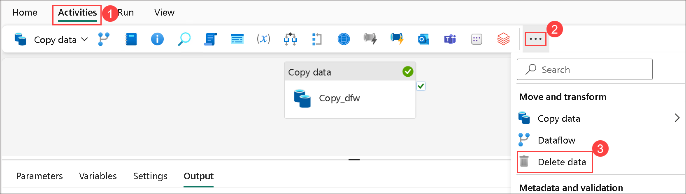

# Module 01c: Use Data Factory pipelines in Microsoft Fabric

## Lab scenario
A data lakehouse is a common analytical data store for cloud-scale analytics solutions. One of the core tasks of a data engineer is to implement and manage the ingestion of data from multiple operational data sources into the lakehouse. In Microsoft Fabric, you can implement extract, transform, and load (ETL) or extract, load, and transform (ELT) solutions for data ingestion through the creation of pipelines.

Fabric also supports Apache Spark, enabling you to write and run code to process data at scale. By combining the pipeline and Spark capabilities in Fabric, you can implement complex data ingestion logic that copies data from external sources into the OneLake storage on which the lakehouse is based, and then uses Spark code to perform custom data transformations before loading it into tables for analysis.

This lab will take approximately **60** minutes to complete.

> **Note**: You need a Microsoft school or work account to complete this exercise. If you don’t have one, you can sign up for a trial of Microsoft Office 365 E3 or higher.

## Lab objectives
In this lab, you will perform:

- Create a lakehouse
- Create a pipeline
- Create a notebook
- Modify the pipeline

## Estimated timing: 60 minutes

## Architecture Diagram


### Task 1: Create a lakehouse

Now that you have a workspace, it’s time to create a data lakehouse into which you will ingest data.

1. At the bottom left of the Power BI portal, select the **Power BI (1)** icon and switch to the **Data Engineering (2)** experience.

   
   
2. In the **Data engineering** home page, click on **Lakehouse** to create a new lakehouse.

    - **Name:** Enter **Lakehouse<inject key="DeploymentID" enableCopy="false"/>**

    - Click on **Create**.

      

        >**Note:** After a minute or so, a new lakehouse with no **Tables** or **Files** will be created.

3. On the **Lakehouse<inject key="DeploymentID" enableCopy="false"/>** tab in the pane on the left, in the **...** menu for the **Files (1)** node, select **New subfolder (2)**.
   

4. Create a subfolder named **new_data**.

    

> **Congratulations** on completing the task! Now, it's time to validate it. Here are the steps:<br>
- Navigate to the Lab Validation Page, from the upper right corner in the lab guide section.<br>
- Hit the Validate button for the corresponding task. If you receive a success message, you can proceed to the next task.<br>
- If not, carefully read the error message and retry the step, following the instructions in the lab guide.<br>
- If you need any assistance, please contact us at labs-support@spektrasystems.com. We are available 24/7 to help!

### Task 2: Create a pipeline

A simple way to ingest data is to use a **Copy data** activity in a pipeline to extract the data from a source and copy it to a file in the lakehouse.

1. At the bottom left of the Power BI portal, select **Data Engineering** icon , and select **Data Engineering** again.

     

1. On the **Home** page for your lakehouse, select **Data pipeline**.

    

2. Create a new data pipeline named **Ingest Sales Data Pipeline (1)** and click on **Create (2)**. 
   
   
   
3. If the **Copy data** wizard doesn't open automatically, select **Copy data assistant** in the pipeline editor page.

   

4. In the **Copy Data** wizard, on the **Choose a data source** page, search and then select **Http**.

   

5. Select **Next** and enter the following settings for the connection to your data source:
    - **URL (1)**: `https://raw.githubusercontent.com/MicrosoftLearning/dp-data/main/sales.csv`
    - **Connection (2)**: Create new connection
    - **Connection name (3)**: *Specify a unique name*
    - **Authentication kind (4)**: Basic (*Leave the username and password blank*)
    - **Username (5)**: Provide the username
    - Click on **Next (6)**
  
        
    
6. Select **Next**. Make sure the following settings are selected:
    - **Relative URL**: *Leave blank*
    - **Request method**: GET
    - **Additional headers**: *Leave blank*
    - **Binary copy**: Unselected
    - **Request timeout**: *Leave blank*
    - **Max concurrent connections**: *Leave blank*
  
        
   
8. Wait for the data to be sampled and then ensure that the following settings are selected:
    - **File format (1)**: DelimitedText
    - **Column delimiter (2)**: Comma (,)
    - **Row delimiter (3)**: Line feed (\n)
    - Select **Preview data (4)** to see a sample of the data that will be ingested. Then close the data preview and select **Next**.

      

        

10. On the **Choose data destination** page, search **(1)** and select your lakehouse **Lakehouse<inject key="DeploymentID" enableCopy="false"/> (2)**.

    

11. Set the following data destination options, and then select **Next (4)**:
    - **Root folder (1)**: Files
    - **Folder path (2)**: new_data
    - **File name (3)**: sales.csv
   
       

12. Set the following file format options and then select **Next (4)**:
    - **File format (1)**: DelimitedText
    - **Column delimiter (2)**: Comma (,)
    - **Row delimiter (3)**: Line feed (\n)
   
      

13. On the **Copy summary** page, review the details of your copy operation and then select **Save + Run**.

    

    - A new pipeline containing a **Copy data** activity is created, as shown here:

        

14. When the pipeline starts to run, you can monitor its status in the **Output** pane under the pipeline designer. Use the **&#8635;** (*Refresh*) icon to refresh the status, and wait until it has succeeded.

    

15. In the menu bar on the left, select your lakehouse i.e., **Lakehouse<inject key="DeploymentID" enableCopy="false"/>**.

16. On the **Home** page, in the **Lakehouse<inject key="DeploymentID" enableCopy="false"/> (1)** pane, expand **Files** and select the **new_data (2)** folder to verify that the **sales.csv (3)** file has been copied.

    

    >**Note:** If the **sales.csv** file doesn't show up, refresh the **new_data** subfolder and verify.

> **Congratulations** on completing the task! Now, it's time to validate it. Here are the steps:<br>
- Navigate to the Lab Validation Page, from the upper right corner in the lab guide section.<br>
- Hit the Validate button for the corresponding task. If you receive a success message, you can proceed to the next task.<br>
- If not, carefully read the error message and retry the step, following the instructions in the lab guide.<br>
- If you need any assistance, please contact us at labs-support@spektrasystems.com. We are available 24/7 to help!

### Task 3: Create a notebook

1. Navigate back to the **Home** page , select **New notebook**.

      

1. Under **Explorer** select **Lakehouses**.

    

1. Select **+ Lakehouse** > **Existing Lakehouse** then click **Add**.

    

1. Select your Lakehouse click on **Add**.

    

1. Select the existing cell in the notebook, which contains some simple code, and then replace the default code with the following variable declaration and click on **&#9655; Run**.

    ```python
   table_name = "sales"
    ```

    

1. In the **... (1)** menu for the cell (at its top-right) select **Toggle parameter cell (2)**. This configures the cell so that the variables declared in it are treated as parameters when running the notebook from a pipeline.

     

1. Under the parameters cell, use the **+ Code** button to add a new code cell. Then add the following code to it:

    ```python
   from pyspark.sql.functions import *

   # Read the new sales data
   df = spark.read.format("csv").option("header","true").option("inferSchema","true").load("Files/new_data/*.csv")

   ## Add month and year columns
   df = df.withColumn("Year", year(col("OrderDate"))).withColumn("Month", month(col("OrderDate")))

   # Derive FirstName and LastName columns
   df = df.withColumn("FirstName", split(col("CustomerName"), " ").getItem(0)).withColumn("LastName", split(col("CustomerName"), " ").getItem(1))

   # Filter and reorder columns
   df = df["SalesOrderNumber", "SalesOrderLineNumber", "OrderDate", "Year", "Month", "FirstName", "LastName", "EmailAddress", "Item", "Quantity", "UnitPrice", "TaxAmount"]

   # Load the data into a managed table
   #Managed tables are tables for which both the schema metadata and the data files are managed by Fabric. The data files for the table are created in the Tables folder.
   df.write.format("delta").mode("append").saveAsTable(table_name)
    ```

    This code loads the data from the sales.csv file that was ingested by the **Copy Data** activity, applies some transformation logic, and saves the transformed data as a **managed table** - appending the data if the table already exists.

1. Verify that your notebooks look similar to this, and then use the **&#9655; Run all** button on the toolbar to run all of the cells it contains and review the output.

    

    

   > **Note**: Since this is the first time you've run any Spark code in this session, the Spark pool must be started. This means that the first cell can take a minute or so to complete.

1. (Optional) You can also create **external tables** for which the schema metadata is defined in the metastore for the lakehouse, but the data files are stored in an external location.

    ```python
    df.write.format("delta").saveAsTable("external_sales", path="<abfs_path>/external_sales")

    #In the Lakehouse explorer pane, in the ... menu for the Files folder, select Copy ABFS path.

    #The ABFS path is the fully qualified path to the Files folder in the OneLake storage for your lakehouse - similar to this:

    #abfss://workspace@tenant-onelake.dfs.fabric.microsoft.com/lakehousename.Lakehouse/Files
    ```
    > **Note**: To run the above code, you need to replace the <abfs_path> with your abfs path you can find <abfs_path> by selecting (...) icon copy ADFS path.

      

8. When the notebook run has completed, in the **Lakehouse explorer** pane on the left, in the **...** menu for **Tables** select **Refresh** and verify that a **sales** table has been created.

9. In the notebook menu bar, use the ⚙️ **Settings (1)** icon to view the notebook settings. Then set the **Name** of the notebook to **Load Sales Notebook (2)** and close the settings pane.

   
 
10. In the hub menu bar on the left, select your lakehouse.

11. In the **Explorer** pane, refresh the view. Then expand **Tables**, and select the **sales** table to see a preview of the data it contains.

### Task 4: Modify the pipeline

Now that you’ve implemented a notebook to transform data and load it into a table, you can incorporate the notebook into a pipeline to create a reusable ETL process.

1. In the hub menu bar on the left select the **Ingest Sales Data pipeline** you created previously.

1. On the **Activities** tab, in the **More activities** list, select **Delete data**. Then position the new **Delete data** activity to the left of the **Copy data** activity and connect its **On completion** output to the Copy data activity.

     

     .png)

1. Select the **Delete data** activity, and in the pane below the design canvas, set the following properties:
    - **General**: 
        - Name: Delete old files
    - **Source**:
        - **Connection**: Your lakehouse
        - **File path type**: Wildcard file path
        - **Folder path**: Files / new_data
        - **Wildcard file name**: *.csv
        - **Recursively**: Selected
    - **Logging settings**:
        - **Enable logging**: Unselected

    >**Note:** These settings will ensure that any existing .csv files are deleted before copying the **sales.csv** file.

1. In the pipeline designer, on the **Activities** tab, select **Notebook** to add a **Notebook** activity to the pipeline.

1. Select the **Copy data** activity and then connect its **On Completion** output to the **Notebook** activity as shown here:

    

1. Select the **Notebook** activity, and then in the pane below the design canvas, set the following properties:
    - **General**:
        - **Name**: Load Sales notebook
    - **Settings**:
        - **Notebook**: Load Sales Notebook
        - **Base parameters**: Add a new parameter with the following properties:

            |Name|	Type	|Value|
            |----|----------|-----|
            |table_name|	String|	new_sales|

    >**Note:** The **table_name** parameter will be passed to the notebook and override the default value assigned to the **table_name** variable in the parameters cell.

1. On the **Home** tab, use the **🖫 (Save)** icon to save the pipeline. Then use the **▷ Run** button to run the pipeline, and wait for all of the activities to complete.

    

1. In the hub menu bar on the left edge of the portal, select your lakehouse.

1. In the **Explorer** pane, expand **Tables** and select the **new_sales** table to see a preview of the data it contains. This table was created by the notebook when it was run by the pipeline.

     

In this exercise, you implemented a data ingestion solution that uses a pipeline to copy data to your lakehouse from an external source, and then uses a Spark notebook to transform the data and load it into a table.

### Review
 In this lab, you have completed the following :
- Created a lakehouse
- Created a pipeline
- Created a notebook
- Modified the pipeline

## You have successfully completed this lab, please proceed with the upcoming modules.
