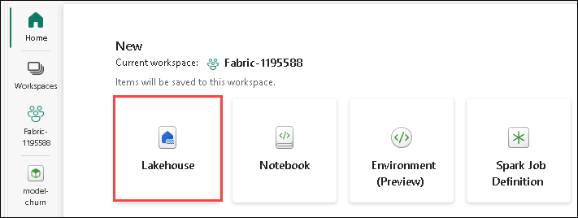

# Module 02.1: Ingest Data in Data Flows (Gen2) in MS Fabric

## Lab scenario 

In Microsoft Fabric, Dataflows (Gen2) connect to various data sources and perform transformations in Power Query Online. They can then be used in Data Pipelines to ingest data into a lakehouse or other analytical store or to define a dataset for a Power BI report.

This lab is designed to introduce the different elements of Dataflows (Gen2), and not create a complex solution that may exist in an enterprise.

## Lab objectives
In this lab, you will perform:

- Create a Lakehouse
- Create a Dataflow (Gen2) to ingest data
- Add data destination for Dataflow
- Add a dataflow to a pipeline

## Estimated timing: 30 minutes

## Architecture Diagram

### Task 1: Create a Lakehouse

Large-scale data analytics solutions have traditionally been built around a *data warehouse*, in which data is stored in relational tables and queried using SQL. The growth in "big data" (characterized by high *volumes*, *variety*, and *velocity* of new data assets) together with the availability of low-cost storage and cloud-scale distributed computing technologies has led to an alternative approach to analytical data storage; the *data lake*. In a data lake, data is stored as files without imposing a fixed schema for storage. Increasingly, data engineers and analysts seek to benefit from the best features of both of these approaches by combining them in a *data lakehouse*; in which data is stored in files in a data lake and a relational schema is applied to them as a metadata layer so that they can be queried using traditional SQL semantics.

In Microsoft Fabric, a lakehouse provides highly scalable file storage in a *OneLake* store (built on Azure Data Lake Store Gen2) with a metastore for relational objects such as tables and views based on the open source *Delta Lake* table format. Delta Lake enables you to define a schema of tables in your lakehouse that you can query using SQL.

Now that you have created a workspace in the previous step, it's time to switch to the *Data engineering* experience in the portal and create a data lakehouse into which you will ingest data.

1. At the bottom left of the Power BI portal, select the **Power BI (1)** icon and switch to the **Data Engineering (2)** experience.

   
   
2. In the **Data engineering** home page, click on **Lakehouse** to create a new lakehouse.

    - **Name:** Enter **Lakehouse<inject key="DeploymentID" enableCopy="false"/>**

    - Click on **Create**.

      

        >**Note:** After a minute or so, a new lakehouse with no **Tables** or **Files** will be created.

3. On the **Lakehouse<inject key="DeploymentID" enableCopy="false"/>** tab in the pane on the left, in the **...** menu for the **Files (1)** node, select **New subfolder (2)** and create a subfolder named **new_data**

   

### Task 2: Create a Dataflow (Gen2) to ingest data

Now that you have a lakehouse, you need to ingest some data into it. One way to do this is to define a dataflow that encapsulates an *extract, transform, and load* (ETL) process.

1. In the home page for your workspace, select **New Dataflow Gen2**. After a few seconds, the Power Query editor for your new dataflow opens as shown here.

   

2. Select **Import from a Text/CSV file**, and create a new data source with the following settings:
 - **Link to file**: *Selected*
 - **File path or URL**: `https://raw.githubusercontent.com/MicrosoftLearning/dp-data/main/orders.csv`
 - **Connection**: Create new connection
 - **data gateway**: (none)
 - **Authentication kind**: Anonymous

3. Select **Next** to preview the file data, and then **Create** the data source. The Power Query editor shows the data source and an initial set of query steps to format the data, as shown here:

   

4. On the toolbar ribbon, select the **Add column** tab. Then select **Custom column** and create a new column named **MonthNo** that contains a number based on the formula `Date.Month([OrderDate])`, and select **OK** - as shown here:

   

    >**Note:** The step to add the custom column is added to the query and the resulting column is displayed in the data pane:

    

    > **Tip:** In the Query Settings pane on the right side, notice the **Applied Steps** include each transformation step. At the bottom, you can also toggle the **Diagram flow** button to turn on the Visual Diagram of the steps. Steps can be moved up or down, edited by selecting the gear icon, and you can select each step to see the transformations applied in the preview pane.

### Task 3: Add data destination for Dataflow

1. On the toolbar ribbon, select the **Home** tab. Then in the **Add data destination** drop-down menu, select **Lakehouse**.

   > **Note:** If this option is greyed out, you may already have a data destination set. Check the data destination at the bottom of the Query settings pane on the right side of the Power Query editor. If a destination is already set, you can change it using the gear.

2. In the **Connect to data destination** dialog box, edit the connection and sign in using your Power BI organizational account to set the identity that the dataflow uses to access the lakehouse.

   

3. Select **Next (3)** and in the list of available workspaces, find your workspace and select the **Lakehouse<inject key="DeploymentID" enableCopy="false"/> (1)** you created in it at the start of this exercise. Then specify a new table named **orders (2)**:

   

1. Select the OrderDate and MonthNo columns in Power Query online. Now, change the **Source type** by selecting the drop-down, follow these instructions, and select **Save settings**:

    - OrderDate = Date/Time
    - MonthNo = Whole number

8. On the **Choose destination settings** page, select **Append**, and then save the settings.

9. Select **Publish** to publish the dataflow. Then wait for the **Dataflow 1** dataflow to be created in your workspace.

    

1. Once published, select the **ellipses (...)**, select **Properties**, and rename your dataflow as **Transform Orders Dataflow**.

### Task 4: Add a dataflow to a pipeline

You can include a dataflow as an activity in a pipeline. Pipelines are used to orchestrate data ingestion and processing activities, enabling you to combine dataflows with other kinds of operations in a single, scheduled process. Pipelines can be created in a few different experiences, including the Data Factory experience.

1. From your Fabric-enabled workspace, select **Data Engineering (1)**. Select **Data pipeline (2)**, then when prompted, create a new pipeline named **Load Orders pipeline**.

   The pipeline editor opens.

   

   > **Tip**: If the Copy Data wizard opens automatically, close it!

2. Select **Add pipeline activity**, and add a **Dataflow** activity to the pipeline.

    

3. With the new **Dataflow1** activity selected, on the **Settings** tab, in the **Dataflow** drop-down list, select **Transform Orders Dataflow** (the data flow you created previously)

   

4. On the **Home** tab, save the pipeline using the **&#128427;** **Save** icon.

5. Use the **&#9655; Run** button to run the pipeline, and wait for it to complete. It may take a few minutes.

   

6. In the menu bar on the left edge, select your lakehouse.

7. In the **...** menu for **Tables**, select **Refresh**. Then expand **Tables** and select the **orders** table, which has been created by your dataflow.

   .png)

> **Congratulations** on completing the task! Now, it's time to validate it. Here are the steps:
     > - Navigate to the Lab Validation Page, from the upper right corner in the lab guide section.
     > - Hit the Validate button for the corresponding task. If you receive a success message, you can proceed to the next task. 
     > - If not, carefully read the error message and retry the step, following the instructions in the lab guide.
     > - If you need any assistance, please contact us at labs-support@spektrasystems.com. We are available 24/7 to help

### Review
 In this lab, you have completed the following :
- Created a Lakehouse
- Created a Dataflow (Gen2) to ingest data
- Added data destination for Dataflow
- Added a dataflow to a pipeline

## You have successfully completed the lab