# Module 03a: Use Apache Spark in Microsoft Fabric

## Lab scenario

Apache Spark is an open-source engine for distributed data processing and is widely used to explore, process, and analyze huge volumes of data in data lake storage. Spark is available as a processing option in many data platform products, including Azure HDInsight, Azure Databricks, Azure Synapse Analytics, and Microsoft Fabric. One of the benefits of Spark is support for a wide range of programming languages, including Java, Scala, Python, and SQL; making Spark a very flexible solution for data processing workloads including data cleansing and manipulation, statistical analysis and machine learning, and data analytics and visualization.

## Lab objectives
In this lab, you will perform:

- Create a lakehouse and upload files
- Create a notebook
- Load data into a dataframe
- Explore data in a dataframe
- Filter a dataframe
- Aggregate and group data in a dataframe
- Use Spark to transform data files
- Use dataframe methods and functions to transform data
- Save the transformed data
- Save data in partitioned files
- Work with tables and SQL
- Create a table
- Run SQL code in a cell
- Visualize data with Spark
- View results as a chart
- Get started with **matplotlib**
- Use the **seaborn** library
- Save the notebook and end the Spark session

## Estimated timing: 45 minutes

## Architecture Diagram


### Task 1: Create a lakehouse and upload files

Now that you have a workspace, it's time to switch to the *Data engineering* experience in the portal and create a data lakehouse for the data files you're going to analyze.

1. At the bottom left of the Power BI portal, select the **Power BI (1)** icon and switch to the **Data Engineering (2)** experience.

   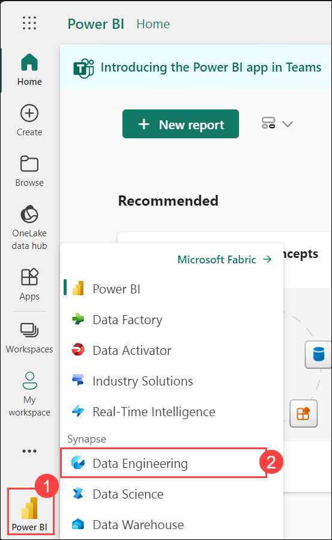

1. In the **Synapse Data Engineering** home page, select **Lakehouse**.

    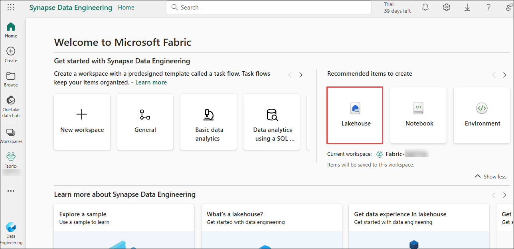

1. Follow these instructions to create a new **Lakehouse**:

   - **Name:** Enter **Lakehouse<inject key="DeploymentID" enableCopy="false"/> (1)**

   - Click on **Create (2)**
  
     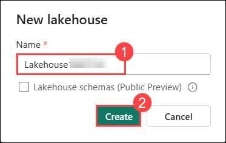

1. Return to the web browser tab containing your lakehouse, and in the **... (1)** menu for the **Files** folder in the **Explorer** pane, select **Upload (2)** and **Upload folder (3)**.

   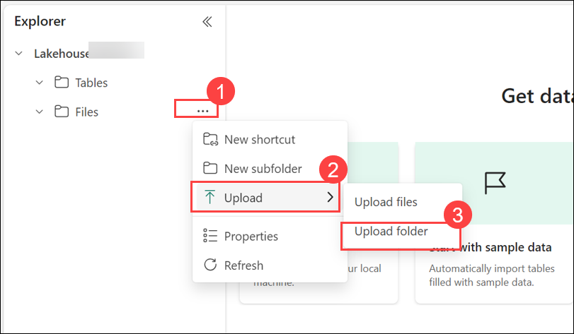

1. Then upload the **orders (1)** folder from **C:\LabFiles\DP-600-Implementing-Analytics-Solutions-Using-Microsoft-Fabric\Allfiles\LabFiles\orders** to the lakehouse, select **Upload (2)**, and close the pane.

   >**Note:** When prompted, for uploading 3 files, select **Upload**.

    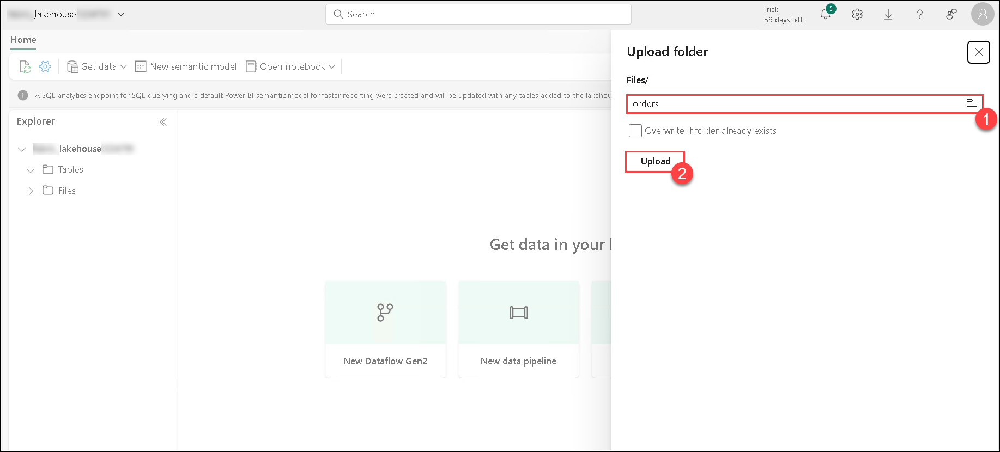

1. After the files have been uploaded, expand **Files** and select the **orders** folder; and verify that the CSV files have been uploaded, as shown here:

    

> **Congratulations** on completing the task! Now, it's time to validate it. Here are the steps:<br>
      - Navigate to the Lab Validation Page, from the upper right corner in the lab guide section.<br>
      - Hit the Validate button for the corresponding task. If you receive a success message, you can proceed to the next task.<br>
      - If not, carefully read the error message and retry the step, following the instructions in the lab guide.<br>
      - If you need any assistance, please contact us at labs-support@spektrasystems.com. We are available 24/7 to help!

### Task 2: Create a notebook

To work with data in Apache Spark, you can create a *notebook*. Notebooks provide an interactive environment in which you can write and run code (in multiple languages), and add notes to document it.

1. Navigate to the **Home** page and select **Notebook (2)**.

   

    >**Note:** If a pop up appears New data sources and languages now available click on skip tour.
    >**Note:** After a few seconds, a new notebook containing a single *cell* will open. Notebooks are made up of one or more cells that can contain *code* or *markdown* (formatted text).

1. Select the first cell (which is currently a *code* cell), and then in the dynamic toolbar at its top-right, use the **M&#8595;** button to convert the cell to a *markdown* cell. When the cell changes to a markdown cell, the text it contains is rendered.

    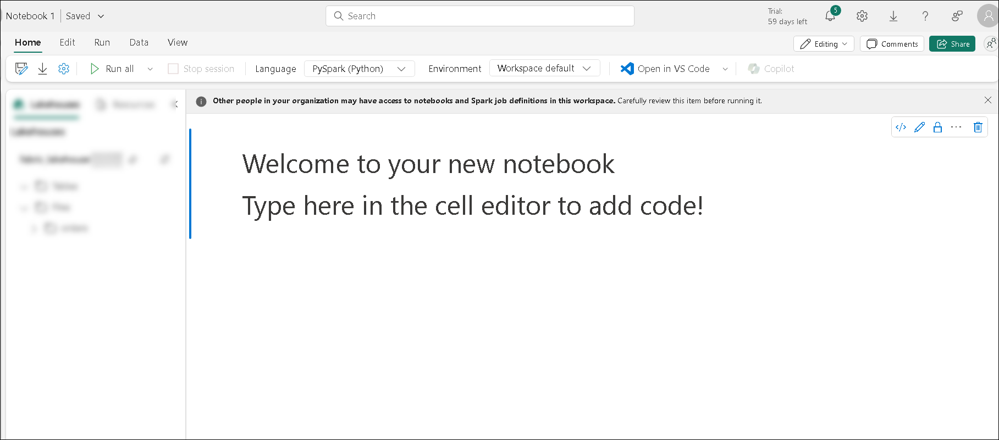

2. Use the **&#128393;** **(Edit)** button to switch the cell to editing mode, then modify the markdown as follows:

    ```
   # Sales order data exploration

   Use the code in this notebook to explore sales order data.
    ```

3. Click anywhere in the notebook outside of the cell to stop editing it and see the rendered markdown.

    

1. In the **Explorer** pane on the left, expand **Lakehouses** and click on  **Add** to add the existing Lakehouse.

   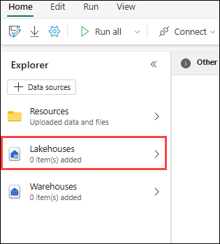

   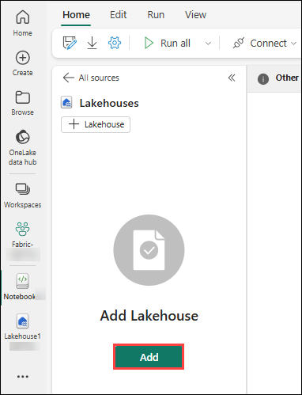

1. A pompt appears, make sure to select **Existing Lakehouse (1)** and then click on **Add (2)**.

   

1. On the **Discover data from your org and beyond and use it to create reports** page , select the **Lakehouse<inject key="DeploymentID" enableCopy="false"/> (1)** and then click on **Add (2).**

   

### Task 3: Load data into a dataframe

Now you're ready to run code that loads the data into a *dataframe*. Dataframes in Spark are similar to Pandas dataframes in Python, and provide a common structure for working with data in rows and columns.

> **Note**: Spark supports multiple coding languages, including Scala, Java, and others. In this exercise, we'll use *PySpark*, which is a Spark-optimized variant of Python. PySpark is one of the most commonly used languages on Spark and is the default language in Fabric notebooks.

1. In the hub menu bar on the left, select your lakehouse.

1. With the notebook visible, expand the **Files** list and select the **orders** folder so that the CSV files are listed next to the notebook editor, like this:

    

2. In the **orders (1)** folder, click on **... (2)** menu for **2019.csv**, select **Load data (3)** > **Spark (4)**.

   

3. A new code cell containing the following code should be added to the notebook:

    ```python
   df = spark.read.format("csv").option("header","true").load("Files/orders/2019.csv")
   # df now is a Spark DataFrame containing CSV data from "Files/orders/2019.csv".
   display(df)
    ```

    > **Tip**: You can hide the Lakehouse Explorer panes on the left by using their **<<** icons. Doing so will help you focus on the notebook.

4. Use the **&#9655; Run cell** button on the left of the cell to run it.

    > **Note**: Since this is the first time you've run any Spark code, a Spark session must be started. This means that the first run in the session can take a minute or so to complete. Subsequent runs will be quicker.

    

5. When the cell command has been completed, review the output below the cell, which should look similar to this:

    .png)

    The output shows the rows and columns of data from the 2019.csv file. However, note that the column headers don't look right. The default code used to load the data into a dataframe assumes that the CSV file includes the column names in the first row, but in this case, the CSV file just includes the data with no header information.

6. Modify the code to set the **header** option to **false** as follows:

    ```python
   df = spark.read.format("csv").option("header","false").load("Files/orders/2019.csv")
   # df now is a Spark DataFrame containing CSV data from "Files/orders/2019.csv".
   display(df)
    ```

7. Re-run the cell and review the output, which should look similar to this:

   .png)

    Now the dataframe correctly includes the first row as data values, but the column names are auto-generated and not very helpful. To make sense of the data, you need to explicitly define the correct schema and data type for the data values in the file.

8. Modify the code as follows to define a schema and apply it when loading the data:

    ```python
   from pyspark.sql.types import *

   orderSchema = StructType([
       StructField("SalesOrderNumber", StringType()),
       StructField("SalesOrderLineNumber", IntegerType()),
       StructField("OrderDate", DateType()),
       StructField("CustomerName", StringType()),
       StructField("Email", StringType()),
       StructField("Item", StringType()),
       StructField("Quantity", IntegerType()),
       StructField("UnitPrice", FloatType()),
       StructField("Tax", FloatType())
       ])

   df = spark.read.format("csv").schema(orderSchema).load("Files/orders/2019.csv")
   display(df)
    ```

9. Run the modified cell and review the output, which should look similar to this:

   .png)

    Now the dataframe includes the correct column names (in addition to the **Index**, which is a built-in column in all dataframes based on the ordinal position of each row). The data types of the columns are specified using a standard set of types defined in the Spark SQL library, which were imported at the beginning of the cell.

10. Confirm that your changes have been applied to the data by viewing the dataframe. Run the following cell:

    ```python
    display(df)
    ```

11. The dataframe includes only the data from the **2019.csv** file. Modify the code so that the file path uses a \* wildcard to read the sales order data from all of the files in the **orders** folder:

    ```python
    from pyspark.sql.types import *

    orderSchema = StructType([
        StructField("SalesOrderNumber", StringType()),
        StructField("SalesOrderLineNumber", IntegerType()),
        StructField("OrderDate", DateType()),
        StructField("CustomerName", StringType()),
        StructField("Email", StringType()),
        StructField("Item", StringType()),
        StructField("Quantity", IntegerType()),
        StructField("UnitPrice", FloatType()),
        StructField("Tax", FloatType())
    ])

    df = spark.read.format("csv").schema(orderSchema).load("Files/orders/*.csv")
    display(df)
    ```

11. Run the modified code cell and review the output, which should now include sales for 2019, 2020, and 2021.

    >**Note**: Only a subset of the rows is displayed, so you may not be able to see examples from all years.

### Task 4: Explore data in a dataframe

The dataframe object includes a wide range of functions that you can use to filter, group, and otherwise manipulate the data it contains.

#### Task 4.1: Filter a dataframe

1. Use the **+ Code** icon below the cell output to add a new code cell to the notebook, and enter the following code in it.

    ```Python
   customers = df['CustomerName', 'Email']
   print(customers.count())
   print(customers.distinct().count())
   display(customers.distinct())
    ```

2. Run the new code cell, and review the results. Observe the following details:
    - When you operate on a dataframe, the result is a new dataframe (in this case, a new **customers** dataframe is created by selecting a specific subset of columns from the **df** dataframe)
    - Dataframes provide functions such as **count** and **distinct** that can be used to summarize and filter the data they contain.
    - The `dataframe['Field1', 'Field2', ...]` syntax is a shorthand way of defining a subset of columns. You can also use the **select** method, so the first line of the code above could be written as `customers = df.select("CustomerName", "Email")`

3. Modify the code as follows:

    ```Python
   customers = df.select("CustomerName", "Email").where(df['Item']=='Road-250 Red, 52')
   print(customers.count())
   print(customers.distinct().count())
   display(customers.distinct())
    ```

4. Run the modified code to view the customers who have purchased the *Road-250 Red, 52* product. Note that you can "chain" multiple functions together so that the output of one function becomes the input for the next - in this case, the dataframe created by the **select** method is the source dataframe for the **where** method that is used to apply filtering criteria.

#### Task 4.2: Aggregate and group data in a dataframe

1. Add a new code cell to the notebook, and enter the following code in it:

    ```Python
   productSales = df.select("Item", "Quantity").groupBy("Item").sum()
   display(productSales)
    ```

2. Run the code cell you added, and note that the results show the sum of order quantities grouped by product. The **groupBy** method groups the rows by *Item*, and the subsequent **sum** aggregate function is applied to all of the remaining numeric columns (in this case, *Quantity*)

3. Add another new code cell to the notebook, and enter the following code in it:

    ```Python
   from pyspark.sql.functions import *

   yearlySales = df.select(year(col("OrderDate")).alias("Year")).groupBy("Year").count().orderBy("Year")
   display(yearlySales)
    ```

4. Run the code cell you added, and note that the results show the number of sales orders per year. Note that the **select** method includes a SQL **year** function to extract the year component of the *OrderDate* field (which is why the code includes an **import** statement to import functions from the Spark SQL library). It then uses an **alias** method is used to assign a column name to the extracted year value. The data is then grouped by the derived *Year* column and the count of rows in each group is calculated before finally the **orderBy** method is used to sort the resulting dataframe.

### Task 5: Use Spark to transform data files

A common task for data engineers is to ingest data in a particular format or structure and transform it for further downstream processing or analysis.

#### Task 5.1: Use dataframe methods and functions to transform data

1. Add another new code cell to the notebook, and enter the following code in it:

    ```Python
   from pyspark.sql.functions import *

   ## Create Year and Month columns
   transformed_df = df.withColumn("Year", year(col("OrderDate"))).withColumn("Month", month(col("OrderDate")))

   # Create the new FirstName and LastName fields
   transformed_df = transformed_df.withColumn("FirstName", split(col("CustomerName"), " ").getItem(0)).withColumn("LastName", split(col("CustomerName"), " ").getItem(1))

   # Filter and reorder columns
   transformed_df = transformed_df["SalesOrderNumber", "SalesOrderLineNumber", "OrderDate", "Year", "Month", "FirstName", "LastName", "Email", "Item", "Quantity", "UnitPrice", "Tax"]

   # Display the first five orders
   display(transformed_df.limit(5))
    ```

2. Run the code to create a new dataframe from the original order data with the following transformations:
    - Add **Year** and **Month** columns based on the **OrderDate** column.
    - Add **FirstName** and **LastName** columns based on the **CustomerName** column.
    - Filter and reorder the columns, removing the **CustomerName** column.

3. Review the output and verify that the transformations have been made to the data.

    You can use the full power of the Spark SQL library to transform the data by filtering rows, deriving, removing, renaming columns, and applying any other required data modifications.

    > **Tip**: See the [Spark dataframe documentation](https://spark.apache.org/docs/latest/api/python/reference/pyspark.sql/dataframe.html) to learn more about the methods of the Dataframe object.

#### Task 5.2: Save the transformed data

1. Add a new cell with the following code to save the transformed dataframe in Parquet format (Overwriting the data if it already exists):

    ```python
   transformed_df.write.mode("overwrite").parquet('Files/transformed_data/orders')
   print ("Transformed data saved!")
    ```

    > **Note**: Commonly, the *Parquet* format is preferred for data files that you will use for further analysis or ingestion into an analytical store. Parquet is a very efficient format that is supported by most large-scale data analytics systems. In fact, sometimes your data transformation requirement may simply be to convert data from another format (such as CSV) to Parquet!

2. Run the cell and wait for the message that the data has been saved. Then, in the **Explorer** pane on the left, in the **...** menu for the **Files** node, select **Refresh**; and select the **transformed_data** folder to verify that it contains a new folder named **orders**, which in turn contains one or more Parquet files.

    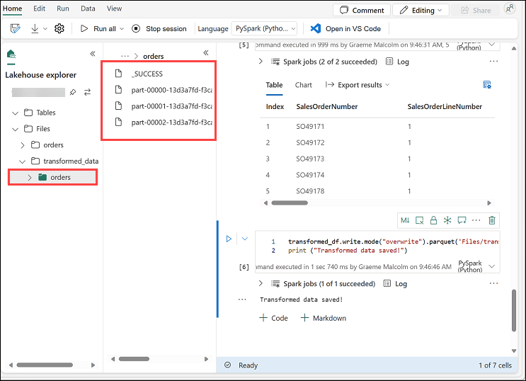

3. Add a new cell with the following code to load a new dataframe from the parquet files in the **transformed_orders/orders** folder:

    ```python
   orders_df = spark.read.format("parquet").load("Files/transformed_data/orders")
   display(orders_df)
    ```

4. Run the cell and verify that the results show the order data that has been loaded from the parquet files.

#### Task 5.3: Save data in partitioned files

1. Add a new cell with the following code; which saves the dataframe, partitioning the data by **Year** and **Month**:

    ```python
   orders_df.write.partitionBy("Year","Month").mode("overwrite").parquet("Files/partitioned_data")
   print ("Transformed data saved!")
    ```

2. Run the cell and wait for the message that the data has been saved. Then, in the **Explorer** pane on the left, in the **...** menu for the **Files** node, select **Refresh**; and expand the **partitioned_data** folder to verify that it contains a hierarchy of folders named **Year=*xxxx***, each containing folders named **Month=*xxxx***. Each month's folder contains a parquet file with the orders for that month.

    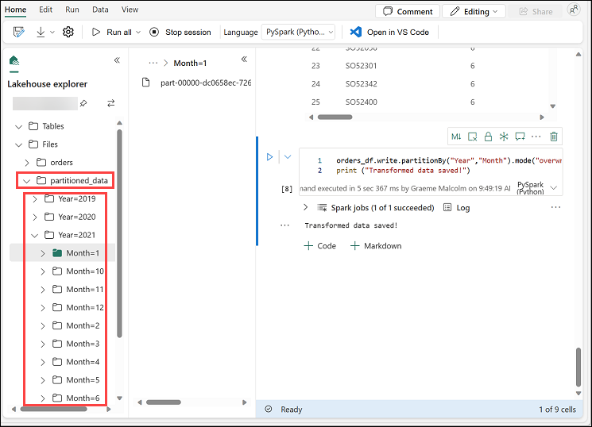

    Partitioning data files is a common way to optimize performance when dealing with large volumes of data. This technique can significantly improve performance and make it easier to filter data.

3. Add a new cell with the following code to load a new dataframe from the **orders.parquet** file:

    ```python
   orders_2021_df = spark.read.format("parquet").load("Files/partitioned_data/Year=2021/Month=*")
   display(orders_2021_df)
    ```

4. Run the cell and verify that the results show the order data for sales in 2021. Note that the partitioning columns specified in the path (**Year** and **Month**) are not included in the dataframe.

### Task 6: Work with tables and SQL

As you've seen, the native methods of the dataframe object enable you to query and analyze data from a file quite effectively. However, many data analysts are more comfortable working with tables that they can query using SQL syntax. Spark provides a *metastore* in which you can define relational tables. The Spark SQL library that provides the dataframe object also supports the use of SQL statements to query tables in the metastore. By using these capabilities of Spark, you can combine the flexibility of a data lake with the structured data schema and SQL-based queries of a relational data warehouse - hence the term "data lakehouse".

#### Task 6.1: Create a table

Tables in a Spark metastore are relational abstractions over files in the data lake. tables can be *managed* (in which case the files are managed by the metastore) or *external* (in which case the table references a file location in the data lake that you manage independently of the metastore).

1. Add a new code cell to the notebook, and enter the following code, which saves the dataframe of sales order data as a table named **salesorders**:

    ```Python
   # Create a new table
   df.write.format("delta").saveAsTable("salesorders")

   # Get the table description
   spark.sql("DESCRIBE EXTENDED salesorders").show(truncate=False)
    ```

    > **Note:** It's worth noting a couple of things about this example. Firstly, no explicit path is provided, so the files for the table will be managed by the metastore. Secondly, the table is saved in **delta** format. You can create tables based on multiple file formats (including CSV, Parquet, Avro, and others) but *delta lake* is a Spark technology that adds relational database capabilities to tables; including support for transactions, row versioning, and other useful features. Creating tables in delta format is preferred for data lakehouses in Fabric.

2. Run the code cell and review the output, which describes the definition of the new table.

3. In the **Explorer** pane, in the **...** menu for the **Tables** folder, select **Refresh**. Then expand the **Tables** node and verify that the **salesorders** table has been created.

    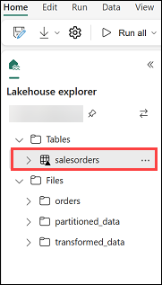

4. In the **... (1)** menu for the **salesorders** table, select **Load data (2)** > **Spark (3)**.

   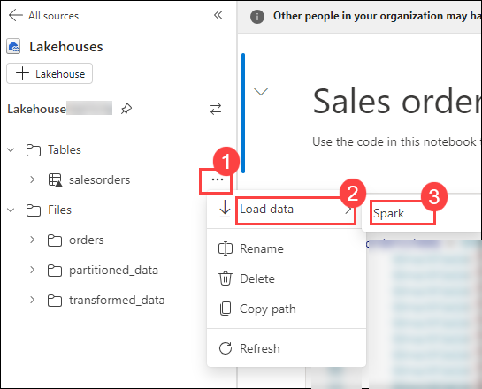

    A new code cell containing code similar to the following example is added to the notebook:

    ```Python
   df = spark.sql("SELECT * FROM [your_lakehouse].salesorders LIMIT 1000")
   display(df)
    ```

6. Run the new code, which uses the Spark SQL library to embed a SQL query against the **salesorder** table in PySpark code and load the results of the query into a dataframe.

#### Task 6.2: Run SQL code in a cell

While it's useful to be able to embed SQL statements into a cell containing PySpark code, data analysts often just want to work directly in SQL.

1. Add a new code cell to the notebook, and enter the following code in it:

    ```SQL
   %%sql
   SELECT YEAR(OrderDate) AS OrderYear,
          SUM((UnitPrice * Quantity) + Tax) AS GrossRevenue
   FROM salesorders
   GROUP BY YEAR(OrderDate)
   ORDER BY OrderYear;
    ```

2. Run the cell and review the results. Observe that:
    - The `%%sql` line at the beginning of the cell (called a *magic*) indicates that the Spark SQL language runtime should be used to run the code in this cell instead of PySpark.
    - The SQL code references the **salesorders** table that you created previously.
    - The output from the SQL query is automatically displayed as the result under the cell.

> **Note**: For more information about Spark SQL and dataframes, see the [Spark SQL documentation](https://spark.apache.org/docs/2.2.0/sql-programming-guide.html).

### Task 7: Visualize data with Spark

A picture is proverbially worth a thousand words, and a chart is often better than a thousand rows of data. While notebooks in Fabric include a built-in chart view for data that is displayed from a dataframe or Spark SQL query, it is not designed for comprehensive charting. However, you can use Python graphics libraries like **matplotlib** and **seaborn** to create charts from data in dataframes.

#### Task 7.1: View results as a chart

1. Add a new code cell to the notebook, and enter the following code in it:

    ```SQL
   %%sql
   SELECT * FROM salesorders
    ```

2. Run the code and observe that it returns the data from the **salesorders** view you created previously.

3. In the results section beneath the cell, change the **View** option from **Table** to **Chart**.

4. Use the **Customize chart** button at the top right of the chart to display the options pane for the chart. Then set the options as follows and select **Apply**:
    - **Chart type**: Bar chart
    - **Key**: Item
    - **Values**: Quantity
    - **Series Group**: *leave blank*
    - **Aggregation**: Sum
    - **Stacked**: *Unselected*

5. Verify that the chart looks similar to this:

    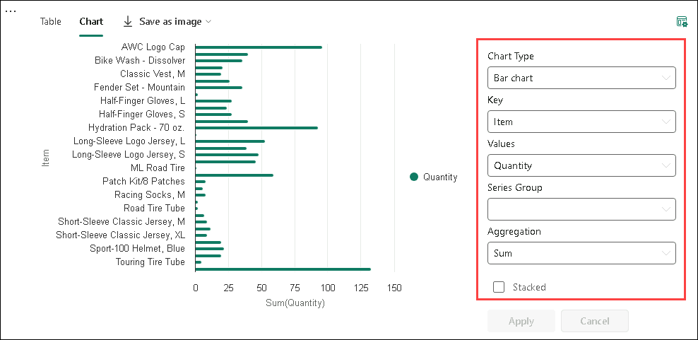

#### Task 7.2: Get started with **matplotlib**

1. Add a new code cell to the notebook, and enter the following code in it:

    ```Python
   sqlQuery = "SELECT CAST(YEAR(OrderDate) AS CHAR(4)) AS OrderYear, \
                   SUM((UnitPrice * Quantity) + Tax) AS GrossRevenue \
               FROM salesorders \
               GROUP BY CAST(YEAR(OrderDate) AS CHAR(4)) \
               ORDER BY OrderYear"
   df_spark = spark.sql(sqlQuery)
   df_spark.show()
    ```

2. Run the code and observe that it returns a Spark dataframe containing the yearly revenue.

    To visualize the data as a chart, we'll start by using the **matplotlib** Python library. This library is the core plotting library on which many others are based, and provides a great deal of flexibility in creating charts.

3. Add a new code cell to the notebook, and add the following code to it:

    ```Python
   from matplotlib import pyplot as plt

   # matplotlib requires a Pandas dataframe, not a Spark one
   df_sales = df_spark.toPandas()

   # Create a bar plot of revenue by year
   plt.bar(x=df_sales['OrderYear'], height=df_sales['GrossRevenue'])

   # Display the plot
   plt.show()
    ```

4. Run the cell and review the results, which consist of a column chart with the total gross revenue for each year. Note the following features of the code used to produce this chart:
    - The **matplotlib** library requires a *Pandas* dataframe, so you need to convert the *Spark* dataframe returned by the Spark SQL query to this format.
    - At the core of the **matplotlib** library is the **pyplot** object. This is the foundation for most plotting functionality.
    - The default settings result in a usable chart, but there's considerable scope to customize it

5. Modify the code to plot the chart as follows:

    ```Python
   from matplotlib import pyplot as plt

   # Clear the plot area
   plt.clf()

   # Create a bar plot of revenue by year
   plt.bar(x=df_sales['OrderYear'], height=df_sales['GrossRevenue'], color='orange')

   # Customize the chart
   plt.title('Revenue by Year')
   plt.xlabel('Year')
   plt.ylabel('Revenue')
   plt.grid(color='#95a5a6', linestyle='--', linewidth=2, axis='y', alpha=0.7)
   plt.xticks(rotation=45)

   # Show the figure
   plt.show()
    ```

6. Re-run the code cell and view the results. The chart now includes a little more information.

    A plot is technically contained with a **Figure**. In the previous examples, the figure was created implicitly for you; but you can create it explicitly.

7. Modify the code to plot the chart as follows:

    ```Python
   from matplotlib import pyplot as plt

   # Clear the plot area
   plt.clf()

   # Create a Figure
   fig = plt.figure(figsize=(8,3))

   # Create a bar plot of revenue by year
   plt.bar(x=df_sales['OrderYear'], height=df_sales['GrossRevenue'], color='orange')

   # Customize the chart
   plt.title('Revenue by Year')
   plt.xlabel('Year')
   plt.ylabel('Revenue')
   plt.grid(color='#95a5a6', linestyle='--', linewidth=2, axis='y', alpha=0.7)
   plt.xticks(rotation=45)

   # Show the figure
   plt.show()
    ```

8. Re-run the code cell and view the results. The figure determines the shape and size of the plot.

    A figure can contain multiple subplots, each on its own *axis*.

9. Modify the code to plot the chart as follows:

    ```Python
   from matplotlib import pyplot as plt

   # Clear the plot area
   plt.clf()

   # Create a figure for 2 subplots (1 row, 2 columns)
   fig, ax = plt.subplots(1, 2, figsize = (10,4))

   # Create a bar plot of revenue by year on the first axis
   ax[0].bar(x=df_sales['OrderYear'], height=df_sales['GrossRevenue'], color='orange')
   ax[0].set_title('Revenue by Year')

   # Create a pie chart of yearly order counts on the second axis
   yearly_counts = df_sales['OrderYear'].value_counts()
   ax[1].pie(yearly_counts)
   ax[1].set_title('Orders per Year')
   ax[1].legend(yearly_counts.keys().tolist())

   # Add a title to the Figure
   fig.suptitle('Sales Data')

   # Show the figure
   plt.show()
    ```

10. Re-run the code cell and view the results. The figure contains the subplots specified in the code.

> **Note:** To learn more about plotting with matplotlib, see the [matplotlib documentation](https://matplotlib.org/).

#### Task 7.3: Use the **seaborn** library

While **matplotlib** enables you to create complex charts of multiple types, it can require some complex code to achieve the best results. For this reason, over the years, many new libraries have been built on the base of matplotlib to abstract its complexity and enhance its capabilities. One such library is **seaborn**.

1. Add a new code cell to the notebook, and enter the following code in it:

    ```Python
   import seaborn as sns

   # Clear the plot area
   plt.clf()

   # Create a bar chart
   ax = sns.barplot(x="OrderYear", y="GrossRevenue", data=df_sales)
   plt.show()
    ```

2. Run the code and observe that it displays a bar chart using the seaborn library.

3. Modify the code as follows:

    ```Python
   import seaborn as sns

   # Clear the plot area
   plt.clf()

   # Set the visual theme for seaborn
   sns.set_theme(style="whitegrid")

   # Create a bar chart
   ax = sns.barplot(x="OrderYear", y="GrossRevenue", data=df_sales)
   plt.show()
    ```

4. Run the modified code and note that seaborn enables you to set a consistent color theme for your plots.

5. Modify the code again as follows:

    ```Python
   import seaborn as sns

   # Clear the plot area
   plt.clf()

   # Create a bar chart
   ax = sns.lineplot(x="OrderYear", y="GrossRevenue", data=df_sales)
   plt.show()
    ```

6. Run the modified code to view the yearly revenue as a line chart.

    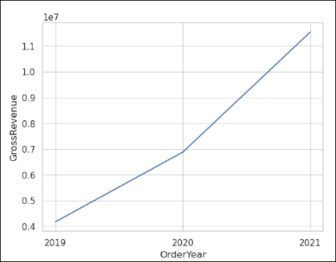

    > **Note**: To learn more about plotting with seaborn, see the [seaborn documentation](https://seaborn.pydata.org/index.html).

### Task 8: Save the notebook and end the Spark session

Now that you've finished working with the data, you can save the notebook with a meaningful name and end the Spark session.

1. In the notebook menu bar, select **Notebook 1 | Saved**.

   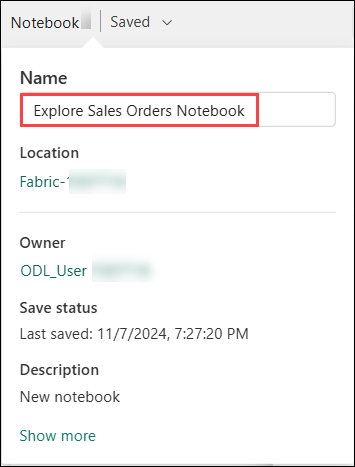

3. Set the **Name** of the notebook to **Explore Sales Orders Notebook**, and press enter.

    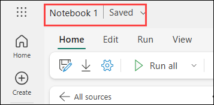

5. On the notebook menu, select **Stop session** to end the Spark session.

   

> **Congratulations** on completing the task! Now, it's time to validate it. Here are the steps:<br>
      - Navigate to the Lab Validation Page, from the upper right corner in the lab guide section.<br>
      - Hit the Validate button for the corresponding task. If you receive a success message, you can proceed to the next task.<br>
      - If not, carefully read the error message and retry the step, following the instructions in the lab guide.<br>
      - If you need any assistance, please contact us at labs-support@spektrasystems.com. We are available 24/7 to help!

### Review
 In this lab, you have completed the following :
- Created a lakehouse and upload files
- Created a notebook
- Loaded data into a dataframe
- Explored data in a dataframe
- Filtered a dataframe
- Aggregated and group data in a dataframe
- Used Spark to transform data files
- Used dataframe methods and functions to transform data
- Saved the transformed data
- Saved data in partitioned files
- Worked with tables and SQL
- Created a table
- Ran SQL code in a cell
- Visualized data with Spark
- Viewed results as a chart
- Get started with **matplotlib**
- Used the **seaborn** library
- Saved the notebook and end the Spark session

## You have successfully completed this lab, please proceed with the upcoming modules.

