# Module 03b: Work with Delta Lake tables in Microsoft Fabric

## Lab scenario

Tables in a Microsoft Fabric lakehouse are based on the open source Delta Lake format for Apache Spark. Delta Lake adds support for relational semantics for both batch and streaming data operations, and enables the creation of a Lakehouse architecture in which Apache Spark can be used to process and query data in tables that are based on underlying files in a data lake.

>**Note:** You need a Microsoft school or work account to complete this exercise. If you don’t have one, you can sign up for a trial of Microsoft Office 365 E3 or higher.

## Lab objectives
In this lab, you will perform:

- Create a lakehouse and upload files
- Explore data in a dataframe
- Create delta tables
- Create a managed table
- Create an external table
- Compare managed and external tables
- Use SQL to create a table
- Explore table versioning
- Use delta tables for streaming data

## Estimated timing: 40 minutes

## Architecture Diagram

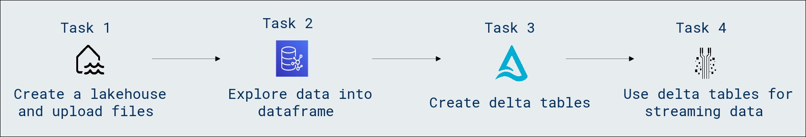

### Task 1: Create a lakehouse and upload data

It’s time to create a data lakehouse for the data you’re going to analyze.

1. At the bottom left of the Power BI portal, select the **Power BI (1)** icon and switch to the **Data Engineering (2)** experience.

   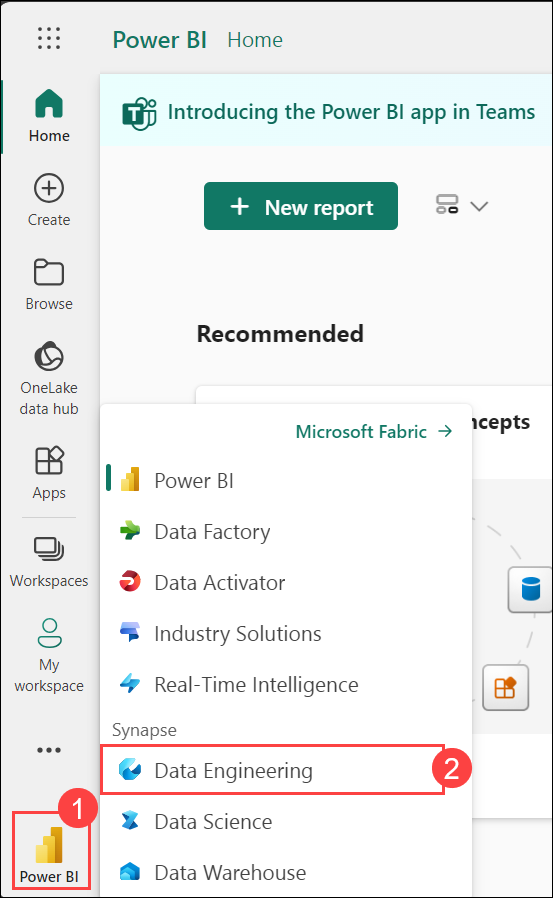
   
1. In the **Data engineering** home page, click on **Lakehouse** to create a new lakehouse.

    - **Name:** Enter **Lakehouse<inject key="DeploymentID" enableCopy="false"/> (1)**

    - Click on **Create (2)**.

      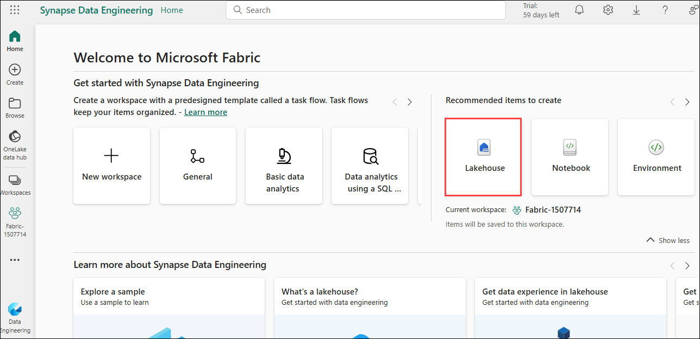
  
      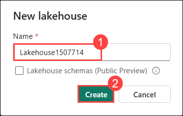

        >**Note:** After a minute or so, a new lakehouse with no **Tables** or **Files** will be created.

1. On the **Lakehouse<inject key="DeploymentID" enableCopy="false"/>** tab in the pane on the left, in the **...** menu for the **Files (1)** node, select **New subfolder (2)** and create a subfolder named **new_data**.

   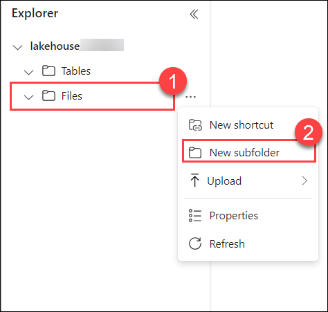

1. Open a new tab, and download the **[data file](https://github.com/MicrosoftLearning/dp-data/blob/main/products.csv)**, saving it as **products.csv** on your lab VM.

1. Return to the web browser tab containing your lakehouse, and in the **…** menu for the **Files** folder in the **Explorer** pane, select **New subfolder** and **create (2)** a folder named **products (1)**.

   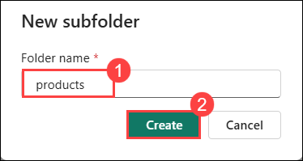

1. In the **… (1)** menu for the **products** folder, select **Upload (2)** and **Upload files (2)**, then upload the **products.csv** file from your lab VM to the lakehouse, and again select **Upload**. Close the **Upload files** pane.

   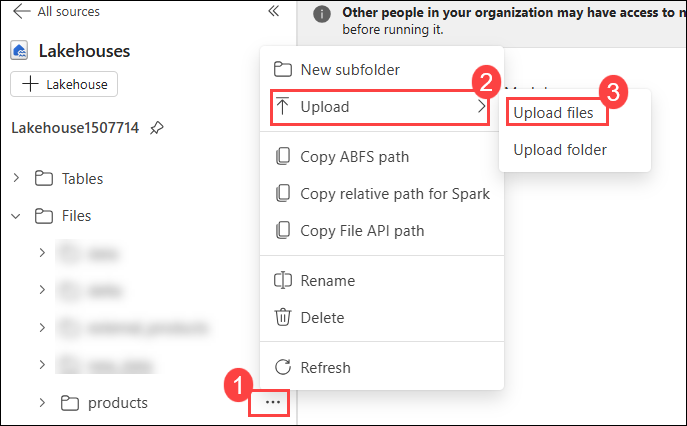

   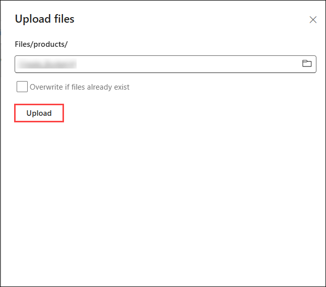

1. After the file has been uploaded, select the **products (1)** folder, and verify that the **products.csv (2)** file has been uploaded, as shown here:

    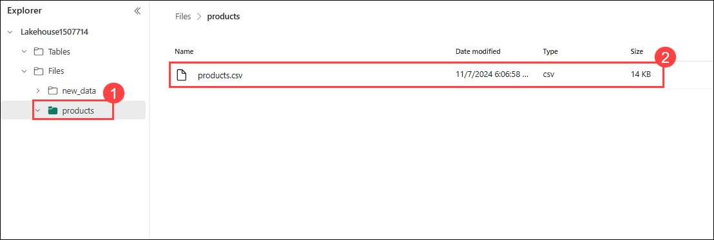

> **Congratulations** on completing the task! Now, it's time to validate it. Here are the steps:<br>
      - Navigate to the Lab Validation Page, from the upper right corner in the lab guide section.<br>
      - Hit the Validate button for the corresponding task. If you receive a success message, you can proceed to the next task.<br>
      - If not, carefully read the error message and retry the step, following the instructions in the lab guide.<br>
      - If you need any assistance, please contact us at labs-support@spektrasystems.com. We are available 24/7 to help!

### Task 2: Explore data in a dataframe

1. Navigate to the **Home (1)** and then select **Notebook (2)**.

   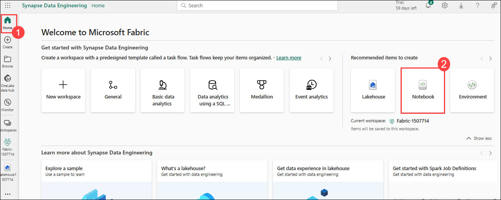

    >**Note:** If a pop up appears New data sources and languages now available click on skip tour.

    >**Note:** After a few seconds, a new notebook containing a single cell will open. Notebooks are made up of one or more cells that can contain code or markdown (formatted text).

3. Select the existing cell in the notebook, which contains some simple code, and then use its **🗑 (Delete)** icon at its top-right to remove it - you will not need this code.

   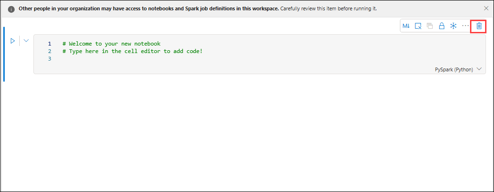

1. In the **Explorer** pane on the left, expand **Lakehouses** and click on  **Add** to add the existing Lakehouse.

   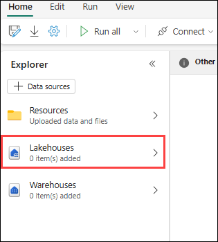

   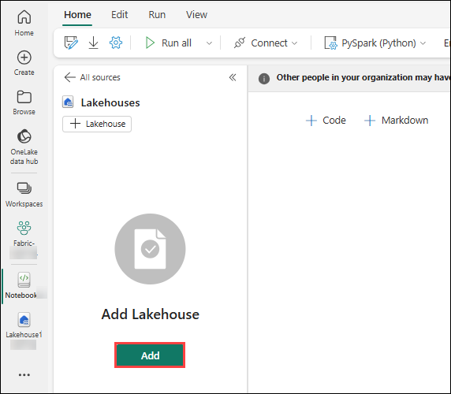

1. A pompt appears, make sure to select **Existing Lakehouse (1)** and then click on **Add (2)**.

   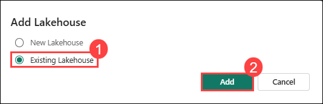

1. On the **Discover data from your org and beyond and use it to create reports** page , select the **Lakehouse<inject key="DeploymentID" enableCopy="false"/> (1)** and then click on **Add (2).**

   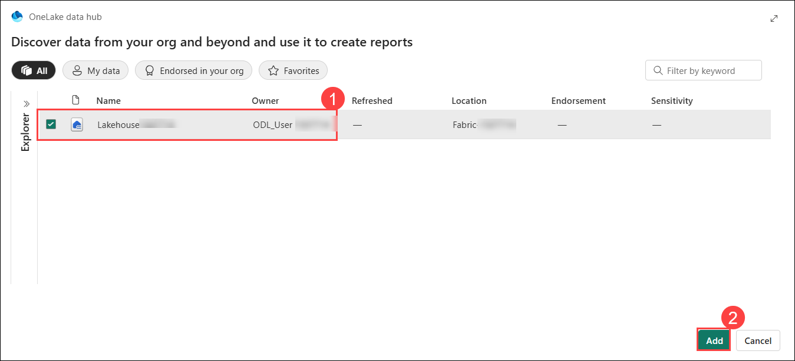
   
1. Expand **Files** > **products** ,In the **…** menu for **products.csv (1)**, select **Load data (2)** > **Spark (3)**. A new code cell containing the following code should be added to the notebook:

   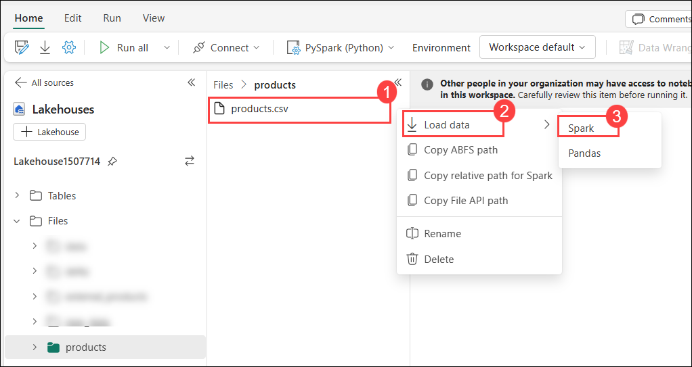

    ```python
    df = spark.read.format("csv").option("header","true").load("Files/products/products.csv")
    # df now is a Spark DataFrame containing CSV data from "Files/products/products.csv".
    display(df)
    ```

    >**Tip:** You can hide the pane containing the files on the left by using its « icon. Doing so will help you focus on the notebook.

1. Use the **▷ (Run cell)** button on the left of the cell to run it.

    >**Note:** Since this is the first time you’ve run any Spark code in this notebook, a Spark session must be started. This means that the first run can take a minute or so to complete. Subsequent runs will be quicker.

1. When the cell command has completed, review the output below the cell, which should look similar to this:

    .png)

### Task 3: Create delta tables

You can save the dataframe as a delta table by using the **saveAsTable** method. Delta Lake supports the creation of both managed and external tables.

#### Task 3.1: Create a managed table

Managed tables are tables for which both the schema metadata and the data files are managed by Fabric. The data files for the table are created in the **Tables** folder.

1. Under the results returned by the first code cell, use the **+ Code** icon to add a new code cell if one doesn’t already exist.

    >**Tip:** To see the **+ Code** icon, move the mouse to just below and to the left of the output from the current cell.

1. Enter the following code in the new cell and run it:

    ```python
    df.write.format("delta").saveAsTable("managed_products")
    ```

1. In the **Lakehouse explorer** pane, in the **…** menu for the **Tables** folder, select **Refresh**. Then expand the **Tables (1)** node and verify that the **managed_products (2)** table has been created.

    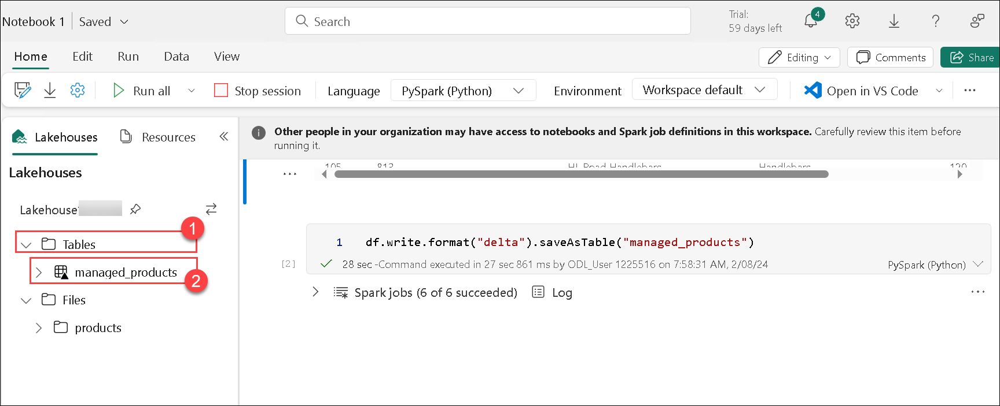

#### Task 3.2: Create an external table

You can also create external tables for which the schema metadata is defined in the metastore for the lakehouse, but the data files are stored in an external location.

1. Add another new code cell, and add the following code to it:

    ```python
    df.write.format("delta").saveAsTable("external_products", path="abfs_path/external_products")
    ```

1. In the **Lakehouse explorer** pane, in the **…** menu for the **Files (1)** folder, select **Copy ABFS path (2)**.

   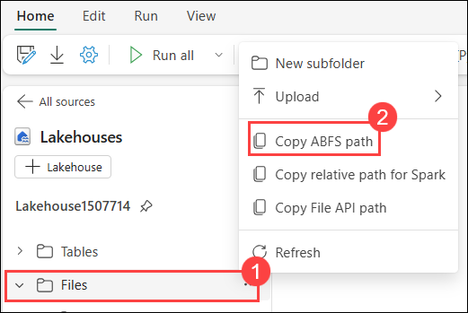

    >**Note:** The ABFS path is the fully qualified path to the **Files** folder in the OneLake storage for your lakehouse - similar to this:
    **abfss://6155fefc-704a-45e2-ba11-cdbeeb0b4a01@onelake.dfs.fabric.microsoft.com/a4a7c03e-fe4d-4cc8-a3a8-62a6fd0a693c/Files**

1. In the code you entered into the code cell, replace **abfs_path** with the path you copied to the clipboard and run the code, so that the code saves the dataframe as an external table with data files in a folder named **external_products** in your **Files** folder location. The full path should look similar to this: **abfss://6155fefc-704a-45e2-ba11-cdbeeb0b4a01@onelake.dfs.fabric.microsoft.com/a4a7c03e-fe4d-4cc8-a3a8-62a6fd0a693c/Files/external_products**

1. In the **Lakehouse explorer** pane, in the **…** menu for the **Tables** folder, select **Refresh**. Then expand the **Tables (1)** node and verify that the **external_products (2)** table has been created.

    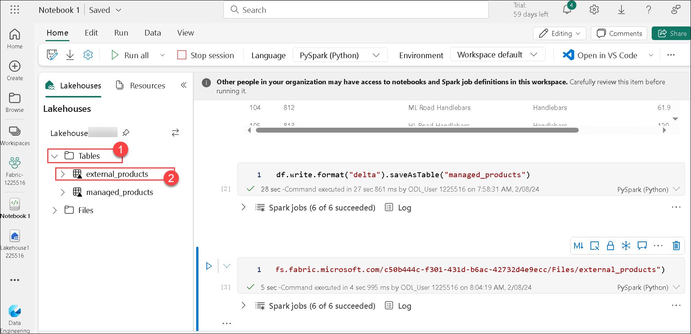

1. In the **Lakehouse explorer** pane, in the **…** menu for the **Files** folder, select **Refresh**. Then expand the **Files (1)** node and verify that the **external_products (2)** folder has been created for the table’s data files.

    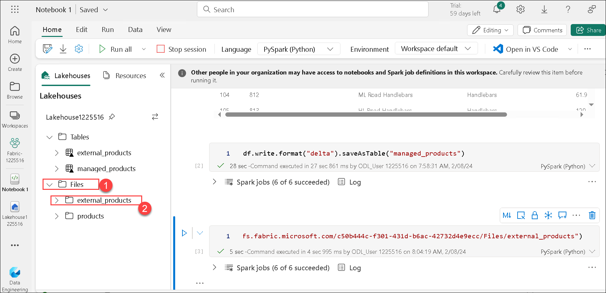

#### Task 3.3: Compare managed and external tables

Let’s explore the differences between managed and external tables.

1. Add another code cell and run the following code:

    ```Sql
    %%sql

    DESCRIBE FORMATTED managed_products;
    ```

    >**Note:** In the results, view the **Location** property for the table, which should be a path to the OneLake storage for the lakehouse ending with **/Tables/managed_products** (you may need to widen the **Data type** column to see the full path).

1. Modify the **DESCRIBE** command to show the details of the **external_products** table as shown here:

    ```Sql
    %%sql

    DESCRIBE FORMATTED external_products;
    ```
    >**Note:** In the results, view the **Location** property for the table, which should be a path to the OneLake storage for the lakehouse ending with **/Files/external_products** (you may need to widen the **Data type** column to see the full path).

    > The files for managed table are stored in the **Tables** folder in the OneLake storage for the lakehouse. In this case, a folder named **managed_products** has been created to store the Parquet files and **delta_log** folder for the table you created.

1. Add another code cell and run the following code:

    ```Sql
    %%sql

    DROP TABLE managed_products;
    DROP TABLE external_products;
    ```

1. In the **Lakehouse explorer** pane, in the **…** menu for the **Tables** folder, select **Refresh**. Then expand the **Tables** node and verify that no tables are listed.

1. In the **Lakehouse explorer** pane, expand the **Files (1)** folder and verify that the **external_products (2)** has not been deleted. Select this folder to view the Parquet data files and **_delta_log (3)** folder for the data that was previously in the **external_products** table. The table metadata for the external table was deleted, but the files were not affected.

    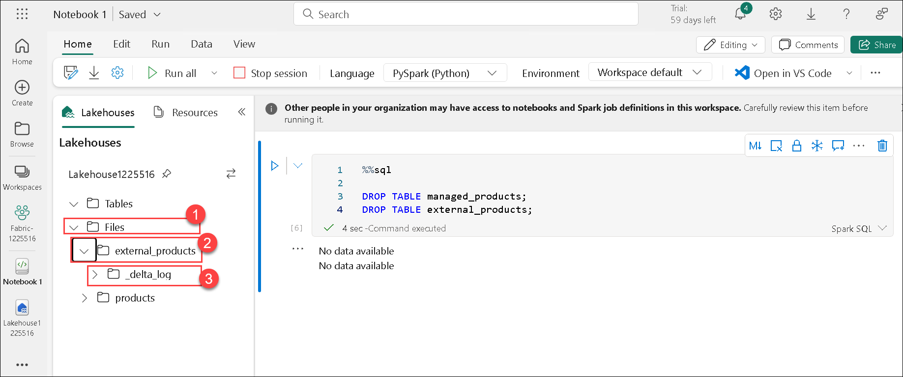

#### Task 3.4: Use SQL to create a table

1. Add another code cell and run the following code:

    ```Sql
    %%sql

    CREATE TABLE products
    USING DELTA
    LOCATION 'Files/external_products';
    ```

1. In the **Lakehouse explorer** pane, in the **…** menu for the **Tables** folder, select **Refresh**. Then expand the **Tables (1)** node and verify that a new table named **products (2)** is listed. Then expand the table to verify that its schema matches the original dataframe that was saved in the **external_products** folder.

    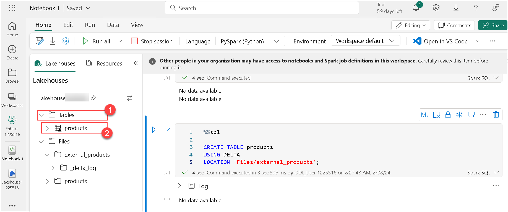

1. Add another code cell and run the following code:

    ```Sql
    %%sql

    SELECT * FROM products;
    ```

#### Task 3.5: Explore table versioning

Transaction history for delta tables is stored in JSON files in the **delta_log** folder. You can use this transaction log to manage data versioning.

1. Add a new code cell to the notebook and run the following code:

    ```Sql
    %%sql

    UPDATE products
    SET ListPrice = ListPrice * 0.9
    WHERE Category = 'Mountain Bikes';
    ```

    >**Note:** This code implements a 10% reduction in the price for mountain bikes.

1. Add another code cell and run the following code:

    ```Sql
    %%sql

    DESCRIBE HISTORY products;
    ```

    >**Note:** The results show the history of transactions recorded for the table.

1. Add another code cell and run the following code:

    ```python
    delta_table_path = 'Files/external_products'

    # Get the current data
    current_data = spark.read.format("delta").load(delta_table_path)
    display(current_data)

    # Get the version 0 data
    original_data = spark.read.format("delta").option("versionAsOf", 0).load(delta_table_path)
    display(original_data)
    ```

    >**Note:** The results show two dataframes - one containing the data after the price reduction, and the other showing the original version of the data.

### Task 4: Use delta tables for streaming data

Delta lake supports streaming data. Delta tables can be a sink or a source for data streams created using the Spark Structured Streaming API. In this example, you’ll use a delta table as a sink for some streaming data in a simulated internet of things (IoT) scenario.

1. Add a new code cell in the notebook. Then, in the new cell, add the following code and run it:

    ```python
    from notebookutils import mssparkutils
    from pyspark.sql.types import *
    from pyspark.sql.functions import *

    # Create a folder
    inputPath = 'Files/data/'
    mssparkutils.fs.mkdirs(inputPath)

    # Create a stream that reads data from the folder, using a JSON schema
    jsonSchema = StructType([
    StructField("device", StringType(), False),
    StructField("status", StringType(), False)
    ])
    iotstream = spark.readStream.schema(jsonSchema).option("maxFilesPerTrigger", 1).json(inputPath)

    # Write some event data to the folder
    device_data = '''{"device":"Dev1","status":"ok"}
    {"device":"Dev1","status":"ok"}
    {"device":"Dev1","status":"ok"}
    {"device":"Dev2","status":"error"}
    {"device":"Dev1","status":"ok"}
    {"device":"Dev1","status":"error"}
    {"device":"Dev2","status":"ok"}
    {"device":"Dev2","status":"error"}
    {"device":"Dev1","status":"ok"}'''
    mssparkutils.fs.put(inputPath + "data.txt", device_data, True)
    print("Source stream created...")
    ```

    >**Note:** Ensure the message Source stream created… is printed. The code you just ran has created a streaming data source based on a folder to which some data has been saved, representing readings from hypothetical IoT devices.

1. In a new code cell, add and run the following code:

    ```python
    # Write the stream to a delta table
    delta_stream_table_path = 'Tables/iotdevicedata'
    checkpointpath = 'Files/delta/checkpoint'
    deltastream = iotstream.writeStream.format("delta").option("checkpointLocation", checkpointpath).start(delta_stream_table_path)
    print("Streaming to delta sink...")
    ```
    >**Note:** This code writes the streaming device data in delta format to a folder named iotdevicedata. Because the path for the folder location in the Tables folder, a table will automatically be created for it.

1. In a new code cell, add and run the following code:

    ```Sql
    %%sql

    SELECT * FROM IotDeviceData;
    ```
    >**Note:** This code queries the IotDeviceData table, which contains the device data from the streaming source.

1. In a new code cell, add and run the following code:

    ```python
    # Add more data to the source stream
    more_data = '''{"device":"Dev1","status":"ok"}
    {"device":"Dev1","status":"ok"}
    {"device":"Dev1","status":"ok"}
    {"device":"Dev1","status":"ok"}
    {"device":"Dev1","status":"error"}
    {"device":"Dev2","status":"error"}
    {"device":"Dev1","status":"ok"}'''

    mssparkutils.fs.put(inputPath + "more-data.txt", more_data, True)
    ```

    >**Note:** This code writes more hypothetical device data to the streaming source.

1. Re-run the cell containing the following code:

    ```Sql
    %%sql

    SELECT * FROM IotDeviceData;
    ```
    >**Note:** This code queries the **IotDeviceData** table again, which should now include the additional data that was added to the streaming source.

1. In a new code cell, add and run the following code:

    ```python
    deltastream.stop()
    ```

    >**Note:** This code stops the stream.

### Review
 In this lab, you have completed the following :
- Created a lakehouse and upload files
- Explored data in a dataframe
- Created delta tables
- Created a managed table
- Created an external table
- Compared managed and external tables
- Used SQL to create a table
- Explored table versioning
- Used delta tables for streaming data

## You have successfully completed this lab, please proceed with the upcoming modules.
