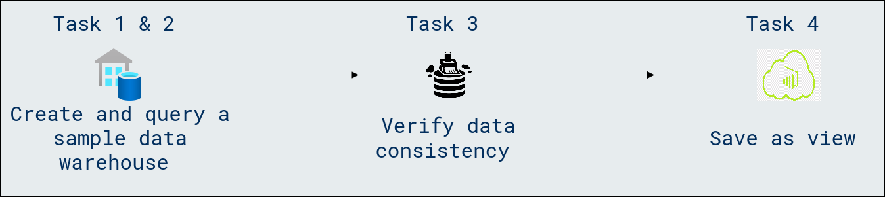
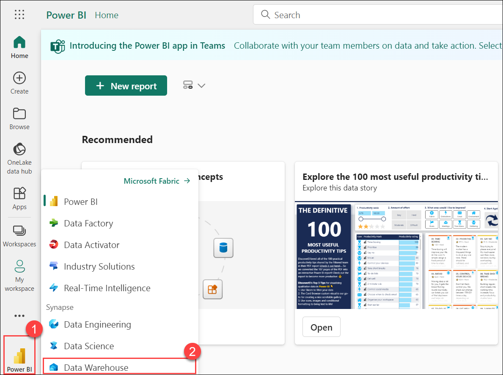
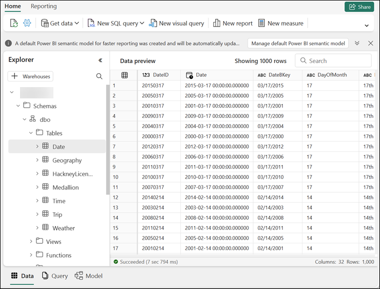
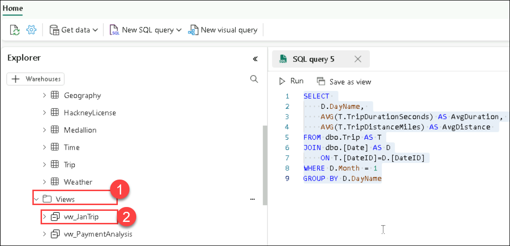

# Module 05a: Query a data warehouse in Microsoft Fabric

## Lab scenario
In Microsoft Fabric, a data warehouse provides a relational database for large-scale analytics. The rich set of experiences built into Microsoft Fabric workspace enables customers to reduce their time to insights by having an easily consumable, always connected semantic model that is integrated with Power BI in DirectLake mode.

>**Note:** You need a Microsoft school or work account to complete this exercise. If you don’t have one, you can sign up for a trial of Microsoft Office 365 E3 or higher.

## Lab objectives
In this lab, you will perform:

- Create a sample data warehouse
- Query the data warehouse
- Verify data consistency
- Save as view

## Estimated timing: 30 minutes

## Architecture Diagram



### Task 1: Create a sample data warehouse

Now that you have a workspace, it’s time to create a data warehouse.

1. At the bottom left of the Power BI portal, select the **Power BI (1)** icon and switch to the **Data Warehouse (2)** experience.

   

1. On the Home page, select **Sample warehouse** and create a new data warehouse named **Warehouse<inject key="DeploymentID" enableCopy="false"/>**.

    >**Note:** After a minute or so, a new warehouse will be created and populated with sample data for a taxi ride analysis scenario.

    

    >**Note:** If the Sample Warehouse option does not appear, please wait for at least 15 minutes and ensure that you have not selected the Warehouse option.
    
> **Congratulations** on completing the task! Now, it's time to validate it. Here are the steps:<br>
      - Navigate to the Lab Validation Page, from the upper right corner in the lab guide section.<br>
      - Hit the Validate button for the corresponding task. If you receive a success message, you can proceed to the next task.<br>
      - If not, carefully read the error message and retry the step, following the instructions in the lab guide.<br>
      - If you need any assistance, please contact us at labs-support@spektrasystems.com. We are available 24/7 to help!

### Task 2: Query the data warehouse

The SQL query editor provides support for IntelliSense, code completion, syntax highlighting, client-side parsing, and validation. You can run Data Definition Language (DDL), Data Manipulation Language (DML) and Data Control Language (DCL) statements.

1. In the **Warehouse<inject key="DeploymentID" enableCopy="false"/>** data warehouse page, in the **New SQL query** drop-down list, select **New SQL query**.

1. In the new blank query pane, enter the following Transact-SQL code:

    ```Sql
    SELECT 
    D.MonthName, 
    COUNT(*) AS TotalTrips, 
    SUM(T.TotalAmount) AS TotalRevenue 
    FROM dbo.Trip AS T
    JOIN dbo.[Date] AS D
        ON T.[DateID]=D.[DateID]
    GROUP BY D.MonthName;
    ```

1. Use the **▷ Run** button to run the SQL script and view the results, which show the total number of trips and total revenue by month.

1. In the **New SQL query** drop-down list, select **New SQL query** and enter the following Transact-SQL code:

    ```Sql
    SELECT 
    D.DayName, 
    AVG(T.TripDurationSeconds) AS AvgDuration, 
    AVG(T.TripDistanceMiles) AS AvgDistance 
    FROM dbo.Trip AS T
    JOIN dbo.[Date] AS D
        ON T.[DateID]=D.[DateID]
    GROUP BY D.DayName;
    ```

1. Run the modified query and view the results, which show the average trip duration and distance by day of the week.

    .png)

1. In the **New SQL query** drop-down list, select **New SQL query** and enter the following Transact-SQL code:

    ```Sql
    SELECT TOP 10 
    G.City, 
    COUNT(*) AS TotalTrips 
    FROM dbo.Trip AS T
    JOIN dbo.Geography AS G
        ON T.PickupGeographyID=G.GeographyID
    GROUP BY G.City
    ORDER BY TotalTrips DESC;
        
    SELECT TOP 10 
        G.City, 
        COUNT(*) AS TotalTrips 
    FROM dbo.Trip AS T
    JOIN dbo.Geography AS G
        ON T.DropoffGeographyID=G.GeographyID
    GROUP BY G.City
    ORDER BY TotalTrips DESC;
    ```

1. Run the modified query and view the results, which show the top 10 most popular pickup and dropoff locations.

    .png)

1. Close all query tabs.

### Task 3: Verify data consistency

Verifying data consistency is important to ensure that the data is accurate and reliable for analysis and decision-making. Inconsistent data can lead to incorrect analysis and misleading results.

Let’s query your data warehouse to check for consistency.

1. In the **New SQL query** drop-down list, select **New SQL query**.

1. In the new blank query pane, enter the following Transact-SQL code:

    ```Sql
    -- Check for trips with unusually long duration
    SELECT COUNT(*) FROM dbo.Trip WHERE TripDurationSeconds > 86400; -- 24 hours
    ```

1. Run the modified query and view the results, which show details of all trips with unusually long duration.

1. In the **New SQL query** drop-down list, select **New SQL query** to add a second query tab. Then in the new empty query tab, run the following code:

    ```Sql
    -- Check for trips with negative trip duration
    SELECT COUNT(*) FROM dbo.Trip WHERE TripDurationSeconds < 0;
    ```

1. In the **New SQL query** drop-down list, select **New SQL query**. In the new blank query pane, enter and run the following Transact-SQL code:

    ```Sql
    -- Remove trips with negative trip duration
    DELETE FROM dbo.Trip WHERE TripDurationSeconds < 0;
    ```

    >**Note:** There are several ways to handle inconsistent data. Rather than removing it, one alternative is to replace it with a different value such as the mean or median.

1. Close all query tabs.

### Task 4: Save as view

Suppose that you need to filter certain trips for a group of users who will use the data to generate reports.

Let’s create a view based on the query we used earlier, and add a filter to it.

1. In the **New SQL query** drop-down list, select **New SQL query**.

1. In the new blank query pane, re-enter and run the following Transact-SQL code:

    ```Sql
    SELECT 
        D.DayName, 
        AVG(T.TripDurationSeconds) AS AvgDuration, 
        AVG(T.TripDistanceMiles) AS AvgDistance 
    FROM dbo.Trip AS T
    JOIN dbo.[Date] AS D
        ON T.[DateID]=D.[DateID]
    GROUP BY D.DayName;
    ```

1. Modify the query to add **WHERE D.Month = 1**. This will filter the data to include only records from the month of January. The final query should look like this:

    ```Sql
    SELECT 
        D.DayName, 
        AVG(T.TripDurationSeconds) AS AvgDuration, 
        AVG(T.TripDistanceMiles) AS AvgDistance 
    FROM dbo.Trip AS T
    JOIN dbo.[Date] AS D
        ON T.[DateID]=D.[DateID]
    WHERE D.Month = 1
    GROUP BY D.DayName
    ```

1. Select the text of the SELECT statement in your query. Then next to the **▷ Run** button, select **Save as view**.

1. Create a new view named **vw_JanTrip**, and select **OK**.

1. In the **Explorer**, navigate to **Schemas » dbo » Views**. Note the vw_JanTrip view you just created.

    

1. Close all query tabs.

### Review
 In this lab, you have completed the following :
- Created a sample data warehouse
- Queried the data warehouse
- Verified data consistency
- Saved as view

## You have successfully completed this lab, please proceed with the upcoming modules.
