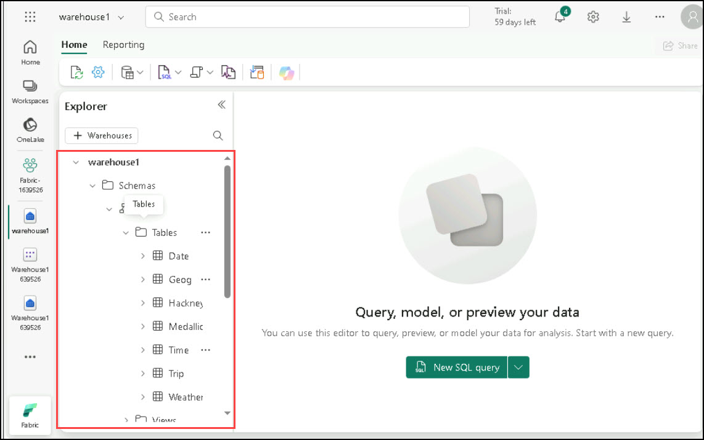

# Module 05b: Monitor a Microsoft Fabric data warehouse

## Lab scenario

In Microsoft Fabric, a data warehouse provides a relational database for large-scale analytics. Data warehouses in Microsoft Fabric include dynamic management views that you can use to monitor activity and queries.

>**Note:** You need a Microsoft school or work account to complete this exercise. If you don’t have one, you can sign up for a trial of Microsoft Office 365 E3 or higher.

## Lab objectives
In this lab, you will perform:

- Create a sample data warehouse
- Explore dynamic management views
- Explore query insights

## Estimated timing: 30 minutes

## Architecture Diagram


### Task 1: Create a sample data warehouse

Now that you have a workspace, it’s time to create a data warehouse. The Synapse Data Warehouse home page includes a shortcut to create a new warehouse:

1. In the bottom left corner of the Power BI portal, click the **Power BI** icon and select **Fabric** to switch to the Fabric experience.

   

1. From the left pane, click on **Fabric (1)**, select **+ New item (2)**, then scroll down in the pop-up and choose **Warehouse** to create a new Warehouse with a name **Warehouse<inject key="DeploymentID" enableCopy="false"/>**.

    >**Note:** After a minute or so, a new warehouse will be created:

    

1. Once you create the Data warehouse, please load sample data by selecting **Sample Data** under the **Build a warehouse** section.

   

1. After completing the sample data loading, please expand Schema, then expand dbo and tables, you can find available tables there.

   
    
**Congratulations** on completing the task! Please go to the next task.

### Task 2: Explore dynamic management views

Microsoft Fabric data warehouses include dynamic management views (DMVs), which you can use to identify current activity in the data warehouse instance.

1. In the **Warehouse<inject key="DeploymentID" enableCopy="false"/>** data warehouse page, in the **New SQL query** drop-down list, select **New SQL query**.

1. In the new blank query pane, enter the following Transact-SQL code to query the **sys.dm_exec_connections** DMV:

    ```Sql
    SELECT * FROM sys.dm_exec_connections;
    ```

1. Use the **▷ Run** button to run the SQL script and view the results, which include details of all connections to the data warehouse.

    >**Note:** If the result is not as expected, select the **Messages** tab, and then choose **Results**; it will be displayed.

1. Modify the SQL code to query the **sys.dm_exec_sessions** DMV, like this:

    ```Sql
    SELECT * FROM sys.dm_exec_sessions;
    ```

1. Run the modified query and view the results, which show details of all authenticated sessions.

    >**Note:** If the result is not as expected, select the **Messages** tab, and then choose **Results**; it will be displayed.

1. Modify the SQL code to query the **sys.dm_exec_requests** DMV, like this:

    ```Sql
    SELECT * FROM sys.dm_exec_requests;
    ```

1. Run the modified query and view the results, which show details of all requests being executed in the data warehouse.

    >**Note:** If the result is not as expected, select the **Messages** tab, and then choose **Results**; it will be displayed.

1. Modify the SQL code to join the DMVs and return information about currently running requests in the same database, like this:

    ```Sql
    SELECT connections.connection_id,
    sessions.session_id, sessions.login_name, sessions.login_time,
    requests.command, requests.start_time, requests.total_elapsed_time
    FROM sys.dm_exec_connections AS connections
    INNER JOIN sys.dm_exec_sessions AS sessions
        ON connections.session_id=sessions.session_id
    INNER JOIN sys.dm_exec_requests AS requests
        ON requests.session_id = sessions.session_id
    WHERE requests.status = 'running'
        AND requests.database_id = DB_ID()
    ORDER BY requests.total_elapsed_time DESC;
    ```

1. Run the modified query and view the results, which show details of all running queries in the database.

    >**Note:** If the result is not as expected, select the **Messages** tab, and then choose **Results**; it will be displayed.

1. In the **New SQL query** drop-down list, select **New SQL query** to add a second query tab. Then in the new empty query tab, run the following code:

    ```Sql
    WHILE 1 = 1
    SELECT * FROM Trip;
    ```

1. Leave the query running, and return to the tab containing the code to query the DMVs and re-run it. This time, the results should include the second query that is running in the other tab. Note the elapsed time for that query.

1. Wait a few seconds and re-run the code to query the DMVs again. The elapsed time for the query in the other tab should have increased.

1. Return to the second query tab where the query is still running and select X Cancel to cancel it.

1. Back on the tab with the code to query the DMVs, re-run the query to confirm that the second query is no longer running.

1. Close all query tabs.


### Task 3: Explore query insights

Microsoft Fabric data warehouses provide query insights - a special set of views that provide details about the queries being run in your data warehouse.

1. In the **Warehouse<inject key="DeploymentID" enableCopy="false"/>** data warehouse page, in the **New SQL query** drop-down list, select **New SQL query**.

1. In the new blank query pane, enter the following Transact-SQL code to query the **exec_requests_history** view:

    ```Sql
    SELECT * FROM queryinsights.exec_requests_history;
    ```

1. Use the **▷ Run** button to run the SQL script and view the results, which include details of previously executed queries.

    >**Note:** If the result is not as expected, select the **Messages** tab, and then choose **Results**; it will be displayed.

1. Modify the SQL code to query the **frequently_run_queries** view, like this:

    ```Sql
    SELECT * FROM queryinsights.frequently_run_queries;
    ```

1. Run the modified query and view the results, which show details of frequently run queries.

    >**Note:** If the result is not as expected, select the **Messages** tab, and then choose **Results**; it will be displayed.

1. Modify the SQL code to query the **long_running_queries** view, like this:

    ```Sql
    SELECT * FROM queryinsights.long_running_queries;
    ```

1. Run the modified query and view the results, which show details of all queries and their durations.

    

### Review
 In this lab, you have completed the following :
- Created a sample data warehouse
- Explored dynamic management views
- Explored query insights

## You have successfully completed this lab, please proceed with the upcoming modules.
