# Module 05c: Enforce Row-Level Security

## Lab scenario

In this lab you will create a many-to-many relationship between the **Salesperson** table and the **Sales** table. You will also enforce row-level security to ensure that a salesperson can only analyze sales data for their assigned region(s).

In this lab you learn how to:

- Task 1: Configure many-to-many relationships
- Task 2: Enforce row-level security

## Lab objectives
In this lab, you will perform:

- Configure many-to-many relationships
- Enforce row-level security

## Estimated timing: 60 minutes    

## Architecture Diagram

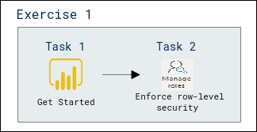

## Exercise 1: Enforce row-level security

In this exercise you will enforce row-level security to ensure a salesperson can only ever see sales made in their assigned region(s).

### Task 1: Get started

In this task you will setup the environment for the lab.

**Important**: If you are continuing on from the previous lab (and you completed that lab successfully), do not complete this task; instead, continue from the next task.

1. To open the Power BI Desktop, on the taskbar, click the Microsoft Power BI Desktop shortcut.

	

1. To close the getting started window, at the top-left of the window, click **X**.

	
	
1. To sign in to the Power BI service, at the top-right, click **Sign In**.

	
	
1. Complete the sign in process using the same account used to sign in to the Azure portal.

1. Enter the Lab username in **Enter your email address** page and select **Continue**.
    * Azure Username/Email: <inject key="AzureAdUserEmail"></inject> 
    
      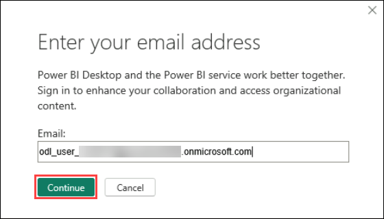

    * Complete the sign up process by selecting **Work or school account** and then **Continue**. If prompted to Sign in, provide same username as previous step.

1. Enter the password.
    * Azure Password: <inject key="AzureAdUserPassword"></inject>
         
       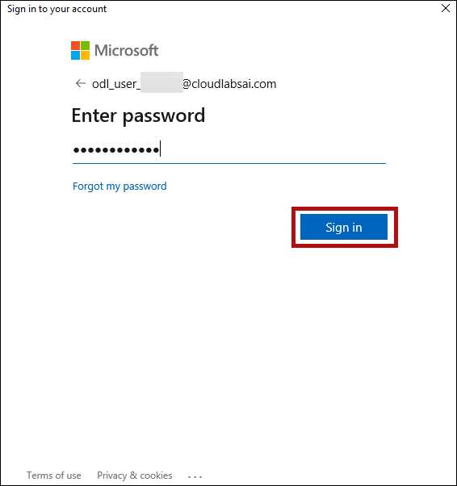

1. In the **Stay signed in to all your apps** tab, select **No, sign in to this app only**

      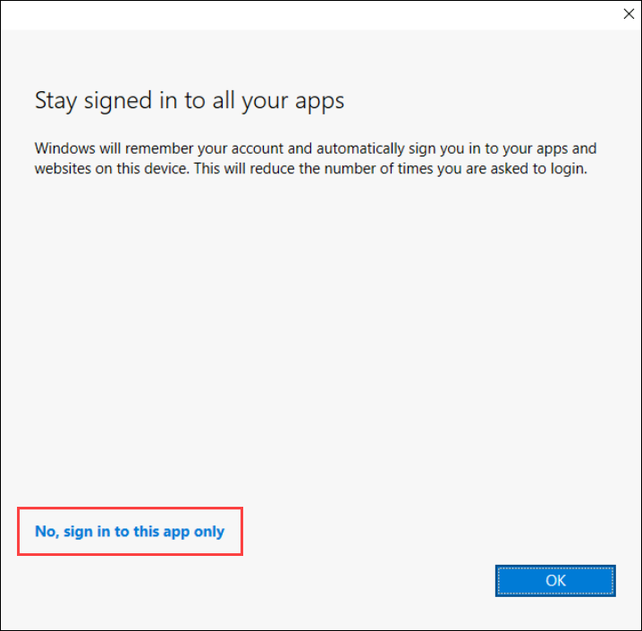
          
1. Leave the Microsoft Edge browser window open.

1. Navigate back to **Power BI Desktop**

1. To open the starter Power BI Desktop file, click the **File** ribbon tab to open the backstage view.

1. Select **Open Report**.

	.png)

1. Click **Browse Reports**.

	

1. In the **Open** window, navigate to the **C:\LabFiles\DP-600-Implementing-Analytics-Solutions-Using-Microsoft-Fabric\Allfiles\LabFiles\10-row-level-security\Starter** folder.

1. Select the **Sales Analysis** file.

1. Click **Open**.

	

1. Close any informational windows that may open.

1. On the **"There are pending changes in your queries that haven't been applied"** warning message, select **Discard Changes**.

	.png)

1. Now you will see another pop up as shown below, select **Discard**.

	.png)

1. To create a copy of the file, click the **File** ribbon tab to open the backstage view.

1. Select **Save As**.

	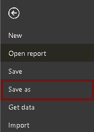
	
1. If prompted to apply changes, click **Apply Later**.

1. In the **Save As** window, navigate to the **C:\LabFiles\DP-600-Implementing-Analytics-Solutions-Using-Microsoft-Fabric\Allfiles\LabFiles\MySolution** folder.

1. Click **Save**.

	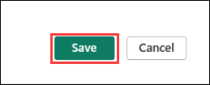

### Task 2: Enforce row-level security

In this task you will enforce row-level security to ensure a salesperson can only see sales made in their assigned region(s).

1. Switch to Data view.

	

2. In the **Fields** pane, select the **Salesperson (Performance)** table.

3. Review the data, noticing that Michael Blythe (EmployeeKey 281) has a UPN value of: *michael-blythe@adventureworks.com*

	>**Note**: Recall that Michael Blythe is assigned to three sales regions: US Northeast, US Central, and US Southeast.

4. Switch to Report view.

5. On the **Modeling** ribbon tab, from inside the **Security** group, click **Manage Roles**.

	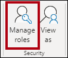

6. In the **Manage Roles** window, click **Create**.

	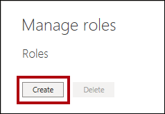

7. In the box, replace the selected text with the name of the role: **Salespeople**, and then press **Enter**.

	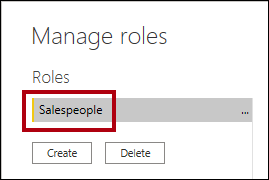

8. To assign a filter, for the **Salesperson (Performance)** table, click the ellipsis (…) character, and then select **Add Filter \| [UPN]**.

	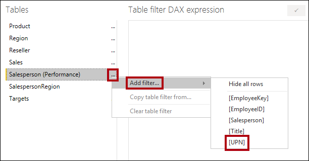

9. In the **Table Filter DAX Expression** box, modify the expression by replacing **“Value”** with **USERPRINCIPALNAME()**.

	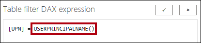

	>**Note**: USERPRINCIPALNAME() is a Data Analysis Expressions (DAX) function that returns the name of the authenticated user. It means that the **Salesperson (Performance)** table will filter by the User Principal Name (UPN) of the user querying the model.

10. Click **Save**.

	

11. To test the security role, on the **Modeling** ribbon tab, from inside the **Security** group, click **View As**.

	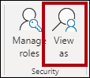

12. In the **View as Roles** window, check the **Other User** item, and then in the corresponding box, enter: *michael-blythe@adventureworks.com*

13. Check the **Salespeople** role. Click **OK**.

	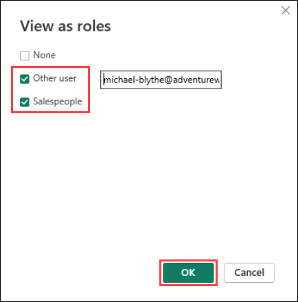

	>**Note**: This configuration results in using the **Salespeople** role and impersonating the user with your Michael Blythe’s name.

14. Notice the yellow banner above the report page, describing the test security context.

	

15. In the table visual, notice that only the salesperson **Michael Blythe** is listed.

	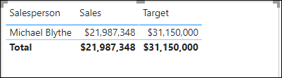

16. To stop testing, at the right side of the yellow banner, click **Stop Viewing**.

	

	>**Note**: When the Power BI Desktop file is published to the Power BI service, you’ll need to complete a post-publication task to map security principals to the **Salespeople** role. You won’t do that in this lab.

17. To delete the role, on the **Modeling** ribbon tab, from inside the **Security** group, click **Manage Roles**.

	

18. In the **Manage Roles** window, click **Delete**.

	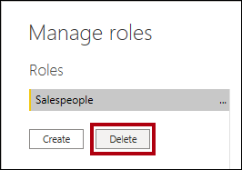

19. When prompted to confirm the deletion, click **Yes, Delete**.

20. Click **Save**.

	

### Task 3: Finish up

In this task you will complete the lab.

1. Save the Power BI Desktop file.

## Review
In this lab, you have completed:
- Enforced row level security.

## You have successfully completed this lab, please proceed with the upcoming modules.
