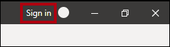
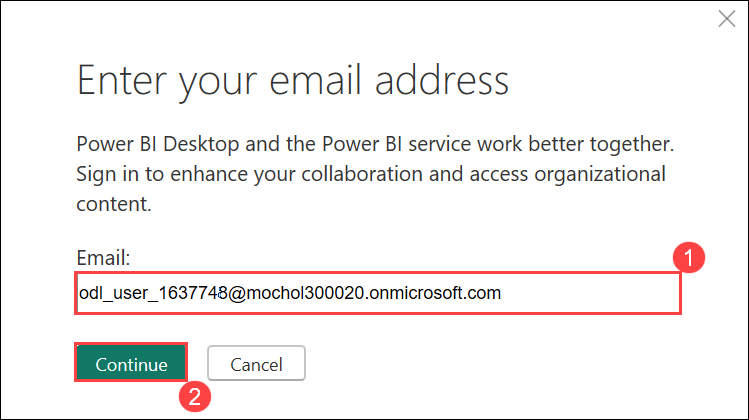
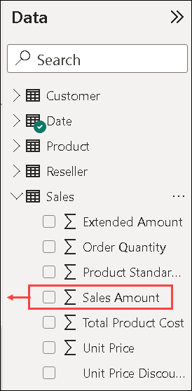
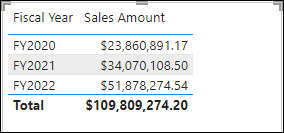
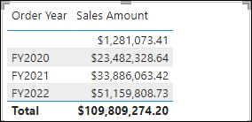
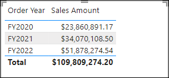
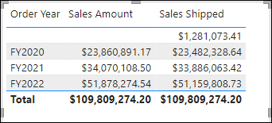
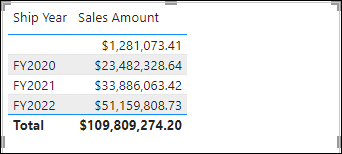
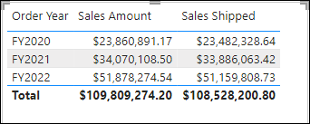
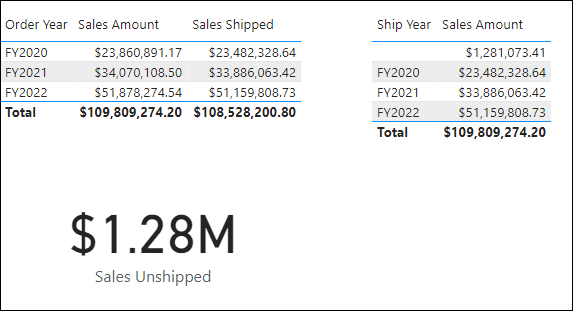

# Module 06a: Understand scalability in Power BI

## Lab scenario

In this lab, you will work with model relationships specifically to address the need for role-playing dimensions. It will involve working with active and inactive relationships, and also Data Analysis Expressions (DAX) functions that modify relationship behavior.

## Lab objectives
In this lab, you will perform:

- Explore model relationships
- Use inactive relationships
- Add another Date table
- Explore other relationship functions

## Estimated timing: 45 minutes

## Architecture Diagram


## Exercise 1: Explore model relationships

In this exercise, you will open a pre-developed Power BI Desktop solution to learn about the data model. You will then explore the behavior of active model relationships.

### Task 1: Download starter file

1. Open a new tab, open and download the **[Sales Analysis starter](https://aka.ms/fabric-relationships-starter)** file and save it on the Lab-VM (in any folder).

1. Navigate to the downloaded file, right click on it then slect **Open with.. .** 

	

1. Open it in **Power BI Desktop.**    

	

    >**Note**: Ignore and close the warning asking to apply changes.

1. At the top-right corner of Power BI Desktop, if you're not already signed in, select **Sign In**. Use the lab credentials in the Environment details tab to complete the sign-in process.

	
	
1. Enter the Lab username in the **Enter your email address (1)** and click on **Continue (2)**
    * Email/Username: <inject key="AzureAdUserEmail"></inject>

	

    >**Note:** When prompted, on the **Let's get you signed in**, select **Work or school account (1)**, and select **continue (2)** on the pop-up.
	
      

1. Complete the sign up process by entering the **Email**, and select **Next**. 
   * Email/Username: <inject key="AzureAdUserEmail"></inject>

      

1. Enter the Password provided in the Environment Details tab and click on **Sign-in (2)**

   * Password: **<inject key="AzureAdUserPassword"></inject> (2)**

      

    >**Note:** On the **Stay Signed in to all your apps**, select **No, this app only**.

      

### Task 2: Review the data model

1. In Power BI Desktop, at the left, switch to **Model** view.

    

1. Use the model diagram to review the model design.

    

    >**Note:** The model comprises six dimension tables and one fact table. The **Sales** fact table stores sales order details. It’s a classic star schema design.

1. Notice that there are three relationships between the **Date** and **Sales** tables.

    

    >**Note:** The **DateKey** column in the **Date** table is a unique column representing the “one” side of the relationships. Filters applied to any column of the **Date** table propagate to the **Sales** table using one of the relationships.

1. Hover the cursor over each of the three relationships to highlight the “many” side column in the **Sales** table.

1. Notice that the relationship to the **OrderDateKey** column is a solid line, while the other relationships are represented by a dotted line.

    >**Note:** A solid line represents an active relationship. There can only be one active relationship path between two model tables, and the path is used by default to propagate filters between tables. Conversely, a dotted line represents an inactive relationship. Inactive relationships are used only when explicitly invoked by DAX formulas.

    > The current model design indicates that the Date table is a role-playing dimension. This dimension could play the role of order date, due date, or ship date. Which role depends on the analytical requirements of the report.

    > In this lab, you will learn how to design a model to support role playing dimensions.

### Task 3: Visualize date data

In this task, you will visualize sales data by date and switch the active status of relationships.

1. Switch to **Report** view.

    

1. To add a table visual, in the **Visualizations** pane, select the **Table** visual icon.

    

1. To add columns to the table visual, in the **Data** pane (located at the right), first expand the **Date** table.

    

1. Drag the **Fiscal Year** column and drop it into the table visual.

    

1. Expand open the **Sales** table, and then drag and drop the **Sales Amount** column into the table visual.

    

1. On the **"There are pending changes in your queries that haven't been applied"** warning message, select **Discard Changes**.

	.png)

1. Now you will see another pop up as shown below, select **Discard**.

    

1. Review the table visual.

    

    >**Note:** The table visual shows the sum of the Sales Amount column grouped by year. But what does Fiscal Year mean? Because there’s an active relationship between the Date and Sales tables to the OrderDateKey column, Fiscal Year means the fiscal year in which the orders were made.

    > To clarify which fiscal year, it’s a good idea to rename the visual field (or add a title to the visual).

1. In the **Visualizations** pane for the table visual, from inside the **Columns** well, select the down-arrow **(1)** and then select **Rename for this visual (2)**.

    

1. Replace the text with **Order Year**, and then press **Enter**.

    

    >**Note**: It’s quicker to rename a visual field by double-clicking its name.

1. Notice that the table visual column header updates to the new name.

    

### Task 4: Modify relationship active status

In this task, you will modify the active status of two relationships.

1. On the **Modeling (1)** ribbon, select **Manage Relationships (2)**.

    

1. In the **Manage relationships** window, Uncheck the **Active** checkbox for the relationship between the Sales and Date tables for the **OrderDateKey** column (third in the list).

    

1. Check **(1)** the **Active** checkbox for the relationship between the Sales and Date tables for the **ShipDateKey** column (last in the list)  then select **Close (2).**

    

    >**Note:** These configurations have switched the active relationship between the **Date** and **Sales** tables to the **ShipDateKey** column.

1. Review the table visual that now shows sales amounts grouped by ship years.

    

1. Click on the Visual table, Rename the first column as **Ship Year**.

    

    >**Note:** The first row represents a blank group because some orders have not yet shipped. In other words, there are BLANKs in the **ShipDateKey** column of the **Sales** table.

7. In the **Manage relationships** window, revert the **OrderDateKey** relationship back to active by using the following steps:

    - Open the **Manage relationships (1)** window

    - Uncheck the **Active** checkbox for the **ShipDateKey** relationship (last in the list) **(2)**

    - Check the **Active** checkbox for the **OrderDateKey** relationship (third in the list) **(3)**

    - **Close (4)** the *Manage relationships* window

            

    - Rename the first visual field in the table visual as **Order Year**

        

        >**Note:** In the next exercise, you will learn how to make a relationship active in a DAX formula.

## Exercise 2: Use inactive relationships

In this exercise, you will learn how to make a relationship active in a DAX formula.

### Task 1: Use inactive relationships

In this task, you will use the USERELATIONSHIP function to make an inactive relationship active.

1. In the **Data** pane, right-click the **Sales** table, and then select **New measure**.

    

2. In the formula bar (located beneath the ribbon), replace the text with the following measure definition, and then press **Enter**.

    ```DAX
    Sales Shipped =
    CALCULATE (
    SUM ( 'Sales'[Sales Amount] ),
    USERELATIONSHIP ( 'Date'[DateKey], 'Sales'[ShipDateKey] )
    )
    ```
        

    >**Note:** This formula uses the CALCULATE function to modify the filter context. It’s the USERELATIONSHIP function that, for the purpose of this calculation, makes the **ShipDateKey** relationship active.

3. On the **Measure tools** contextual ribbon, from inside the **Formatting** group, set the decimals places to **2**.

    

4. Add the **Sales Shipped** measure to the table visual.

    

5. Widen the table visual so all columns are fully visible.

    

    >**Note:** Creating measures that temporarily set relationships as active is one way to work with role-playing dimensions. However, it can become tedious when there’s a need to create role-playing versions for many measures. For example, if there were 10 sales-related measures and three role-playing dates, it could mean creating 30 measures. Creating them with calculation groups could make the process easier.

    > Another approach is to create a different model table for each role-playing dimension. You will do that in the next exercise.

6. To remove the measure from the table visual, in the **Visualizations** pane, from inside the **Values** well, for the **Sales Shipped** field, press **X**.

    

## Exercise 3: Add another Date table

In this exercise, you will add a date table to support ship date analysis.

### Task 1: Remove the inactive relationships

In this task, you will remove the existing relationship to the **ShipDateKey** column.

1. Switch to **Model** view.

    

2. In the model diagram, right-click the **ShipDateKey** relationship, and then select **Delete**.

    

3. When prompted to confirm the deletion, select **Yes**.

    >**Note:** Deleting the relationship results in an error with the **Sales Shipped** measure. You will rewrite the measure formula later in this lab.

### Task 2: Disable relationship options

In this task, you will disable two relationship options.

1. Click on the **File** ribbon tab.

    

1. Select **Options and settings (1)** and then select **Options (2)**.

    

2. In the **Options** window at the bottom-left from inside the **CURRENT FILE** group, select **Data Load (1).** In the **Relationships** section, uncheck the two enabled options **(2)** and then click on **OK (3).** 

    

### Task 3: Add another date table

In this task, you will create a query to add another date table to the model.

1. On the **Home** ribbon tab, click on the **Transform data (1)** drop-down icon and then select **Transform data (2)**  which opens the **Power Query Editor**.

    

1. Navigate to **Customer** table.    

    >**Note:** If you are prompted to specify how to connect, **Edit Credentials**.

    

    >**Note:** Leave the default connection settings for Windows with **Use my current credentials (1)** then **Connect (2)**.

     
    
    >**Note:** Select **Yes** to close the warning message.

    >**Note:** When prompted, select **OK** on the **Encryption Support** pop-up.

1. In the **Power Query Editor** window, in the **Queries** pane (located at the left), right-click the **Date** query **(1)**, and then select **Reference (2)**.

    

    >**Note:** A referencing query is one that uses another query as its source. So, this new query sources its date from the **Date** query.

1. In the **Query Settings** pane (located at the right), in the **Name** box, replace the text with **Ship Date**.

    

1. To rename the **DateKey** column, double-click the **DateKey** column header.

1. Replace the text with **ShipDateKey**, and then press **Enter**.

    

1. Also rename the **Fiscal Year** column as **Ship Year**.

    >**Note:** If possible, it’s a good idea to rename all columns so they describe the role they’re playing. In this lab, to keep things simple you will rename only two columns.

1. To load the table to the model, on the **Home** ribbon tab, select the **Close &amp; Apply** icon.

    

1. When the table has added to the model, to create a relationship, from the **Ship Date** table drag the **ShipDateKey** column to the **ShipDateKey** column of the **Sales** table.

    

1. Notice that an active relationship now exists between the **Ship Date** and **Sales** tables.

    

### Task 4: Visualize ship date data

In this task, you will visualize the ship date data in a new table visual.

1. Switch to **Report** view.

    

2. To clone the table visual, first select the table visual.

3. On the **Home** ribbon tab, from inside the **Clipboard** group, select **Copy**.

    

4. To paste the copied visual, on the **Home** ribbon tab, from inside the **Clipboard** group, select **Paste**.

    *Tip: You can also use the **Ctrl+C** and **Ctrl+V** shortcuts.*

    

5. Move the new table visual to the right of the existing table visual.

    

6. Select the new table visual, and then in the **Visualizations** pane, from inside the **Columns** well, remove the **Order Year** field.

    

7. In the **Data** pane, expand open the **Ship Date** table.

8. To add a new field to the new table visual, from the **Ship Date** table, drag the **Ship Year** field to the **Columns** well above the **Sales Amount** field.

    

9. Verify that the new table visual shows sales amount grouped by ship year.

    

    >**Note:** The model now has two date tables, each with an active relationship to the **Sales** table. The benefit of this design approach is that it’s flexible. It’s now possible to use all measures and summarizable fields with either date table.

    > There are, however, some disadvantages. Each role-playing table will contribute to a larger model size—although dimension table aren’t typically large in terms of rows. Each role-playing table will also require duplicating model configurations, like marking the date table, creating hierarchies, and other settings. Also, additional tables contribute to a possible overwhelming number of fields. Users may find it more difficult to find the model resources they need.

    > Lastly, it’s not possible to achieve a combination of filters in the one visual. For example, it’s not possible to combine sales ordered and sales shipped in the same visual without creating a measure. You will create that measure in the next exercise.

## Exercise 4: Explore other relationship functions

In this exercise, you will work with other DAX relationship functions.

### Task 1: Explore other relationship functions

In this task, you will work with the CROSSFILTER and TREATAS functions to modify relationship behavior during calculations.

1. In the **Data** pane from inside the **Sales** table, select the **Sales Shipped** measure.

    

2. In the formula base, replace the text with the following definition, and press **Enter**:

    ```dax
    Sales Shipped =
    CALCULATE (
    SUM ( 'Sales'[Sales Amount] ),
    CROSSFILTER ( 'Date'[DateKey], 'Sales'[OrderDateKey], NONE ),
    TREATAS (
    VALUES ( 'Date'[DateKey] ),
    'Ship Date'[ShipDateKey]
        )
    )
    ```

        

    >**Note:** This formula uses the CALCULATE function to sum the **Sales Amount** column by using modified relationship behaviors. The CROSSFILTER function disables the active relationship to the **OrderDateKey** column (this function can also modify filter direction). The TREATAS function creates a virtual relationship by applying the in-context **DateKey** values to the **ShipDateKey** column.

3. Add the revised **Sales Shipped** measure to the first table visual.

    

4. Review the first table visual.

    

5. Notice that there is no BLANK group.

    >**Note:** Because there are no BLANKs in the **OrderDateKey** column, a BLANK group wasn’t generated. Showing unshipped sales will require a different approach.

### Task 2: Show unshipped sales

In this task, you will create a measure to show the unshipped sales amount.

1. Create a measure named **Sales Unshipped** in the **Sales** table by using the following definition: **(1)**

    >**Note:** Right click on the **Sales** table and select **New measure.**

    ```DAX
    Sales Unshipped =
    CALCULATE (
    SUM ( 'Sales'[Sales Amount] ),
    ISBLANK ( 'Sales'[ShipDateKey] )
    )
    ```

    >**Note:** This formula sums the **Sales Amount** column where the **ShipDateKey** column is BLANK.

2. Format the measure to use two decimal places. **(2)**

    

3. To add a new visual to the page, first select a blank area of the report page.

4. In the **Visualizations** pane, select the **Card** visual icon.

    

5. Drag the **Sales Unshipped** measure into the card visual.

    

6. Verify that the final report page layout looks like the following.

    

### Finish up

To finish the exercise, close Power BI Desktop - no need to save the file.

### Review
 In this lab, you have completed the following :
- Interpreted relationship properties in the model diagram.
- Set relationship properties.
- Used DAX functions that modify relationship behavior.

## You have successfully completed this lab, please proceed with the upcoming modules.
