# Module 06b: Use tools to optimize Power BI performance

## Lab scenario

In this lab, you will learn how to use two external tools to help you develop, manage, and optimize data models and DAX queries.

## Lab objectives
In this lab, you will perform:

- Best Practice Analyzer (BPA) in Tabular Editor.
- DAX Studio.

## Estimated timing: 30 minutes

## Architecture Diagram

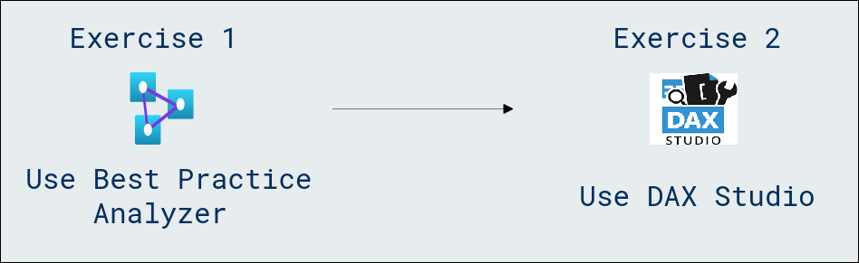

## Exercise 0: Get started

For this lab you'll install and use Tabular Editor, and DAX Studio to optimize a semantic model.

## Exercise 1: Use Best Practice Analyzer

In this exercise, you will install Tabular Editor 2 and load Best Practice Analyzer (BPA) rules. You will review the BPA rules, and then address specific issues found in the data model.

>**Note:** BPA is a free third-party tool that notifies you of potential modeling missteps or changes that you can make to improve your model design and performance. It includes recommendations for naming, user experience, and common optimizations that you can apply to improve performance. For more information, see [Best practice rules to improve your model's performance](https://powerbi.microsoft.com/blog/best-practice-rules-to-improve-your-models-performance/).

### Task 1: Download and Install Tabular Editor 2

Download and install Tabular Editor 2 to enable the creation of calculation groups.

>**Note:** Tabular Editor is an alternative tool for authoring tabular models for Analysis Services and Power BI. Tabular Editor 2 is an open source project that can edit a BIM file without accessing any data in the model.

1. Open a new tab in Microsoft Edge, navigate to the Tabular Editor Release page.

    ```https://github.com/TabularEditor/TabularEditor/releases```

1. Scroll down to the **Assets** section and select the **TabularEditor.Installer.msi** file. This will initiate the file install.
   
    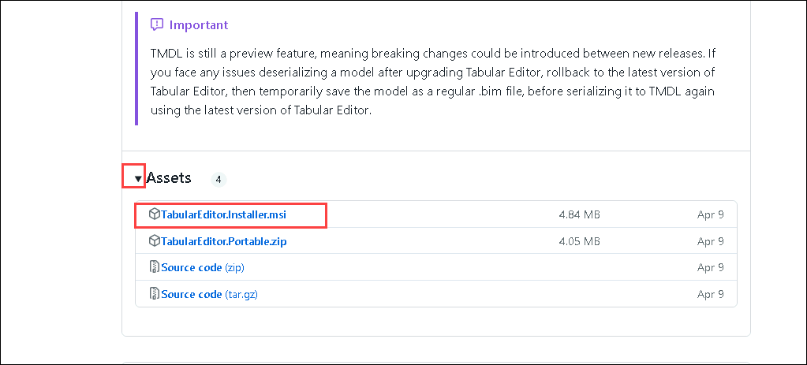

1. Upon completion, select **Open file** to run the installer.

	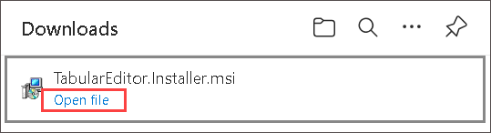

1. In the Tabular Editor installer window, select **Next >**.

     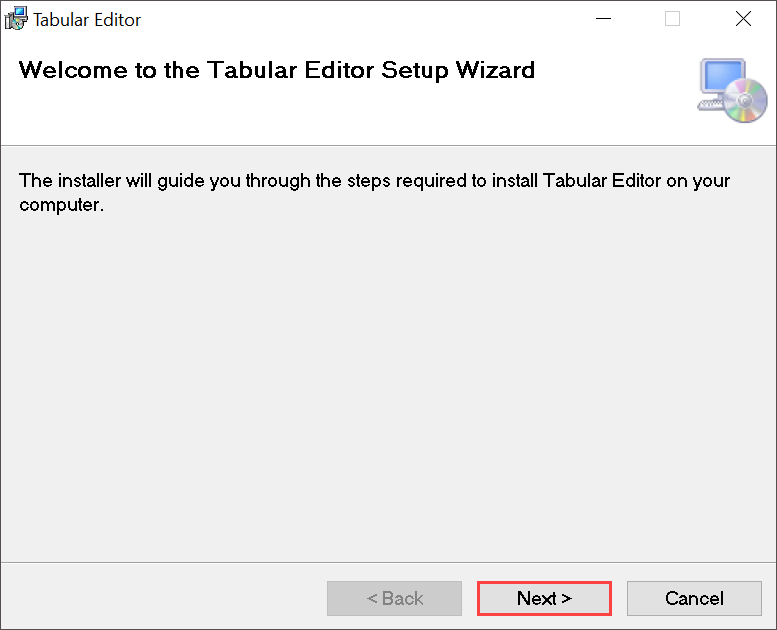

1. At the **License Agreement** step, if you agree, select **I agree**, and then select **Next >**.

     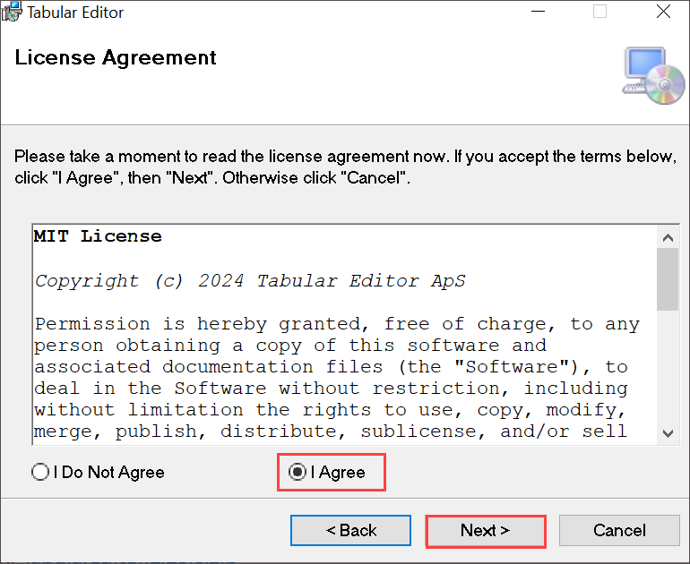

1. At the **Select Installation Folder** step, select **Next >**.

1. At the **Application Shortcuts** step, select **Next >**.

1. At the **Confirm Installation** step, select **Next >**.

    >**Note:** If prompted, select **Yes** to allow app to make changes.

1. When the installation is complete, select **Close**.

    >**Note:** Tabular Editor is now installed and registered as a Power BI Desktop external tool.

### Task 2: Set up Power BI Desktop

In this task, you will open a pre-developed Power BI Desktop solution.

1. Download the [Sales Analysis starter file](https://aka.ms/fabric-optimize-starter) from `https://aka.ms/fabric-optimize-starter` and save it to a location you will remember.
   
   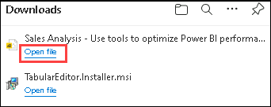

1. Navigate to the downloaded file and open it in Power BI Desktop.

1. At the top-right corner of Power BI Desktop, if you're not already signed in, select **Sign In**. Use the lab credentials in the Environment details tab to complete the sign-in process.

	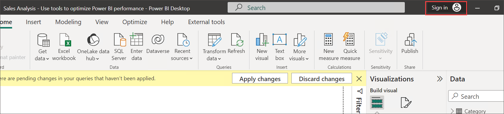
	
1. Enter the Lab username in the **Enter your email address** and click on **Continue**
    * Email/Username: <inject key="AzureAdUserEmail"></inject>

      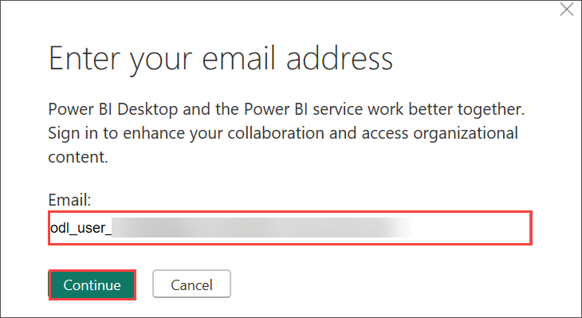

        >**Note:** When prompted, on the **Let's get you signed in**, select **Work or school account**, and select **continue** on the pop-up.

	  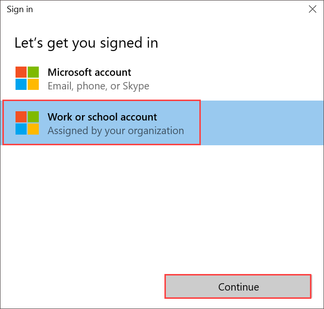
    
1. Complete the sign up process by entering the **Email**, and select **Next**. 
   * Email/Username: <inject key="AzureAdUserEmail"></inject>

      

1. Enter the Password provided in the Environment Details tab and click on **Sign-in**

   * Password: <inject key="AzureAdUserPassword"></inject>

        .png)

        >**Note:** On the **Stay Signed in to all your apps**, select **No, sign in to this app only**.

1. Select the **External Tools** ribbon tab. Notice that you can launch Tabular Editor from this ribbon tab.

    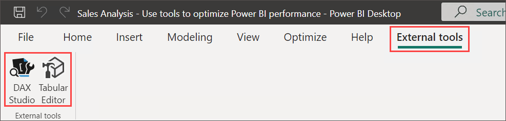

    >**Note:** Later in this exercise, you will use Tabular Editor to work with BPA.

1. On the **There are pending changes in your queries that haven't been applied** pop-up, select **Discard changes**. On the **Discard your changes?** select **Discard**.

    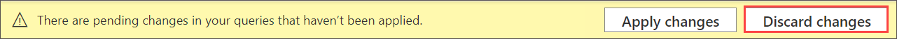

   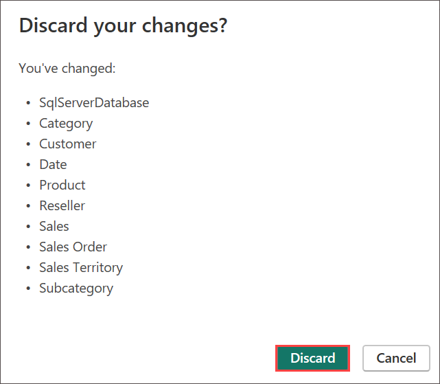

### Task 3: Review the data model

In this task, you will review the data model.

1. In Power BI Desktop, at the left, switch to **Model** view.

    

2. Use the model diagram to review the model design.

    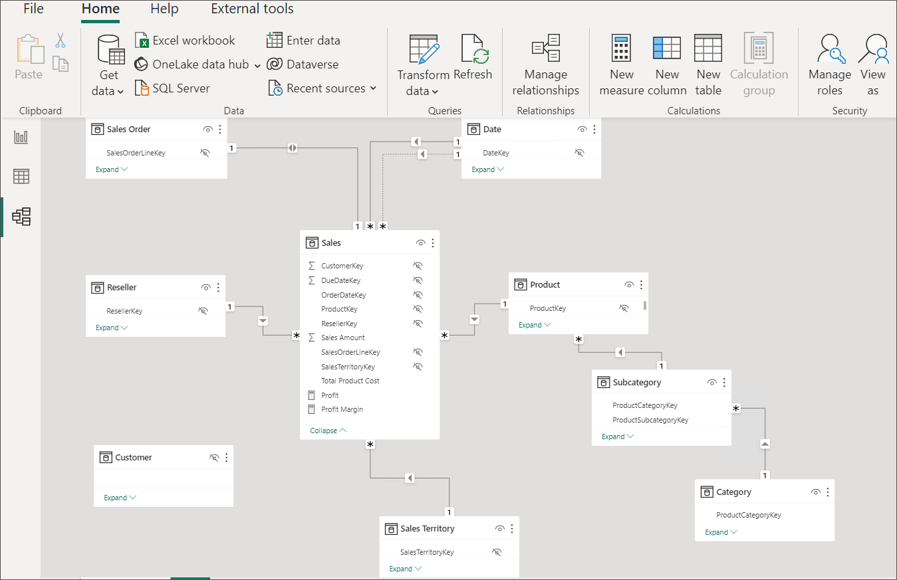

    >**Note:** The model comprises eight dimension tables and one fact table. The **Sales** fact table stores sales order details. It's a classic star schema design that includes snowflake dimension tables (**Category** > **Subcategory** > **Product**) for the product dimension.

    >**Note:** In this exercise, you will use BPA to detect model issues and fix them.

### Task 4: Load BPA rules

In this task, you will load BPA rules.

*The BPA rules aren't added during the Tabular Editor installation. You must download and install them.*

1. On the **External Tools (1)** ribbon, select **Tabular Editor (2)**.

    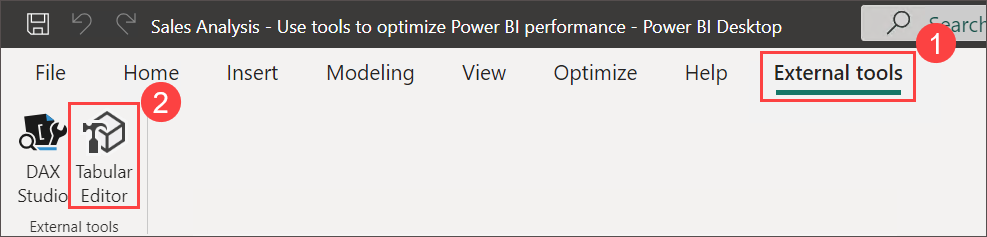

    >**Note:** Tabular Editor opens in a new window and connects live to the data model hosted in Power BI Desktop. Changes made to the model in Tabular Editor aren't propagated to Power BI Desktop until you save them.

2. To load the BPA rules, select the **C# Script** tab.

    >**Note:** This may be called the Advanced Scripting tab in older versions of Tabular Editor.

    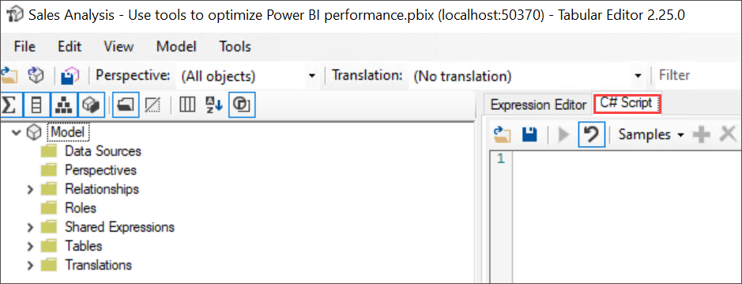

3. Paste in the following script.

    ```csharp
    System.Net.WebClient w = new System.Net.WebClient(); 

    string path = System.Environment.GetFolderPath(System.Environment.SpecialFolder.LocalApplicationData);
    string url = "https://raw.githubusercontent.com/microsoft/Analysis-Services/master/BestPracticeRules/BPARules.json";
    string downloadLoc = path+@"\TabularEditor\BPARules.json";
    w.DownloadFile(url, downloadLoc);
    ```

4. To run the script, on the toolbar, select the **Run script** command.

    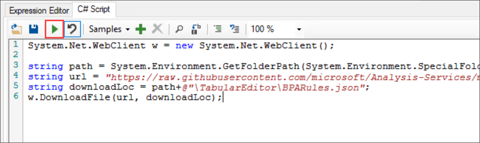

    **Note:** To use the BPA rules, you must close and then reopen Tabular Editor.

5. Close Tabular Editor.

6. To reopen Tabular Editor, in Power BI Desktop, on the **External Tools (1)** ribbon, select **Tabular Editor (2)**.

    

### Task 5: Review the BPA rules

In this task, you will review the BPA rules that you loaded in the previous task.

1. In Tabular Editor, on the menu, select **Tools** > **Manage BPA Rules**.

    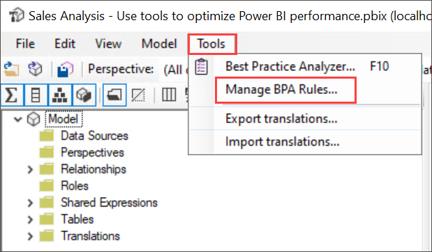

2. In the **Manage Best Practice Rules** window, in the **Rule collections** list, select **Rules for the local user**.

    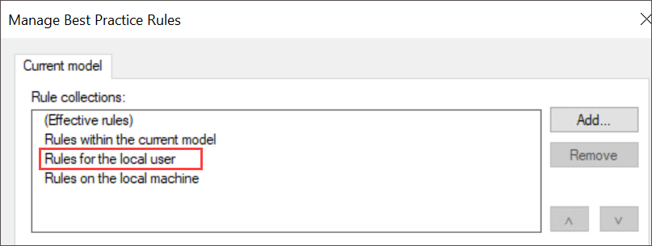

3. In the **Rules in collection** list, scroll down the list of rules.

    >**Tip:** You can drag the bottom right corner to enlarge the window.

    > Within seconds, Tabular Editor can scan your entire model against each of the rules and provides a report of all the model objects which satisfy the condition in each rule.

4. Notice that BPA groups the rules into categories.

    > **Note:** Some rules, like DAX expressions, focus on performance optimization while others, like the formatting rules, are aesthetic-oriented.

5. Notice the **Severity** column.

    > **Note:** The higher the number, the more important the rule.

6. Scroll to the bottom of the list and ensure that the **Set IsAvailableInMdx to false on non-attribute columns** rule is unchecked. Select **OK**.

    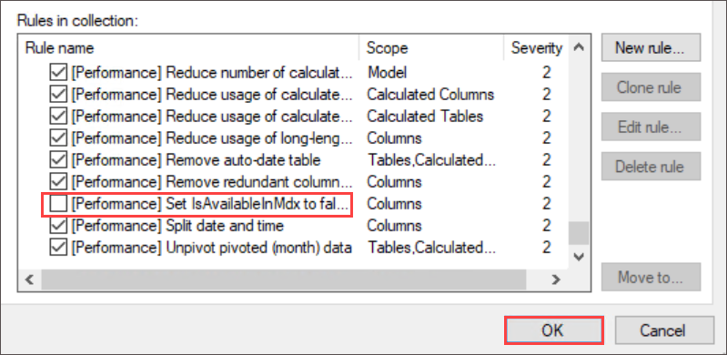

    > **Note:** You can disable individual rules or entire categories of rules. BPA won't check disabled rules against your model. The removal of this specific rule is to show you how to disable a rule.

### Task 6: Address BPA issues

In this task, you will open BPA and review the results of the checks.

1. On the menu, select **Tools** > **Best Practice Analyzer** (or press **F10**).

    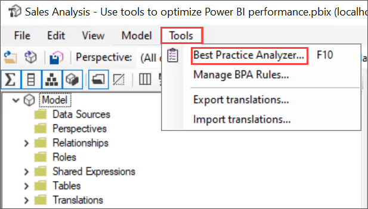

2. In the **Best Practice Analyzer** window, if necessary, maximize the window.

3. Notice the list of (possible) issues, grouped by category.

4. In the first category, right-click the **'Product'** table, and then select **Ignore item**.

    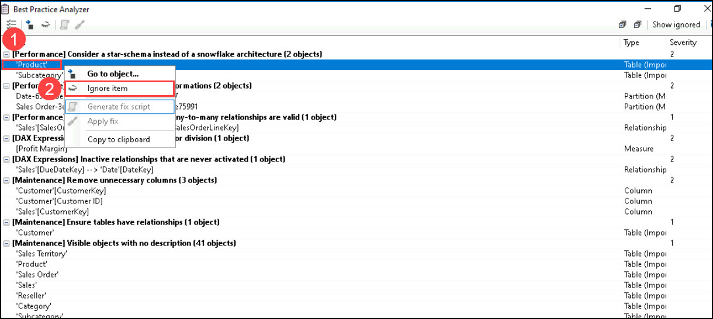

    > **Note:** When an issue isn't really an issue, you can ignore that item. You can always reveal ignored items by using the **Show ignored** command on the toolbar.

5. Further down the list, in the **Use the DIVIDE function for division** category, right-click **[Profit Margin]**, and then select **Go to object**.

    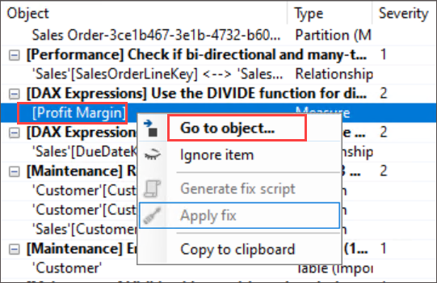

    >**Note:** This command switches to Tabular Editor and focuses on the object. It makes it easy to apply a fix to the issue.

6. In the Expression Editor, modify the DAX formula to use the more efficient (and safe) [DIVIDE](https://docs.microsoft.com/dax/divide-function-dax) function, as follows.

    ```dax
    DIVIDE ( [Profit], SUM ( 'Sales'[Sales Amount] ) )
    ```

7. To save the model changes, on the toolbar, select the **Save changes to the connected database** command (or press **Ctrl+S**).

    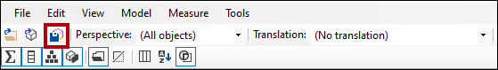

    > **Note:** Saving changes pushes modifications to the Power BI Desktop data model.

8. Switch back to the (out of focus) **Best Practice Analyzer** window.

9. Notice that BPA no longer lists the issue.

10. Scroll down the list of issues to locate the **Provide format string for "Date" columns** category.

    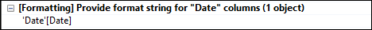

11. Right-click the **'Date'[Date]** issue, and then select **Generate fix script**.

    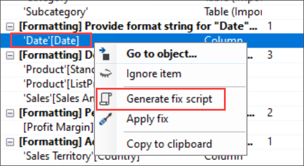

    > **Note:** This command generates a C# script and copies it to the clipboard. You can also use the **Apply fix** command to generate and run the script, however it might be safer to review (and modify) the script before you run it.

12. When notified that BPA has copied the fix script to the clipboard, select **OK**.

13. Switch to Tabular Editor, and select the **C# Script** tab.

    >**Note:** This may be called the Advanced Scripting tab in older versions of Tabular editor.

    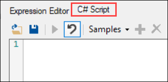

14. To paste the fix script, right-click inside the pane, and then press **Ctrl+V**.

    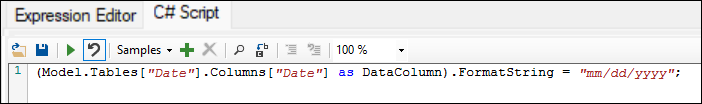

    >**Note:** You can choose to make a change to the format string.

15. To run the script, on the toolbar, select the **Run script** command.

    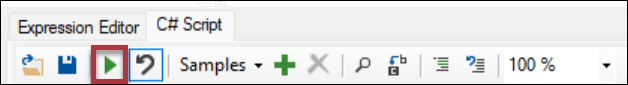

16. Save the model changes.

17. To close Tabular Editor, on the menu, select **File** > **Exit**.

18. Save the Power BI Desktop file.

    

    >**Note:** You must also save the Power BI Desktop file to ensure the Tabular Editor changes are saved.

## Exercise 2: Use DAX Studio

In this exercise, you'll use DAX Studio to optimize DAX queries in the Power BI report file.

>**Note:** According to its website, DAX Studio is "the ultimate tool for executing and analyzing DAX queries against Microsoft Tabular models." It's a feature-rich tool for DAX authoring, diagnosis, performance tuning, and analysis. Features include object browsing, integrated tracing, query execution breakdowns with detailed statistics, DAX syntax highlighting and formatting.

### Task 1: Download DAX Studio

In this task, you will download DAX Studio.

1. On the Lab-VM Desktop, double click on the **DAX Studio** shortcut.

    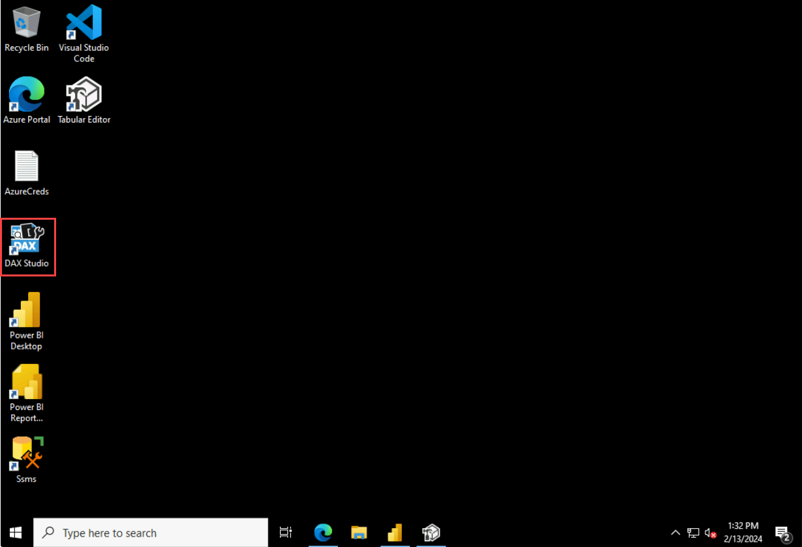

1. In the **Connect** window, select the **Power BI / SSDT Model** option.

1. In the corresponding dropdown list, ensure the **Sales Analysis - Use tools to optimize Power BI performance** model is selected.

    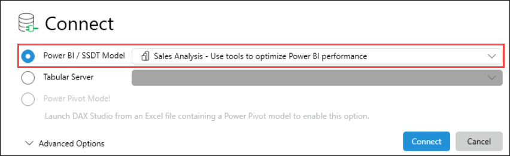

    >**Note:** If you do not have the **Sales Analysis - Use tools to optimize Power BI performance** starter file open, you will not be able to connect. Be sure the file is open.

1. Select **Connect**.

    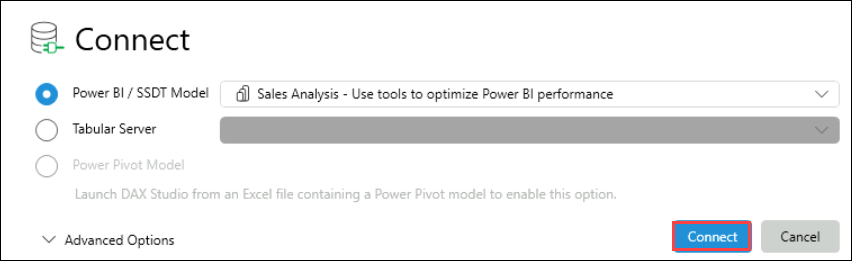

1. Select **OK** on the **Start typing your query in this area**.

1. If necessary, maximize the DAX Studio window.

### Task 2: Use DAX studio to optimize a query

In this task, you will optimize a query by using an improved measure formula.

>**Note:** Note that it's difficult to optimize a query when the data model volumes are small. This exercise focuses on using DAX Studio rather than optimizing DAX queries.

To follow the instructions you've provided, here’s a step-by-step guide:

1. **Open Microsoft Edge**: Launch the Microsoft Edge browser on your device.
  
2. **Download the File**:
   - In the browser window, open the link to the [Monthly Profit Growth.dax](https://aka.ms/fabric-optimize-dax) file.
   - Once the file link opens, **right-click** on the file download link (or the page) and choose **"Save as..."**.
   - Select the location to save the file and save it with the name **"Monthly Profit Growth.dax"**.

3. **Save the File in Lab-VM**: Ensure you are saving the file in the **Lab-VM** (the virtual machine you're working on) as shown below:

    - File name : Keep default **(1)**
    - Save as type : **All Files (2)**
    - Click on **Save**

    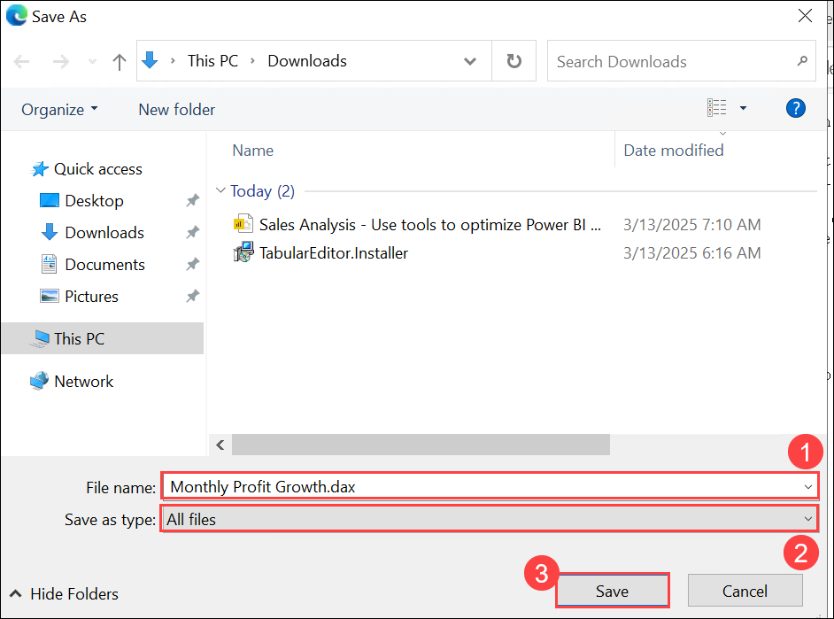

3. Switch to the Dax Studio window and from the **File** menu, select **Browse** to navigate to the **Monthly Profit Growth.dax** file and **Open** the file.

    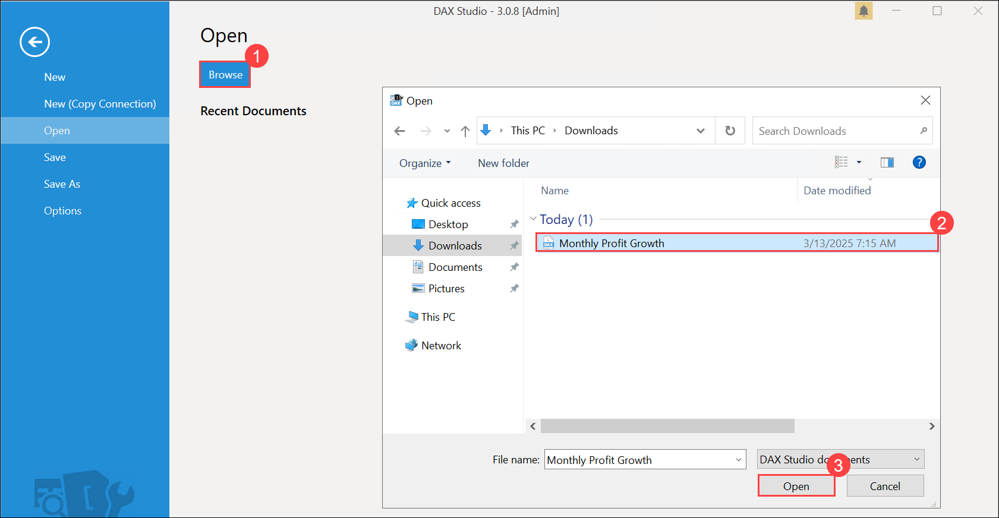

6. Read the comments at the top of the file, and then review the query that follows.

    >**Note:** It's not important to understand the query in its entirety.

    >**Note:** The query defines two measures that determine monthly profit growth. Currently, the query only uses the first measure (at line 72). When a measure isn't used, it doesn't impact on the query execution.

7. To run a server trace to record detailed timing information for performance profiling, on the **Home** ribbon tab, from inside the **Traces** group, select **Server Timings**.

    .png)

8. To run the script, on the **Home** ribbon tab, from inside the **Query** group, select the **Run** icon.

    .png)

9. In the lower pane, review the query result.

    >**Note:** The last column displays the measure results.

10. In the lower pane, select the **Server Timings** tab.

    

11. Review the statistics available at the left side.

    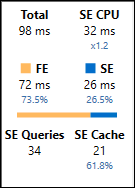

    >**Note:** The image may vary. It will not be the same.

    >**Note:** From top left to bottom right, the statistics tell you how many milliseconds it took to run the query, and the duration the storage engine (SE) CPU took. In this case (your results will differ), the formula engine (FE) took 73.5% of the time, while the SE took the remaining 26.5% of the time. There were 34 individual SE queries and 21 cache hits.

12. Run the query again, and notice that all SE queries come from the SE cache.

    >**Note:** That's because the results were cached for reuse. Sometimes in your testing, you may want to clear the cache. In that case, on the **Home** ribbon tab, by selecting the down arrow for the **Run** command.

    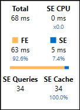

    >**Note:** The image may vary. It will not be the same.

    >**Note:** The second measure definition provides a more efficient result. You will now update the query to use the second measure.

13. At line 72, replace the word **Bad** with **Better**.

    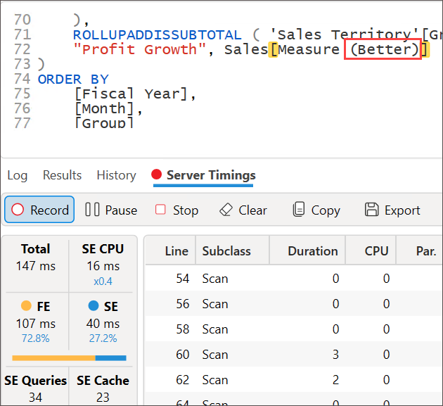

14. Run the query, and then review the server timing statistics.

    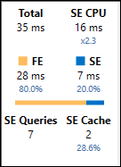

    >**Note:** The image may vary. It will not be the same.

15. Run it a second time to result in full cache hits.

    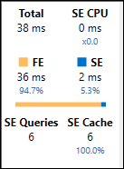

    >**Note:** The image may vary. It will not be the same.

    >**Note:** In this case, you can determine that the "better" query, which uses variables and a time intelligence function, performs better-almost a 50% reduction in query execution time.

### Task 3: Finish up

To conclude this exercise, close all applications - there's no need to save the files.

### Review
 In this lab, you have completed the following :
- Best Practice Analyzer (BPA) in Tabular Editor.
- Worked on DAX Studio.

## You have successfully completed this lab, please proceed with the upcoming modules.
