# Module 07: Enforce model security

## Lab scenario

In this lab, you will update a pre-developed data model to enforce security. Specifically, salespeople at the Adventure Works company should only be able to see sales data related to their assigned sales region.

## Lab objectives

In this lab, you will perform:

- Create static and dynamic roles
- Validate roles
- Map security principals to dataset roles

## Estimated timing: 60 minutes

## Architecture Diagram

## Exercise 0: Set up the prerequisites

### Task 1: Set up Power BI Desktop

In this task, you will set up Power BI Desktop.

1. To open File Explorer, on the taskbar, select the **File Explorer** shortcut.

	

1. Go to the **C:\LabFiles\DP-600-Implementing-Analytics-Solutions-Using-Microsoft-Fabric\Allfiles\LabFiles\09\Starter** folder.

1. To open a pre-developed Power BI Desktop file, double-click the **Sales Analysis - Enforce model security.pbix** file.
	
	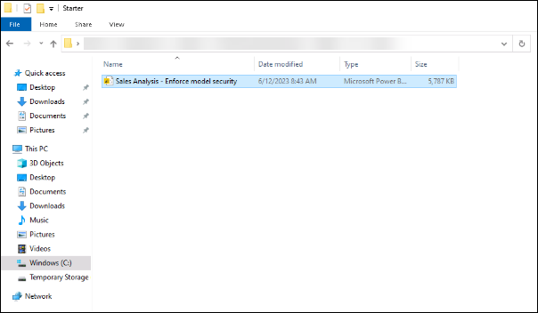

1. At the top-right corner of Power BI Desktop, if you're not already signed in, select **Sign In**. Use the lab credentials in the Environment details tab to complete the sign-in process.

	
	
1. Enter the Lab username in the **Enter your email address (1)** and click on **Continue (2)** 
    * Email/Username: <inject key="AzureAdUserEmail"></inject>

      

      >**Note:** When prompted, on the **Let's get you signed in**, select **Work or school account**, and select **continue** on the pop-up.
	
1. Complete the sign up process by entering the **Email**, and select **Next**. 
   * Email/Username: <inject key="AzureAdUserEmail"></inject>

      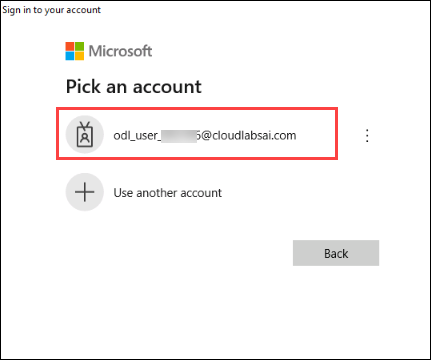

1. Enter the Password provided in the Environment Details tab and click on **Sign-in**

   * Password: <inject key="AzureAdUserPassword"></inject>

        .png)

    >**Note:** On the **Stay Signed in to all your apps**, select **No, sign in to this app only**.
1. At top-right corner, select the profile icon, select **Power BI service**.

   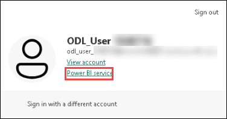

1. Enter the Lab username:- * Email/Username: <inject key="AzureAdUserEmail"></inject>.

1. Do any remaining tasks to complete the trial setup.

   >**Note**: The Power BI web browser experience is known as the **Power BI service**.

### Task 2: Review the data model

In this task, you will review the data model.

1. Navigate back to Power BI Desktop.

1. In Power BI Desktop, at the left, switch to the **Model** view.

   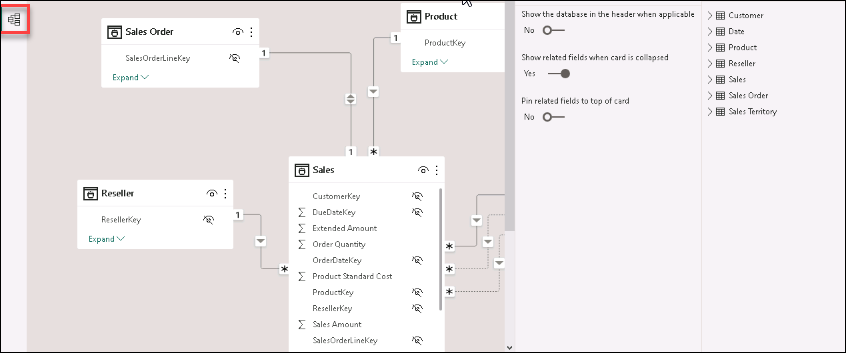

1. Use the model diagram to review the model design.

   

   >**Note**: The model comprises six dimension tables and one fact table. The **Sales** fact table stores sales order details. It's a classic star schema design.

1. Expand the **Sales Territory** table.

   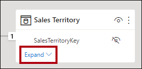

1. Notice that the table includes a **Region** column.

   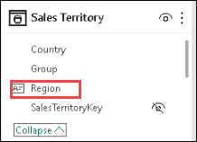

   >**Note**: The **Region** column stores the Adventure Works sales regions. At this organization, salespeople are only allowed to see data related to their assigned sales region. In this lab, you will implement two different row-level security techniques to enforce data permissions.

## Exercise 1: Create static roles

In this exercise, you will create and validate static roles, and then see how you would map security principals to the dataset roles.

### Task 1: Create static roles

In this task, you will create two static roles.

1. Switch to **Report** view.

   

2. In the stacked column chart visual, in the legend, notice (for now) that it's possible to see many regions.

   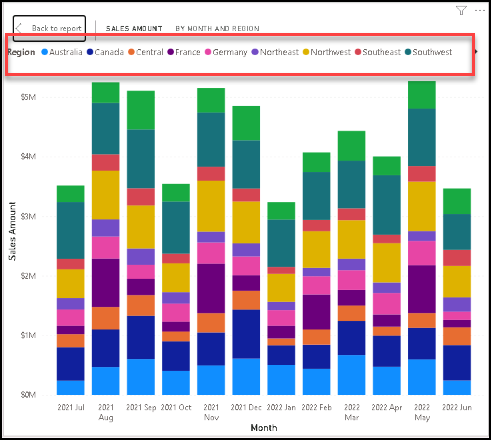

   >**Note**: For now, the chart looks overly busy. That's because all regions are visible. When the solution enforces row-level security, the report consumer will see only one region.

3. To add a security role, on the **Modeling** ribbon tab, from inside the **Security** group, select **Manage roles**.

   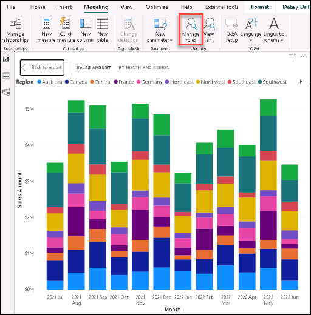

4. In the **Manage roles** window, select **Create**.

   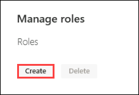

5. To name the role, replace the selected text with **Australia**, and then press **Enter**.

   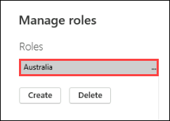

6. In the **Tables** list, for the **Sales Territory** table, select the **ellipsis (1)**, and then select **Add filter (2)** > **[Region] (3)**.

   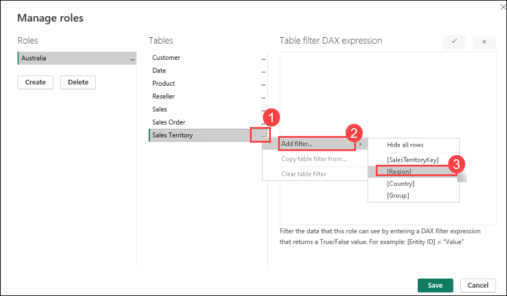

7. In the **Table filter DAX expression** box, replace **Value** with **Australia (1)**.

   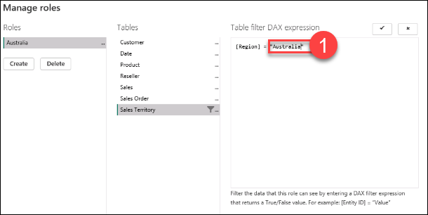

   >**Note**: This expression filters the **Region** column by the value **Australia**.

8. To create another role, press **Create**.

   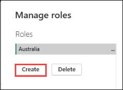

9. Repeat the steps in this task to create a role named **Canada** that filters the **Region** column by **Canada**.

   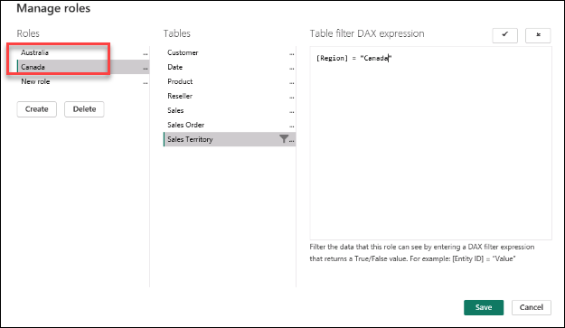

   >**Note**: In this lab, you'll create just the two roles. Consider, however, that in a real-world solution, a role must be created for each of the 11 Adventure Works regions.

10. Select **Save**.

    

### Task 2: Validate the static roles

In this task, you will validate one of the static roles.

1. On the **Modeling** ribbon tab, from inside the **Security** group, select **View as**.

   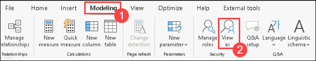

2. In the **View as roles** window, select the **Australia (1)** role. Then Select **OK (2)**.

   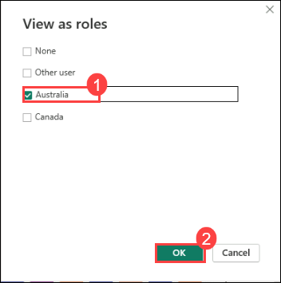

4. On the report page, notice that the stacked column chart visual shows only data for Australia.

   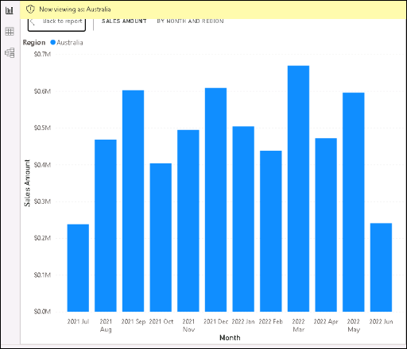

5. Across the top of the report, notice the yellow banner that confirms the enforced role.

   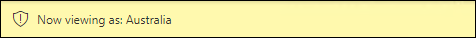

6. To stop viewing by using the role, at the right of the yellow banner, select **Stop viewing**.

   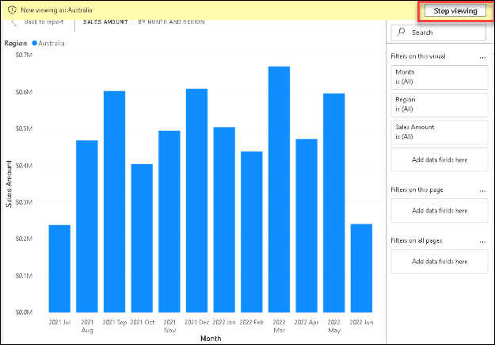

### Task 3: Publish the report

In this task, you will publish the report.

1. Save the Power BI Desktop file.

   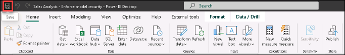
 
2. To publish the report, on the **Home** ribbon tab, select **Publish**.

   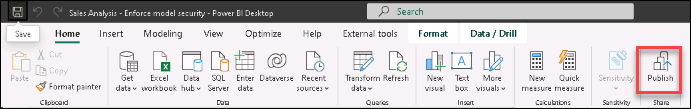

3. In the **Publish to Power BI** window, select your workspace that is **Fabric-<inject key="DeploymentID" enableCopy="false"/> (1)**, and then select **Select (2)**.

   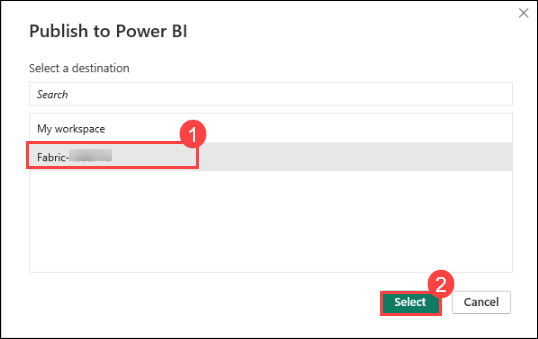
   
5. When the publishing succeeds, select **Got it**.

   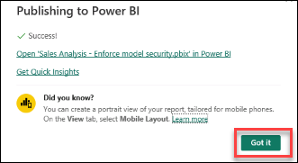

### Task 4: Configure row-level security (*Read-only*)

In this task, you will see how to configure row-level security in the Power BI service. 

This task relies on the existence of a **Salespeople_Australia** security group in the tenant you are working in. This security group does NOT automatically exist in the tenant. If you have permissions on your tenant, you can follow the steps below. If you are using a tenant provided to you in training, you will not have the appropriate permissions to create security groups. Please read through the tasks, but note that you will not be able to complete them in the absence of the existence of the security group. **After reading through, proceed to the Clean Up task.**

1. Switch to the Power BI service (web browser).

2. In the workspace landing page, notice the **Sales Analysis - Enforce model security** Semantic model.

   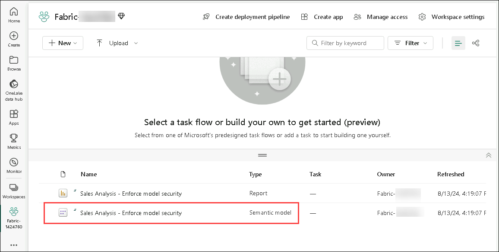

3. Hover the cursor over the Semantic model, and when the ellipsis appears, select the ellipsis, and then select **Security**.

   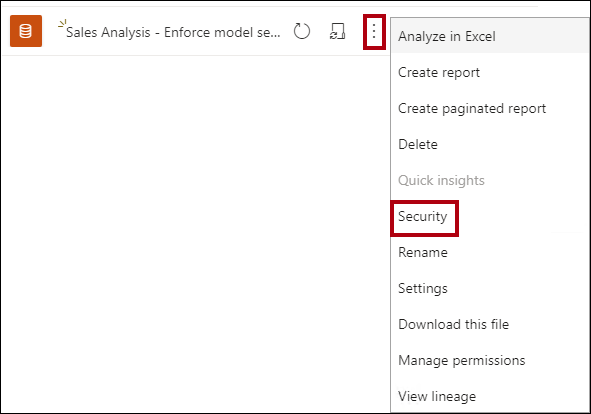
	
   >**Note**: The **Security** option supports mapping Microsoft Azure Active Directory (Azure AD) security principals, which includes security groups and users.

4. At the left, notice the list of roles, and that **Australia** is selected.

   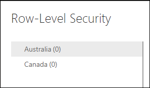

5. In the **Members** box, commence entering **Salespeople_Australia**.

   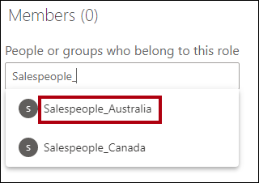

   >**Note**: Steps 5 through 8 are for demonstration purposes only, as they rely on the creation or existence of a Salespeople_Australia security group. If you have permissions and the knowledge to create security groups, please feel free to proceed. Otherwise, continue to the Clean Up task.

6. Select **Add**.

   

7. To complete the role mapping, select **Save**.

   

   >**Note**: Now all members of the **Salespeople_Australia** security group are mapped to the **Australia** role, which restricts data access to view only Australian sales.
 
   >**Note**: In a real-world solution, each role should be mapped to a security group.
 
   >**Note**: This design approach is simple and effective when security groups exist for each region. However, there are disadvantages: it requires more effort to create and set up. It also requires updating and republishing the dataset when new regions are onboarded.

   >**Note**: In the next exercise, you will create a dynamic role that is data-driven. This design approach can help address these disadvantages.

8. To return to the workspace landing page, in the **Navigation** pane, select the workspace.

## Exercise 2: Create a dynamic role

In this exercise, you will add a table to the model, create and validate a dynamic role, and then map a security principal to the dataset role.

### Task 1: Add the Salesperson table

In this task, you will add the **Salesperson** table to the model. Please switch to PowerBI Desktop.

1. Switch to **Model** view.

   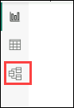

2. On the **Home** ribbon tab, from inside the **Queries** group, select the **Transform data** icon. And Then select **Transform data** from the drop-down.

   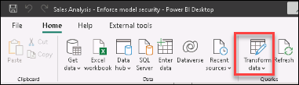

   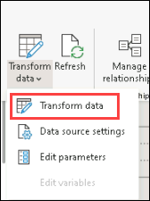

   >**Note**: If you are prompted to specify how to connect, **Edit Credentials** and specify how to sign-in.

   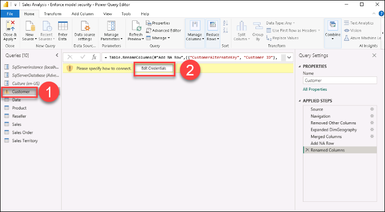

   >**Note**: Select **Connect**.

   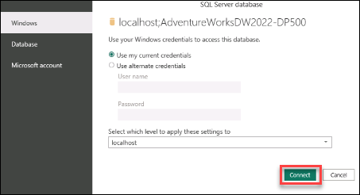
	 
   >**Note**: If you are prompted for Encryption Support, click on **OK**
	
   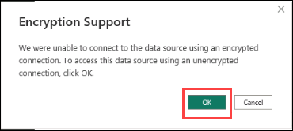

4. In the **Power Query Editor** window, in the **Queries** pane (located at the left), right-click the **Customer (1)** query, and then select **Duplicate (2)**.

   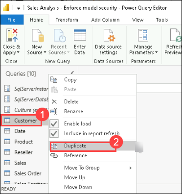

   >**Note**: Because the **Customer** query already includes steps to connect the data warehouse, duplicating it is an efficient way to commence the development of a new query.

5. In the **Query Settings** pane (located at the right), in the **Name** box, replace the text with **Salesperson**.

   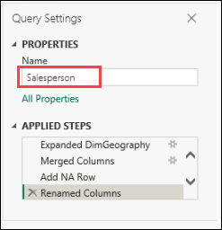

6. In the **Applied Steps** list, right-click the **Removed Other Columns (1)** step (third step), and then select **Delete Until End (2)**.

   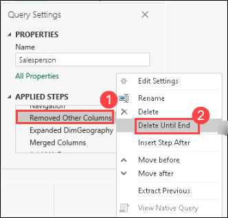

7. When prompted to confirm deletion of the step, select **Delete**.

   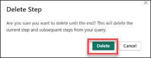

8. To source data from a different data warehouse table, in the **Applied Steps** list, in the **Navigation** step (second step), select the gear icon (located at the right).

   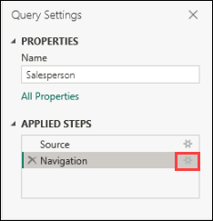

   >**Note:** If you are prompted to specify how to connect, Click on **Connect** followed by **OK** on the Encryption Support Pop-up.

10. In the **Navigation** window, select the **DimEmployee (1)** table.Then Select **OK (2)**.

    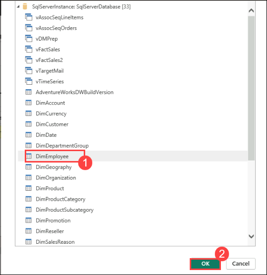

12. To remove unnecessary columns, on the **Home (1)** ribbon tab, from inside the **Manage Columns** group, select the **Choose Columns (2)** icon and slect **Choose Columns (3)** from the drop-down.

     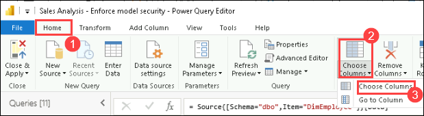

13. In the **Choose Columns** window, uncheck the **(Select All Columns)** item.

     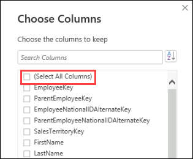

14. Check the following three columns, and select **OK**:

	- EmployeeKey

	- SalesTerritoryKey

	- EmailAddress

	   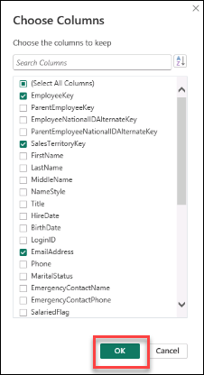

15. To rename the **EmailAddress** column, double-click the **EmailAddress** column header.

    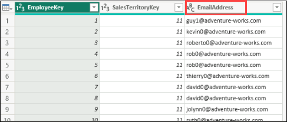

17. Replace the text with **UPN**, and then press **Enter**.

    >**Note**: UPN is an acronym for User Principal Name. The values in this column match the Azure AD account names.

    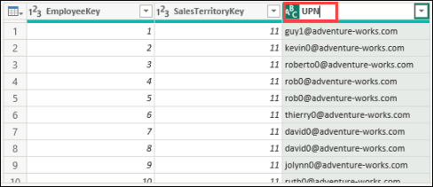

18. To load the table to the model, on the **Home** ribbon tab, select the **Close &amp; Apply** icon.

    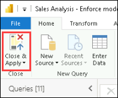

19. When the table has added to the model, notice that a relationship to the **Sales Territory** table was automatically created.

    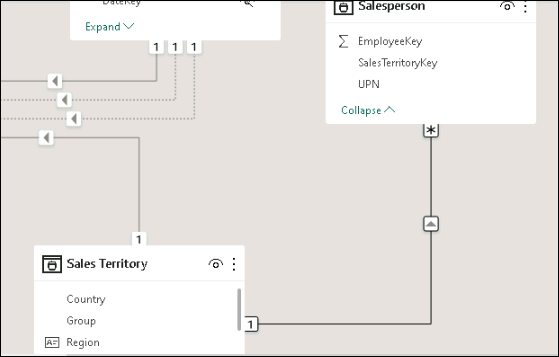

### Task 2: Configure the relationship

In this task, you will configure properties of the new relationship.

1. Right-click the relationship between the **Salesperson** and **Sales Territory** tables, and then select **Properties**.

   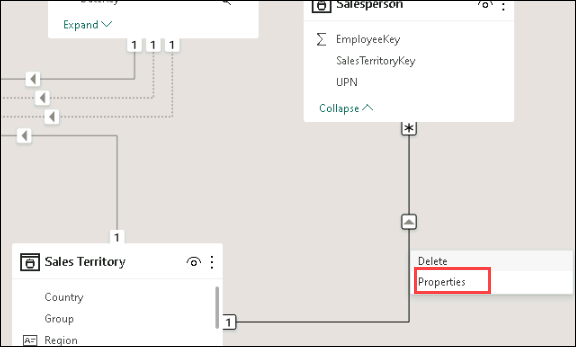

2. In the **Edit relationship** window, in the **Cross filter direction** dropdown list, select **Both (1)**. Check the **Apply security filter in both directions (2)** checkbox.

   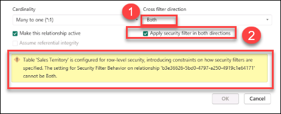

   >**Note**: Because there' a one-to-many relationship from the **Sales Territory** table to the **Salesperson** table, filters propagate only from the **Sales Territory** table to the **Salesperson** table. To force propagation in the other direction, the cross filter direction must be set to both.
	
   >**Note**: In case you encounter this error: `Table 'Sales Territory' is configured for row-level security, introducing constraints on how security filters are specified.` Uncheck the **Apply security filter in both directions** box.

   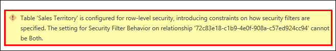
	
   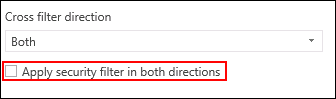

4. Select **OK**.

    

5. To hide the table, at the top-right of the **Salesperson** table, select the eye icon.

   

   >**Note**: The purpose of the **Salesperson** table is to enforce data permissions. When hidden, report authors and the Q&A experience won't see the table or its fields.
 
### Task 3: Create a dynamic role

In this task, you will create a dynamic role, which enforces permissions based on data in the model.

1. Switch to **Report (1)** view.

2. To add a security role, on the **Modeling** ribbon tab, from inside the **Security** group, select **Manage roles (2)**.

   

3. In the **Manage roles** window, select **Create**.

   

4. To name the role, replace the selected text with **Salespeople**.

   

   >**Note**: This time, only one role needs to be created.

5. In order to add a filter to the **UPN** column of the **Salesperson** table, select the ellipsis (1), and then select Add filter (2) > [UPN] (3).

   

6. In the **Table filter DAX expression** box, replace **"Value"** with **USERPRINCIPALNAME() (1)**, and select **Save (2)**.

   

   >**Note**: This expression filters the **UPN** column by the USERPRINCIPALNAME function, which returns the user principal name (UPN) of the authenticated user.

7. Navigate back to **Managed Roles** under **Modelling** Tab. Now, being under the **Salespeople** role, add a filter to the **Region** column of the **Sales Territory** table.

   

8. In the **Table filter DAX expression** box, replace **"Value"** with **Northeast**.

   

   >**Note**: When the UPN filters the **Salesperson** table, it filters the **Sales Territory** table, which in turn filters the **Sales** table. This way, the authenticated user will only see sales data for their assigned region.

7. Select **Save**.

   

### Task 4: Validate the dynamic role

In this task, you will validate the dynamic role.

1. On the **Modeling** ribbon tab, from inside the **Security** group, select **View as**.

   

1. In the **View as roles** window, check **Other user (1)**, and then in the corresponding box, enter: **michael9@adventure-works.com (2)**. Check the **Salespeople (3)** role, and select **OK (4)**.

   
	
   >**Note**: For testing purposes, **Other user** is the value that will be returned by the USERPRINCIPALNAME function. Note that this salesperson is assigned to the **Northeast** region.

1. On the report page, notice that the stacked column chart visual shows only data for Northeast.

   

1. Across the top of the report, notice the yellow banner that confirms the enforced role.

   

1. To stop viewing by using the role, at the right of the yellow banner, select **Stop viewing**.

   

### Task 5: Finalize the design (*Read-only*)

In this task, you will finalize the design by publishing the report and mapping a security group to the role.

*The steps in this task are deliberately brief. For full step details, refer to the task steps of the previous exercise.*

1. Save the Power BI Desktop file.

    

2. Publish the report to the workspace you created at the beginning of the lab.

3. When the publishing succeeds, select Got it.

4. Close Power BI Desktop.

5. Switch to the Power BI service (web browser).

6. Go to the security settings for the **Sales Analysis - Enforce model security** dataset.

7. Map the **Salespeople** security group the **Salespeople** role.

   

   >**Note**: Now all members of the **Salespeople** security group are mapped to the **Salespeople** role. Providing the authenticated user is represented by a row in the **Salesperson** table, the assigned sales territory will be used to filter the sales table.

   >**Note**: This design approach is simple and effective when the data model stores the user principal name values. When salespeople are added or removed, or are assigned to different sales territories, this design approach will simply work.

### Review
In this lab, you have completed:
- Create static and dynamic roles
- Validate roles
- Map security principals to dataset roles
  
## You have successfully completed this lab, please proceed with the upcoming modules.
