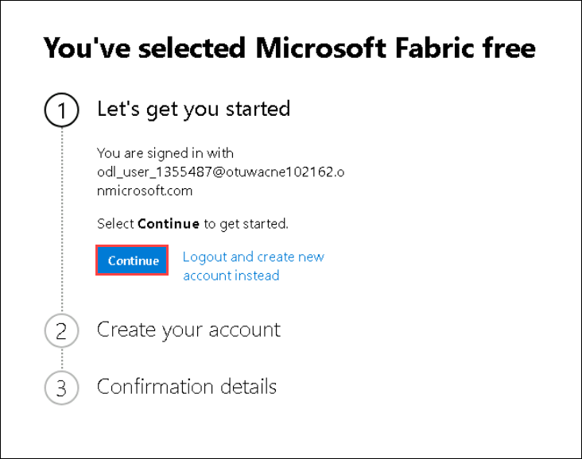
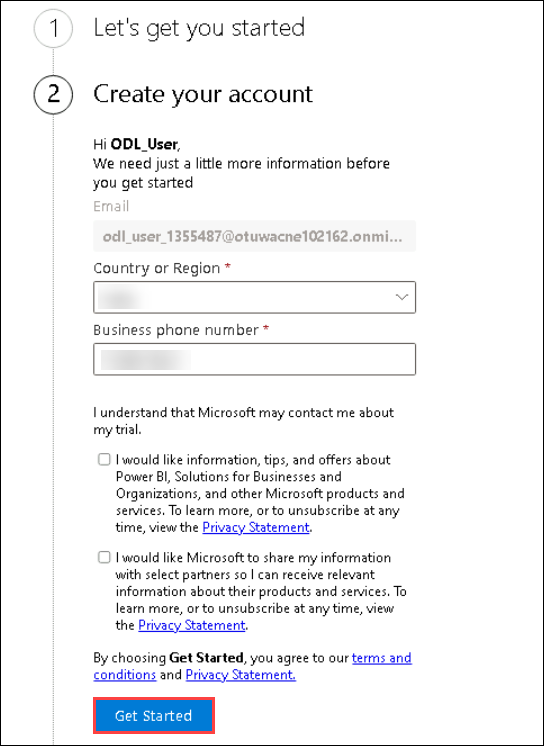
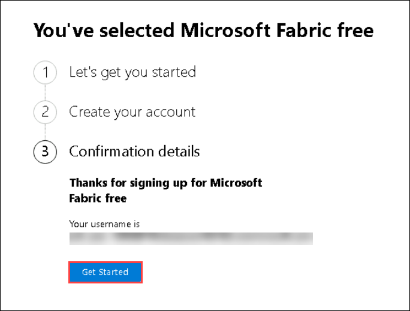
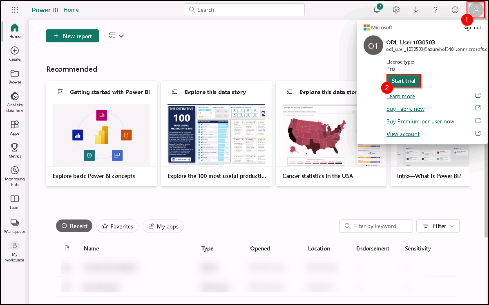
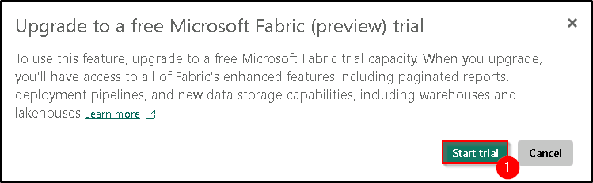
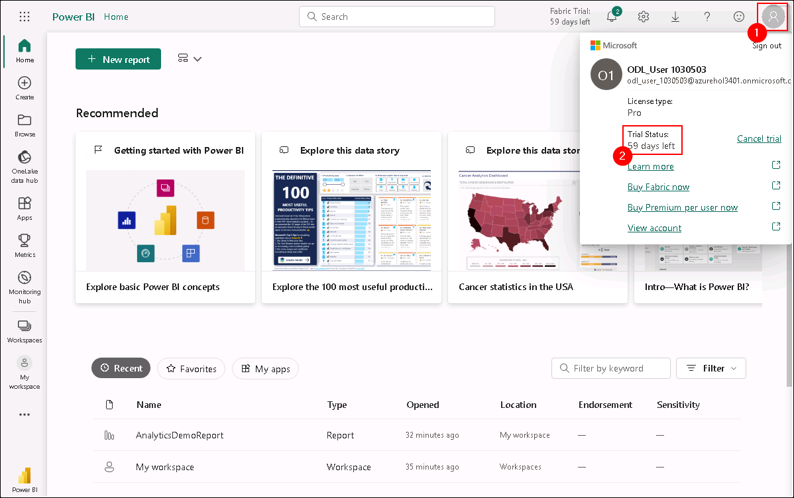
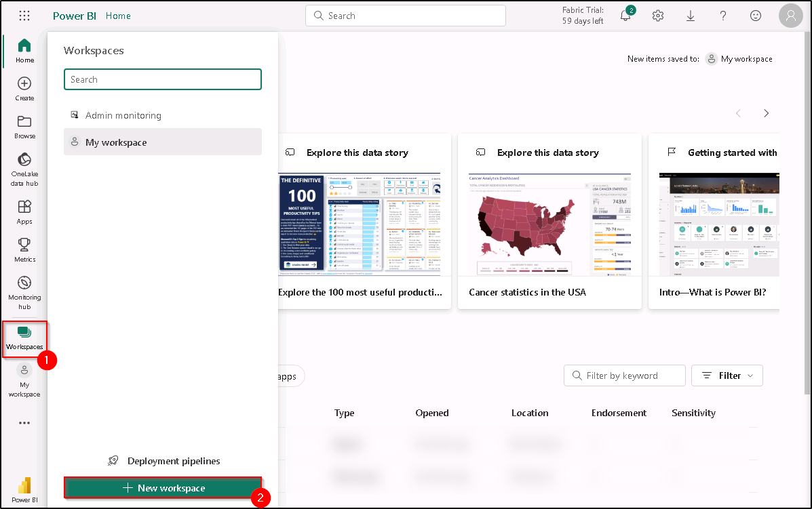
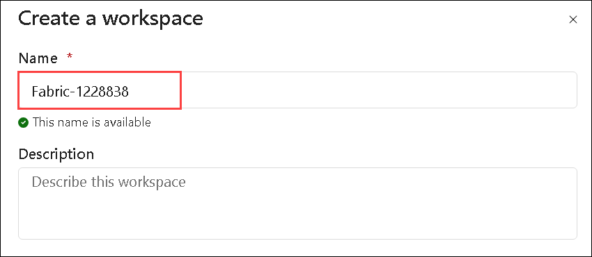

# Before Hands-on Lab 

## Lab objectives

In this lab, you will complete the following tasks:

- Task 1: Sign up for Microsoft Fabric Trial
- Task 2: Create a workspace

#### Task 1: Sign up for Microsoft Fabric Trial

1. Copy the **Power BI homepage link**, and open this link inside the VM in a new tab.

   ```
   https://powerbi.com
   ```

1. Complete the sign in process by clicking on **Continue**

   
   
1. Enter a 10 digit phone number and select **Get started**. Select **Get started** once more. You will be redirected to Power BI.
   
   
   
   
   
1. Leave the Microsoft Edge browser window open.

1. Select **Account manager (1)**, and click on **Start trial (2)**.

   

1. A new prompt will appear asking you to **Upgrade to a free Microsoft Fabric trial**, click on **Start trial (1)**.

   

   >**Note:** On the **Successfully upgraded to Microsoft Fabric** pop-up, select **Stay on current page**.

1. Now, open **Account manager (1)** again, and verify **Trial Status (2)**.

   

   >**Note:** If the **Welcome to Power BI** pop-up appears, close it.

----

#### Task 2: Create a workspace

Here, you create a Fabric workspace. The workspace contains all the items needed for this lakehouse tutorial, which includes lakehouse, dataflows, Data Factory pipelines, notebooks, Power BI datasets, and reports.

1.  Now, select **Workspaces (1)** and click on **+ New workspace (2)**.

    

2. Fill out the **Create a workspace** form with the following details:

   - **Name:** Enter **Fabric-<inject key="DeploymentID" enableCopy="false"/>**

      

   - **Advanced:** Expand it and Under **License mode**, select **Trial capacity (1)** and click on **Apply (2)** to create and open the workspace.

      .png)

      >**Note:** On the **Introducing task flows** select **Got it**.

> **Congratulations** on completing the task! Now, it's time to validate it. Here are the steps:<br>
      - Navigate to the Lab Validation Page, from the upper right corner in the lab guide section.<br>
      - Hit the Validate button for the corresponding task. If you receive a success message, you can proceed to the next task.<br>
      - If not, carefully read the error message and retry the step, following the instructions in the lab guide.<br>
      - If you need any assistance, please contact us at labs-support@spektrasystems.com. We are available 24/7 to help!


