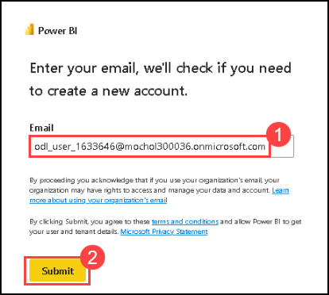
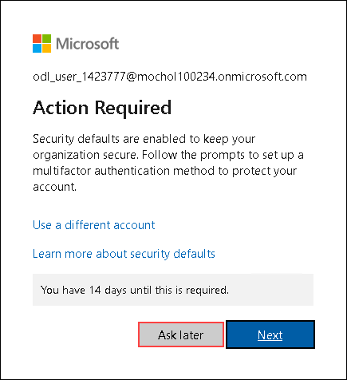
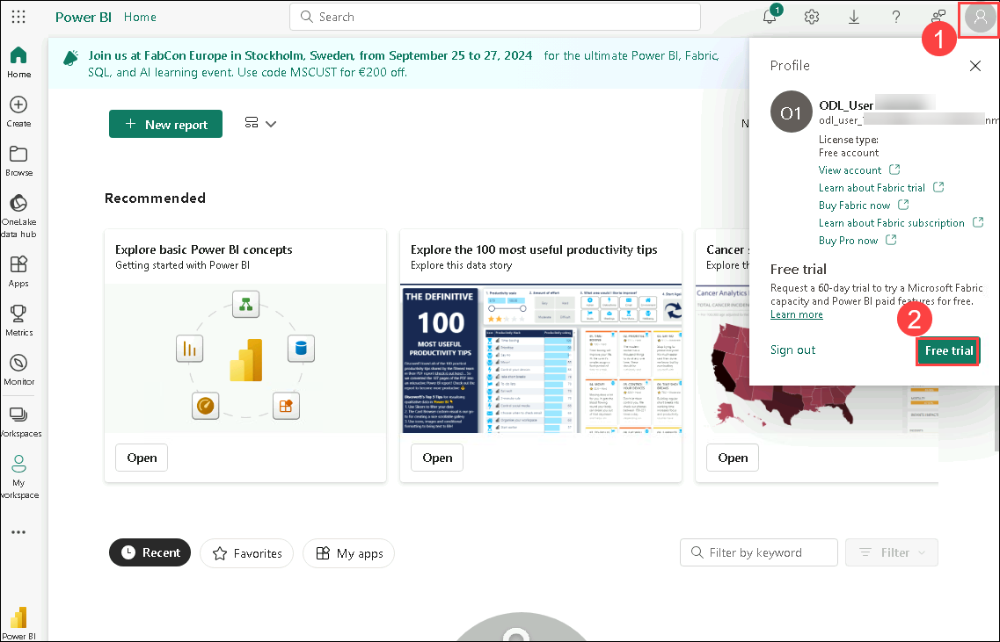
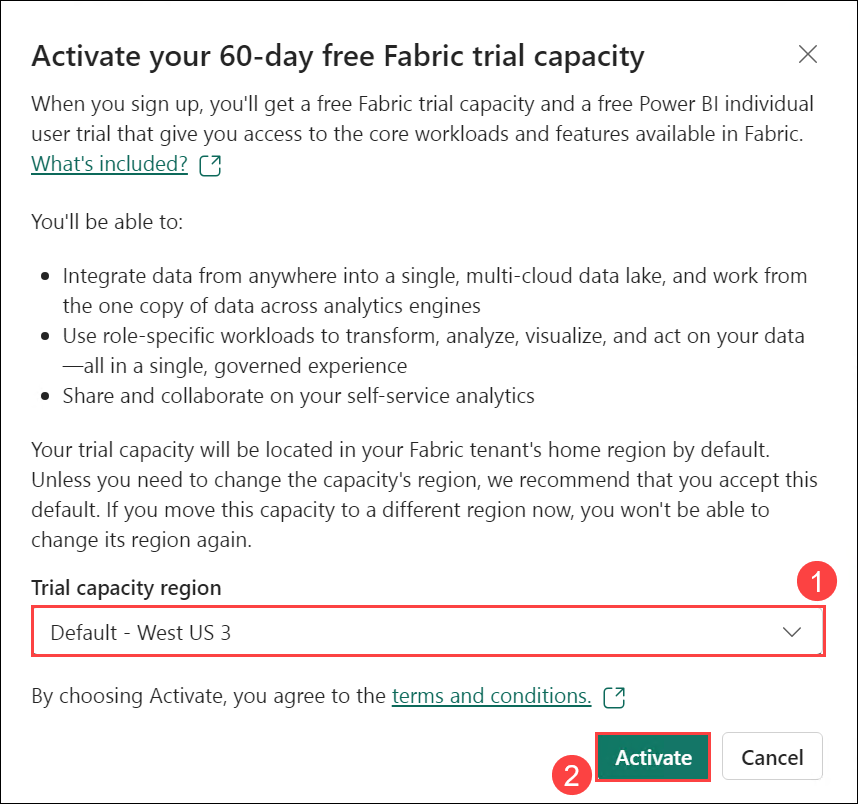
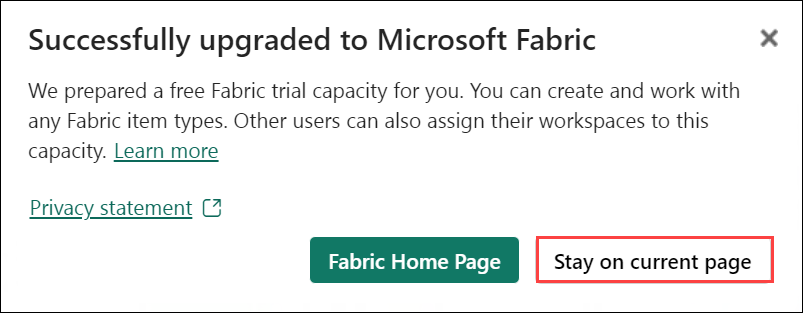
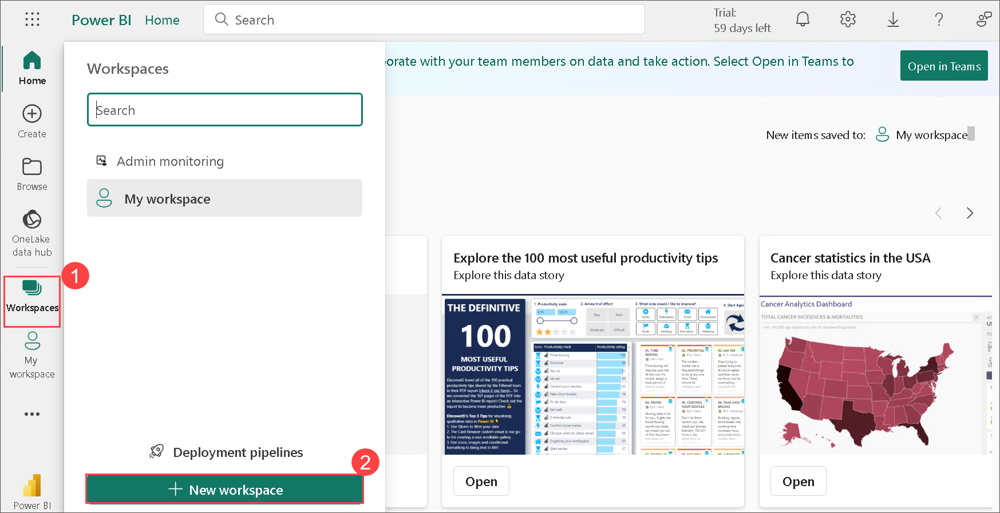

# Before Hands-on Lab 

## Lab objectives

In this lab, you will complete the following tasks:

- Task 1: Sign up for Microsoft Fabric Trial
- Task 2: Create a workspace

### Task 1: Sign up for Microsoft Fabric Trial

1. Copy the **Power BI homepage link**, and open this link inside the VM in a microsoft edge new tab.

   ```
   https://powerbi.com
   ```

1. Enter the **Email: <inject key="AzureAdUserEmail"></inject>** (1) to check if you need to create a new account and click on **Submit (2)**.

   

1. Now enter the following password and click on **Sign in**.
   * Password: <inject key="AzureAdUserPassword"></inject>
   
     

   > **Note**: If you see the **Action Required** dialog box, then select the **Ask Later** option.

      

1. **If** prompted to complete the sign-in process, click **Continue** or proceed directly with the lab from **Step 7**.

   
   
1. Enter a 10 digit phone number and select **Get started**. Select **Get started** once more. You will be redirected to Power BI.
   
   
   
   
   
1. Leave the Microsoft Edge browser window open.

1. Select **Account manager (1)**, and click on **Free trial (2)**.

   

1. On **Activate your 60-day free Fabric trial capacity**, select the **Default (1)** Trial capacity in the Trial capacity region and click on **Activate (2)**.

    

    >**Note:** On the **Successfully upgraded to Microsoft Fabric** pop-up, select **Stay on current page**.

      

1. Now, open **Account manager (1)** again, and verify **Trial Status (2)**.

   

   >**Note:** If the **Welcome to Power BI** pop-up appears, close it.

### Task 2: Create a workspace

Here, you create a Fabric workspace. The workspace contains all the items needed for this lakehouse tutorial, which includes lakehouse, dataflows, Data Factory pipelines, notebooks, Power BI datasets, and reports.

1.  Now, select **Workspaces (1)** and click on **+ New workspace (2)**.

    

2. Fill out the **Create a workspace** form with the following details:

   - **Name:** Enter **Fabric-<inject key="DeploymentID" enableCopy="false"/>**

      

   - **Advanced:** Expand it and Under **License mode**, select **Trial (1)** and click on **Apply (2)** to create and open the workspace.

      .png)

      >**Note:** On the **Introducing task flows** select **Got it**.

> **Congratulations** on completing the task! Now, it's time to validate it. Here are the steps:
> - Hit the Validate button for the corresponding task. If you receive a success message, you can proceed to the next task. 
> - If not, carefully read the error message and retry the step, following the instructions in the lab guide.
> - If you need any assistance, please contact us at cloudlabs-support@spektrasystems.com. We are available 24/7 to help.

<validation step="cdbb0f3a-826d-42b9-957c-c5fec07f354f" />
