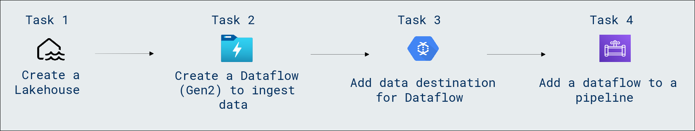

# Lab Scenario Preview: Module 01a: Ingest Data in Data Flows (Gen2) in MS Fabric

## Lab overview

In this lab, you will learn how to explore and understand the fundamental elements of Dataflows (Gen2) without delving into the complexities that may arise in an enterprise-level solution. The primary aim of this hands-on session is to provide you with a foundational understanding of Dataflows (Gen2) by introducing key components in a simplified context.

### Objectives
  
After completing this lab, you will be able to:

- Create a Lakehouse
- Create a Dataflow (Gen2) to ingest data
- Add data destination for Dataflow
- Add a dataflow to a pipeline

### Architecture Diagram

 

Once you understand the lab's content, you can start the Hands-on Lab by clicking the **Launch** button located in the top right corner. This will lead you to the lab environment and guide. You can also preview the full lab guide [here](https://experience.cloudlabs.ai/#/labguidepreview/08fa1161-0d7c-4c26-89c5-27f0d4369e4a) if you want to go through detailed guide prior to launching lab environment.