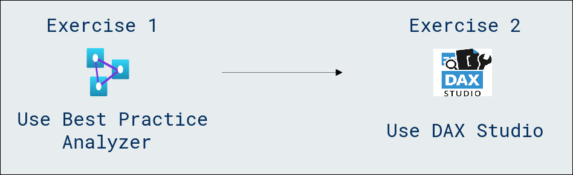

# Lab Scenario Preview: Module 06b: Use tools to optimize Power BI performance

## Lab overview

In this lab, you will learn how to leverage various optimization tools in Power BI to enhance performance and streamline data visualization. Explore techniques for improving report responsiveness, optimizing queries, and ensuring an efficient and impactful Power BI experience.

### Objectives
  
After completing this lab, you will be able to:

- Best Practice Analyzer (BPA) in Tabular Editor.
- DAX Studio.

### Architecture Diagram

Once you understand the lab's content, you can start the Hands-on Lab by clicking the **Launch** button located in the top right corner. This will lead you to the lab environment and guide. You can also preview the full lab guide [here](https://experience.cloudlabs.ai/#/labguidepreview/4ed61a34-3b39-47e2-b82c-2b2384a1bf2e) if you want to go through detailed guide prior to launching lab environment.