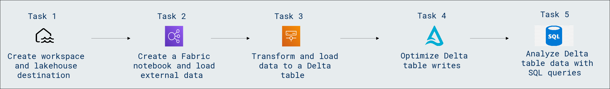

# Lab Scenario Preview: DP-600: Implementing Analytics Solutions Using Microsoft Fabric

## Module 02.2: Ingest data with Spark and Microsoft Fabric notebooks

### Lab overview

In this lab, you will learn how to efficiently ingest data using Spark in Microsoft Fabric Notebooks. This hands-on session is designed to provide you with practical knowledge and skills in leveraging the power of Apache Spark within the Microsoft Fabric environment for seamless data ingestion.

### Objectives
  
After completing this lab, you will be able to:

- Create workspace and lakehouse destination
- Create a Fabric notebook and load external data
- Transform and load data to a Delta table
- Optimize Delta table writes
- Analyze Delta table data with SQL queries

### Architecture Diagram

 

Once you understand the lab's content, you can start the Hands-on Lab by clicking the **Launch** button located in the top right corner. This will lead you to the lab environment and guide. You can also preview the full lab guide [here](https://experience.cloudlabs.ai/#/labguidepreview/3dc2a9e0-64d5-4d20-81f9-d08bce175a3c) if you want to go through detailed guide prior to launching lab environment.