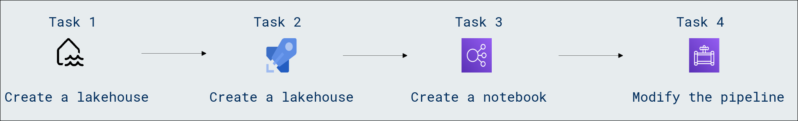

# Lab Scenario Preview: DP-600: Implementing Analytics Solutions Using Microsoft Fabric

## Module 02.3: Use Data Factory pipelines in Microsoft Fabric

### Lab overview

In this lab, you will learn how to leverage Microsoft Fabric by utilizing Data Factory pipelines to orchestrate and automate data workflows. Discover the seamless integration of Data Factory, gaining practical insights into the efficient management and transformation of data within the Microsoft Fabric environment.

### Objectives
  
After completing this lab, you will be able to:

- Create a lakehouse
- Create a pipeline
- Create a notebook
- Modify the pipeline

### Architecture Diagram

Once you understand the lab's content, you can start the Hands-on Lab by clicking the **Launch** button located in the top right corner. This will lead you to the lab environment and guide. You can also preview the full lab guide [here](https://experience.cloudlabs.ai/#/labguidepreview/ec332ad6-4d5a-461e-8cbb-709e3cb8da11) if you want to go through detailed guide prior to launching lab environment.