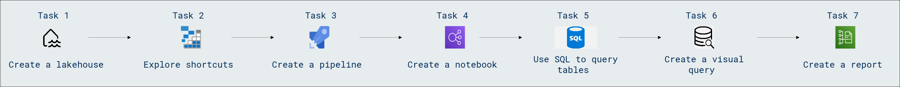

# Lab Scenario Preview: DP-600: Implementing Analytics Solutions Using Microsoft Fabric

## Module 03: Get started with lakehouses in Microsoft Fabric

### Lab overview

In this lab, you will learn how to initiate your exploration of lakehouses in Microsoft Fabric. Discover the essential steps to set up and engage with lakehouse architecture, unlocking the potential for unified data storage and analytics capabilities. Dive into this hands-on experience to lay the foundation for leveraging lakehouses effectively in your data ecosystem.

### Objectives
  
After completing this lab, you will be able to:

- Create a lakehouse
- Explore shortcuts
- Create a pipeline
- Create a notebook
- Use SQL to query tables
- Create a visual query
- Create a report

### Architecture Diagram

Once you understand the lab's content, you can start the Hands-on Lab by clicking the **Launch** button located in the top right corner. This will lead you to the lab environment and guide. You can also preview the full lab guide [here](https://experience.cloudlabs.ai/#/labguidepreview/900c702b-346b-45ae-9c6c-91f04c7d4c9f) if you want to go through detailed guide prior to launching lab environment.