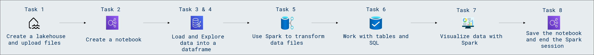

# Lab Scenario Preview: DP-600: Implementing Analytics Solutions Using Microsoft Fabric

## Module 04.1: Use Apache Spark in Microsoft Fabric

### Lab overview

In this lab, you will learn how to leverage Apache Spark within Microsoft Fabric for high-performance data processing and analytics. Explore the seamless integration of Apache Spark's capabilities within the Microsoft ecosystem to harness distributed computing power for scalable and efficient data transformations.

### Objectives
  
After completing this lab, you will be able to:

- Create a lakehouse and upload files
- Create a notebook
- Load data into a dataframe
- Explore data in a dataframe
- Filter a dataframe
- Aggregate and group data in a dataframe
- Use Spark to transform data files
- Use dataframe methods and functions to transform data
- Save the transformed data
- Save data in partitioned files
- Work with tables and SQL
- Create a table
- Run SQL code in a cell
- Visualize data with Spark
- View results as a chart
- Get started with **matplotlib**
- Use the **seaborn** library
- Save the notebook and end the Spark session

### Architecture Diagram

Once you understand the lab's content, you can start the Hands-on Lab by clicking the **Launch** button located in the top right corner. This will lead you to the lab environment and guide. You can also preview the full lab guide [here](https://experience.cloudlabs.ai/#/labguidepreview/dac3d237-bdcf-4093-bceb-1368a2443ff3) if you want to go through detailed guide prior to launching lab environment.