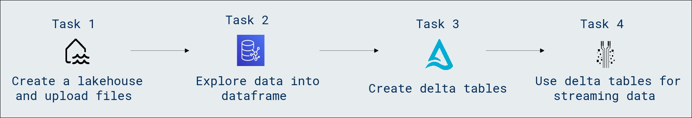

# Lab Scenario Preview: DP-600: Implementing Analytics Solutions Using Microsoft Fabric

## Module 04.2: Work with Delta Lake tables in Microsoft Fabric

### Lab overview

In this lab, you will learn how to effectively work with Delta Lake tables in Microsoft Fabric. Gain hands-on experience with Delta Lake, exploring its features for managing large-scale data lakes seamlessly and ensuring data reliability and transactional consistency.

### Objectives
  
After completing this lab, you will be able to:

- Create a lakehouse and upload files
- Explore data in a dataframe
- Create delta tables
- Create a managed table
- Create an external table
- Compare managed and external tables
- Use SQL to create a table
- Explore table versioning
- Use delta tables for streaming data

### Architecture Diagram

Once you understand the lab's content, you can start the Hands-on Lab by clicking the **Launch** button located in the top right corner. This will lead you to the lab environment and guide. You can also preview the full lab guide [here](https://experience.cloudlabs.ai/#/labguidepreview/fe89f97b-0aa0-49b8-968c-fbb348d0caee) if you want to go through detailed guide prior to launching lab environment.