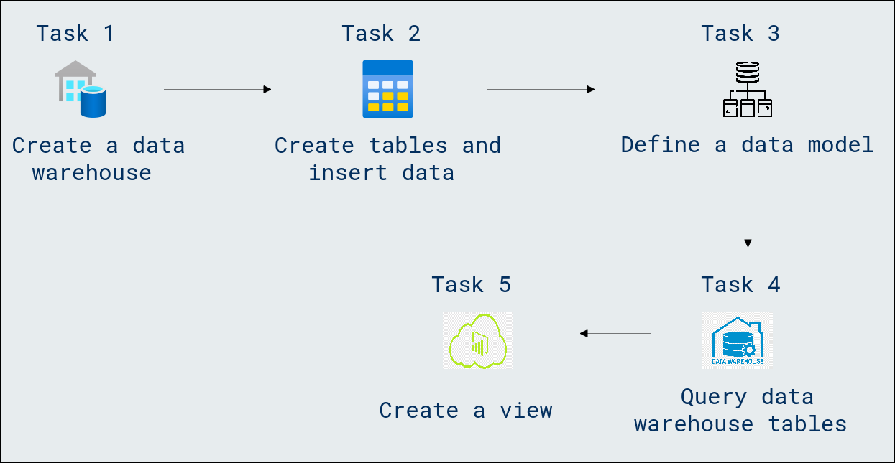

# Lab Scenario Preview: DP-600: Implementing Analytics Solutions Using Microsoft Fabric

## Module 05.1: Get started with data warehouses in Microsoft Fabric

### Lab overview

In this lab, you will learn how to initiate your exploration of data warehouses in Microsoft Fabric. Discover the essential steps to set up and leverage data warehouses efficiently, gaining hands-on experience in their foundational concepts and functionalities.

### Objectives
  
After completing this lab, you will be able to:

- Create a data warehouse
- Create tables and insert data
- Define a data model
- Query data warehouse tables
- Query fact and dimension tables
- Create a view
- Create a visual query
- Visualize your data

### Architecture Diagram

Once you understand the lab's content, you can start the Hands-on Lab by clicking the **Launch** button located in the top right corner. This will lead you to the lab environment and guide. You can also preview the full lab guide [here](https://experience.cloudlabs.ai/#/labguidepreview/9e6adabc-ff7e-4c66-9156-cdb1e9c88e63) if you want to go through detailed guide prior to launching lab environment.