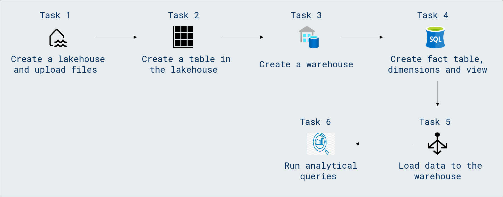

# Lab Scenario Preview: DP-600: Implementing Analytics Solutions Using Microsoft Fabric

## Module 05.2: Load data into a Microsoft Fabric data warehouse

### Lab overview

In this lab, you will learn how to efficiently load data into a Microsoft Fabric data warehouse, mastering the process of seamless data ingestion and optimization. Through hands-on exercises, gain practical insights into leveraging Microsoft Fabric's capabilities for streamlined and high-performance data loading.

### Objectives
  
After completing this lab, you will be able to:

- Create a lakehouse and upload files
- Create a table in the lakehouse
- Create a warehouse
- Create fact table, dimensions and view
- Load data to the warehouse
- Run analytical queries

### Architecture Diagram

Once you understand the lab's content, you can start the Hands-on Lab by clicking the **Launch** button located in the top right corner. This will lead you to the lab environment and guide. You can also preview the full lab guide [here](https://experience.cloudlabs.ai/#/labguidepreview/7759455b-d391-4a18-a200-87e1803e66bb) if you want to go through detailed guide prior to launching lab environment.