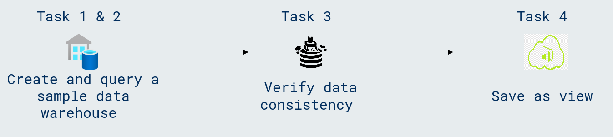

# Lab Scenario Preview: DP-600: Implementing Analytics Solutions Using Microsoft Fabric

## Module 06.1: Query a data warehouse in Microsoft Fabric

### Lab overview

In this lab, you will learn how to query a data warehouse in Microsoft Fabric. Gain practical experience in extracting valuable insights by crafting and executing SQL queries within the Fabric environment. Enhance your skills in leveraging data stored in the warehouse for informed decision-making.

### Objectives
  
After completing this lab, you will be able to:

- Create a sample data warehouse
- Query the data warehouse
- Verify data consistency
- Save as view

### Architecture Diagram

Once you understand the lab's content, you can start the Hands-on Lab by clicking the **Launch** button located in the top right corner. This will lead you to the lab environment and guide. You can also preview the full lab guide [here](https://experience.cloudlabs.ai/#/labguidepreview/1a141bfa-5d2c-4fdb-8ebc-3a00ccd468c3) if you want to go through detailed guide prior to launching lab environment.