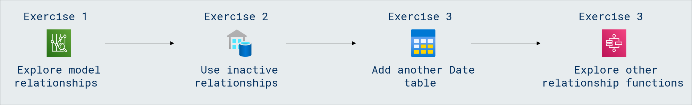

# Lab Scenario Preview: DP-600: Implementing Analytics Solutions Using Microsoft Fabric

## Module 06.3: Enforce Row-Level Security

### Lab overview

In this lab, you will learn how to enforce row-level security in your database, a crucial aspect of access control. Implementing row-level security ensures that users can only access and modify data that is explicitly authorized, enhancing data confidentiality and compliance with security policies.

### Objectives
  
After completing this lab, you will be able to:

- Configure many-to-many relationships
- Enforce row-level security

### Architecture Diagram

Once you understand the lab's content, you can start the Hands-on Lab by clicking the **Launch** button located in the top right corner. This will lead you to the lab environment and guide. You can also preview the full lab guide [here](https://experience.cloudlabs.ai/#/labguidepreview/8dd4fb47-816d-4079-9232-7dcb06ab0430) if you want to go through detailed guide prior to launching lab environment.