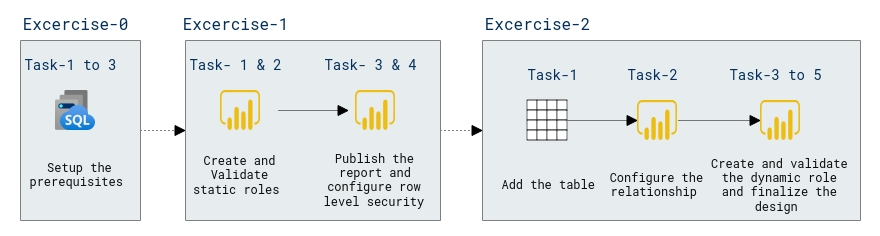

# Lab Scenario Preview: DP-600: Implementing Analytics Solutions Using Microsoft Fabric

## Module 08: Enforce model security

### Lab overview

In this lab, you will learn how to enforce model security, safeguarding machine learning models against unauthorized access and ensuring the integrity of your predictive analytics. Implement robust security measures and access controls to protect valuable model assets and sensitive data.

### Objectives
  
After completing this lab, you will be able to:

- Create static and dynamic roles
- Validate roles
- Map security principals to dataset roles

### Architecture Diagram

Once you understand the lab's content, you can start the Hands-on Lab by clicking the **Launch** button located in the top right corner. This will lead you to the lab environment and guide. You can also preview the full lab guide [here](https://experience.cloudlabs.ai/#/labguidepreview/c745d6cf-d7c4-462c-9ded-12dea05a18c0) if you want to go through detailed guide prior to launching lab environment.